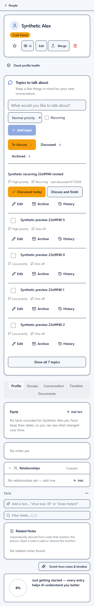
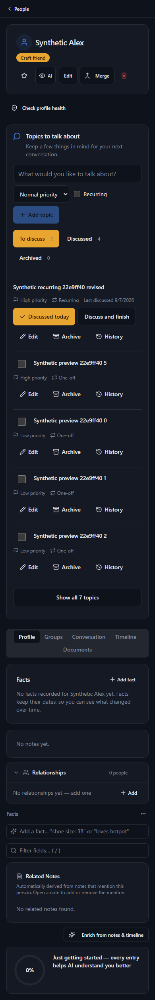

# Conversation topics: tested result

Verified on 7 September 2026, using synthetic data only. The refined checklist is live at https://menerio.com/dashboard/people. Michael authorized live testing after the interface refinement.

## Delivered

Native person topics support High/Normal/Low priority, one-off and recurring discussions, historical wording, archive, reopen, and append-only undo. The person panel sits below the identity and above the tabs, with a five-topic checklist preview including recent checked items, secondary actions behind ellipsis menus, compact optional capture settings, state filters, keyboard capture, history, retry-safe commands, and preserved drafts during external edits.

Browser and all eight MCP topic tools share database commands. Owner policies, service-only entrypoints, AI visibility, request receipts, version checks, and lifecycle locks protect writes. Active topics appear in both person-context responses. Realtime subscriptions plus focus/reconnect and a visible-page polling fallback refresh an open profile. Topics are excluded from persisted browser caches.

Merging people transfers topic IDs and history atomically with the merge marker. A self-merge with topics requires reassignment; an interrupted self-merge remains visible and resumable. Deletion explicitly cascades the deleted person's topics and history. The existing multi-request profile merge is not converted into a whole-profile transaction.

The shared hub `talk-about` skill handles capture, discussion completion, prioritization, call preparation, ambiguity, retries, German requests, and dated discussion versus explicit reminders. It creates no substitute notes or reminders.

## Verification

- Full repository suite: 735 passed, 14 skipped, all 73 test files passed, including the final overlapping-merge interruption regression.
- Feature UI and hook suite: 22 tests, including pagination beyond 1,000 high-priority topics, stale drafts, retained rows, account changes, retry receipts, and refresh cleanup.
- MCP transport unit suite: 13 tests. Actual full MCP entrypoint additionally passed HTTP integration tests through the SDK client, including advertised schemas, malformed inputs, scopes, owner isolation, retries, aliases, history, and both person-context responses.
- PostgreSQL 16 with pgTAP: all 51 assertions passed. Separate concurrent-session checks passed for repeated requests, stale versions, rollback after injected event failure, both capture/merge orderings, lock interleaving, failed merge rollback, and private merge-target retries.
- Production frontend build and TypeScript checks passed. Full lint had zero errors and 1,454 warnings, compared with 1,434 baseline warnings; warnings are not reported as a clean lint result.
- All 34 synthetic natural-language skill examples passed independent model-based scenario review. These are scenario evaluations, not live memory writes or deterministic tool execution. Skill structure validation passed.

## Actual UI verification

Headless Chromium exercised the actual PersonDetail page and production topic components with synthetic authentication, the actual MCP handler, and a local PostgreSQL-backed HTTP adapter. It verified Enter capture in the browser then MCP retrieval, browser discussion then MCP history, MCP capture appearing in the already-open page through the 30-second fallback, recurring discussion remaining active, original wording after editing, MCP completion, browser reopen/archive/undo, priority preview, and the Conversation tab remaining reachable. No browser page errors or horizontal page overflow occurred.

Mobile at 390px and desktop at 1280px were captured in light and dark themes and visually inspected. Identity actions wrap on mobile; topics remain above the tabs.

| Mobile light | Mobile dark |
| --- | --- |
|  |  |

[Desktop light](assets/contact-topics/desktop-light.png) · [Desktop dark](assets/contact-topics/desktop-dark.png)

The first acceptance run used a local adapter. A subsequent release run exercised actual hosted Supabase authentication, PostgREST, and Realtime with two temporary synthetic owners. All eight MCP tools were advertised. Owner isolation, hidden-person denial, retry receipts, recurring close/undo, history, and stale-version rejection passed.

On the actual public site, browser capture was retrieved through MCP, browser discussion appeared in MCP history, checked topics stayed visible, and MCP capture appeared in the already-open profile in 934 milliseconds through Realtime. A simultaneous MCP edit while a browser draft was open returned the conflict message in 237 milliseconds and preserved the draft. Menu keyboard behavior, 390px layout, and desktop layout passed; no page errors occurred. The temporary users, people, keys, topics, and history were removed and empty fixture results verified.

The hosted check exposed PostgREST retrying intentional SQLSTATE 40001 business conflicts. The additive conflict migration changes only those codes to PT409, producing HTTP 409. Both browser and MCP recognize it. All 51 SQL assertions and 29 focused UI/MCP tests passed after this change, along with TypeScript, edge import checks, a production build, scoped review, and GitHub CI. See the [PostgREST retry issue](https://github.com/PostgREST/postgrest/issues/3673) and [custom HTTP error documentation](https://postgrest.org/en/v11/references/errors.html#raise-errors-with-http-status-codes).

[Public-site mobile screenshot](assets/contact-topics/live-mobile-dark.png) · [Public-site desktop screenshot](assets/contact-topics/live-desktop-dark.png)

Physical touch hardware and a screen reader were not manually exercised.

## Release status

Published code: `223b5bdd585ca2e4f48512c207d3f39370c31153`, present in Lovable before publication. Deployment `edb744bd-7932-41d2-a372-00a81fa93a3f` published the final conflict-handling frontend; the public JavaScript bundle and actual UI were then verified. GitHub CI passed for this code.

Both migrations are recorded in production: `20260907140000` and `20260907141000`. MCP version 73 and merge-contacts version 200 are active, with their existing authentication settings preserved. Topic Realtime publication membership and restricted function grants were checked live. The pre-release database backup completed on 7 September at 04:24 UTC.

The shared hub skill is pushed to hub origin. Menerio code is pushed to `main` and `codex/person-conversation-topics`. No production deployment remains pending for this feature. Open [People](https://menerio.com/dashboard/people), choose a person, and use the checklist below their name. This is live account data, not a separate test database.
