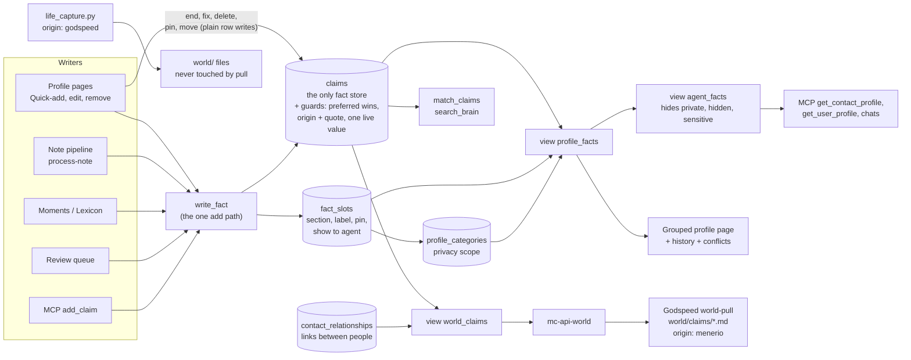

# One fact store: plan

Status: proposal, 2026-09-28, reviewed nine times (section 8). Nothing in this document has been built.

**This file on `main` is the only copy of this plan.** Every session reads it from `main` and commits its changes back to `main` in the same session. No other branch holds a version of it (section 9).
Scope: Menerio (this repo) and the Godspeed `world/` mirror.

How to read the markers:

- **VERIFIED** means I read the code or migration named next to it.
- **UNVERIFIED** means I did not read it, or it depends on production state I cannot see. Every production number is UNVERIFIED unless a query in this document produced it, and none has been run.
- Paths are relative to the repo named in the section. Line numbers are approximate.

---

## 1. Summary for Michael

1. Keep one list of dated facts, `claims`. Every fact about you or a person lives there, once.
2. The grouped profile page becomes a view over those facts. A small table remembers only how each *kind* of fact is shown for a person: its section, its label, whether it is pinned, and whether assistants see it. For example: "Languages → Identity, pinned".
3. Why: today's bridge copies facts back and forth between two lists. It still shows old values as current, rewrites history when you edit, and never shows facts added about you by assistants. It can drift again whenever a background job runs.
4. With one list, a fact cannot appear twice. A new value keeps the old one as "was true until". Assistants, search and Godspeed all read the same thing.
5. Your typed words stay protected. The same rule that guards the profile list today moves onto the facts themselves.
6. Relationships between people stay in their own table. They link two people, and that works well already.
7. How it ships: everything is built and rehearsed first (8-10 days of work, nothing changes in production), then goes live in one sitting of about three hours, tested straight away. There are no waiting periods between steps. Every job that writes facts is paused during the switch. The data switch is one transaction that checks its own counts, there is one rollback script, and the old table is archived, not deleted. Fact data never leaves the database during any of this: the session sees counts and ids only (section 5.1).
8. Godspeed: the pull becomes a straight copy of the facts, and existing files keep their ids. Its hourly pull learns paging during the build (see Risk R1).
9. Decided (section 7): changing a fact keeps the old value as history; removing offers "not true any more" and "this was wrong"; private sections stay out of the Godspeed repo.
10. Separately, I found a bug that can lose facts today: the tidy-up job deletes rows it then cannot re-insert (Risk R2). That job and the nightly bag splitter are deleted, not rewritten: facts are tidied on the way in instead.
11. Facts that assistants recorded but that never showed on a profile (about 200 about you) are listed for you before go-live, because some may be facts you deleted before the 09-28 fix. You mark the ones you deleted; they are removed and not suggested again. The rest appear on your profile. Assistants already see all of them today.

---

## 2. Current system map

### 2.1 The three stores

| Store | What it holds | Dates | Embedding | Protection of human words |
|---|---|---|---|---|
| `claims` (migrations `20260811091414`, `20260901090000`, `…094000`, `…098000`) | `subject_type` self/contact/entity, `subject_id`, `attribute`, `value`, `valid_from`/`valid_to`, `confidence`, `cardinality`, `evidence_quote`, `review_by`, `source_type`/`source_id`, `origin` (default `'menerio'`), `embedding` | yes | yes (`match_claims`) | **none**: only the `claims_updated_at` trigger. VERIFIED. |
| `profile_entries` + `profile_categories` | undated `label`/`value`, `category_id`, `contact_id` (NULL = self), `is_pinned`, `show_to_agent`, `rank`, `sort_order`, `linked_note_id`, `origin` (default `'unverified'`), `evidence_quote`, `derived_from_claim_id`. Categories are per subject (`contact_id`) and carry `visibility_scope` ('private' hides the section from agents). | no | no | `world_preferred_wins` and `world_preferred_survives_delete` (`20260816120000`, redefined `20260916120000`). VERIFIED. |
| `contact_relationships` | `source_*`/`target_*` (contact or self), `label`, `custom_label`, `pair_key`, `origin`, `evidence_quote`, `evidence_note_id`, `valid_from`/`valid_to`, `rank`; plus the `relationship_rejections` ledger and `relationship_evidence` | yes | no | the same preferred triggers. VERIFIED. |

Claims have **no foreign key on `subject_id`** (it points at a contact, an entity or nothing) and **no uniqueness constraint** of any kind. VERIFIED.

### 2.2 Triggers on `profile_entries` today (final active set, from migrations)

These come from the edge-case research pass over the migrations. I read the three marked ones myself; the rest are UNVERIFIED against production (see R5).

| Trigger | When | Does |
|---|---|---|
| `trg_a_profile_entries_atomize` | BEFORE INSERT | Splits a multi-fact value into sibling rows (`20260820213200`). |
| `trg_profile_entries_canonicalize` | BEFORE INSERT/UPDATE | Resolves the canonical label. An unknown field goes to the review queue and the row is dropped (`20260816020759`). |
| `trg_profile_entries_preferred_wins` | BEFORE INSERT/UPDATE | A human row becomes `rank='preferred'`. A machine update of a preferred row gets its label and value put back. VERIFIED. |
| `trg_profile_entries_prevent_duplicate_fact` | BEFORE INSERT/UPDATE | Duplicate guard: drops the row by returning NULL (`20260815231856`). |
| `trg_profile_entries_quality_guard` | BEFORE INSERT/UPDATE | Drops empty, "none", or value-equals-label rows (`20260809131242`). |
| `trg_profile_entry_require_origin` | BEFORE INSERT/UPDATE | Origin must be from the allowed list; a new `unverified` row is refused; automated origins need a quote of 10+ characters (`20260928121000`). VERIFIED. |
| `trg_profile_entries_preferred_delete` | BEFORE DELETE | A machine delete of a preferred row is cancelled. |
| `profile_entries_enqueue_normalization`, `trg_profile_entries_mark_audit_dirty` | AFTER any write | Feed cron jobs 4 and 16. |
| `trg_profile_entry_sync_claim` | AFTER UPDATE OF value, label | **Overwrites the linked live claim in place** and clears its embedding (`20260928120000`). VERIFIED. |
| `trg_profile_entry_end_claim` | AFTER DELETE | If this was the last row showing a claim, sets that claim's `valid_to`. VERIFIED. |

Unique indexes: `profile_entries_no_exact_duplicate` and `profile_entries_unique_profile_fact` (`20260724111157`, `20260724181849`).

### 2.3 Writers and readers, and what each becomes

"Fact store" below means the new module `supabase/functions/_shared/fact-store.ts` and its SQL function (section 3.5). "View" means `profile_facts` or `agent_facts` (section 3.3).

**Edge functions and shared modules**

| Caller | Store(s) touched today | What it does today | Target |
|---|---|---|---|
| `normalize-profile/index.ts` `writeProfileEntrySafely` (~214-427); actions `write_profile_entry`, `accept_profile_entry`, `bulk_profile_reviews` | writes entries | Every manual add ("Add a fact", section add, owner suggestions) and every review-queue accept. Runs the canonical label, name guard, skill guard and dedup, then INSERTs. Sets no claim. | Calls `writeFact()`. Keeps its guards (label canonicalization, name guard, blocked labels), now applied before the claim insert. |
| `normalize-profile` `explodeBags` (~598-720), nightly cron job 15 at `40 3 * * *` | deletes and inserts entries | Splits "bag" rows. **Drops `derived_from_claim_id`**, so the end-claim trigger closes the claim, and the pieces are promoted later as new claims. VERIFIED from report; UNVERIFIED line-level. | **Deleted** with cron 15 (eighth review). `writeFact` splits bags on the way in; the legacy bags are split once in B6. |
| `normalize-profile` actions `plan`/`backfill`/`apply`/`rollback` → `_shared/profile-normalization.ts` | deletes, updates and inserts entries | The normalizer. Merges duplicates and fixes labels and sections. Its canonical insert and its restore set **no origin** (R2). VERIFIED. | **Deleted** (eighth review). `writeFact` canonicalizes on the way in, the unique live-value index prevents exact duplicates, and label or section changes are slot edits by the owner. This removes R2 with the code. |
| `admin-normalize/index.ts` (cron job 4, `22 */6`) | via `applyNormalization` | Drains normalization jobs. | **Deleted** with cron 4. |
| `process-note/index.ts` `prepareSuggestionForInsert` (~517-633), `generateProfileSuggestions` (~1341, dedup reads ~1765-1790), relationships (~1957-2185), promote call (~2851-2890) | writes entries (`ai_note`) and relationships; reads entries for dedup; fires `promote-profile-entries` | The note pipeline. | Auto-apply calls `writeFact({origin:'ai_note', evidence_quote, source_type:'note'})`. Dedup reads `profile_facts` (current) plus the "never suggest again" suppressions. The promote call is removed. Relationships are unchanged. |
| `_shared/moment-profile-extraction.ts` (~261-327, ~487-620); `extract-moment-profile`; `backfill-moment-profile-extraction` | writes entries (`ai_moment`) and relationships | Facts from timeline moments. | `writeFact({origin:'ai_moment', source_type:'moment'})`. |
| `enrich-person-from-lexicon/index.ts` (~188-202, ~660-727) | writes entries (`ai_lexicon`) and relationships | "Enrich from notes & timeline". | `writeFact({origin:'ai_lexicon'})`. `claims.source_type` gains `'lexicon'` (CHECK change). |
| `backfill-profile-extraction/index.ts` | none directly (re-posts notes) | Re-runs the note pipeline. | Unchanged. |
| `classify-profile-fact/index.ts` | none | Returns label, value and section for Quick-add. | Unchanged. |
| `generate-profile-suggestions/index.ts` | reads categories and owner entries | Owner suggestions. | Reads `agent_facts WHERE is_current` (it sends facts to the LLM; the owner view would add history and private rows). |
| `promote-profile-entries/index.ts` + `_shared/promote-entries.ts` + `_shared/adopt-claims.ts` | entries → claims, and claims → entries | The bridge. | **Retired** at go-live (B3, B5). |
| `profile-audit/index.ts` + RPC `profile_audit_apply_merge` (cron job 16, `50 */6`) | merges entries | Duplicate audit. | Retired. The unique live-value index (section 3.2) makes exact duplicates impossible. Near-duplicates go to the claims lint. |
| `profile-lint/index.ts` (cron job 11, `20 3`) | deletes entries (repair); relationships | Nightly lint. | Claims lint, **report-only** for claims; relationship repair unchanged. Whether the live cron sends `repair:true` is UNVERIFIED. |
| `profile-reconcile/index.ts` (cron job 12, `17 */2`) | moves entries to self, updates and deletes them; relationships | Folds contact duplicates of self. It **orphans those contacts' claims** (reported; UNVERIFIED line-level). | Keeps only this: moves the contact's claims, slots and private sections to self (`subject_type='self'`, `subject_id=NULL`) in one transaction, the most private scope winning. Identical live values fold as in the merge. It runs as the service role, so it cannot delete a preferred copy: when both copies are preferred it skips that contact and reports it, instead of failing on the unique index every two hours (ninth review). |
| `review-queue-bulk/index.ts` (keep ~282-316, `unknown_profile_field` ~566-625, revert ~738-810) | writes and deletes entries; relationships | Bulk review. | Keep calls `writeFact`. Revert deletes the claim and inserts the suppression row itself (the item's `target_entity_id` now holds a claim id; switch step 12). Items whose entry was folded are not revertible. |
| `conversation-chat/index.ts` (~113, 240-251) | reads entries (no visibility filter) | Person context in chat. | Reads `agent_facts`, which also closes today's visibility gap. |
| `note-chat/index.ts` (~483), `_shared/read-tools.ts` `loadPersonProfile` (~193-243), chat tool `get_person_profile` | reads entries and relationships (no sensitivity filter) | Person context in chat. | Reads `agent_facts`; relationships are filtered on the contact's visibility. |
| `_shared/read-tools.ts` `search_claims` → `match_claims` | reads claims | Chat search. | Unchanged caller. It now covers every fact, so `match_claims` gains the private-section and entity filters in the schema migration (section 3.6). |
| `_shared/user-profile.ts` `getUserProfile` | reads self entries (ignores `show_to_agent`) | "Who is the user" digest for chats. | Reads `agent_facts` for self, current rows only. |
| `_shared/people-sync-core.ts` / `people-vault.ts` (`github-people-sync`) | reads contact entries (`select *`) | GitHub people vault export. | Reads `profile_facts` current rows, pinned first. Private sections go to the vault as they do today (the vault repo is created private, `_shared/github-api.ts:41`); hidden contacts too. |
| `merge-contacts` → SQL `merge_contacts_atomic` (`20260908120002`) + trigger `contact_merge_move_references` (`20260923170100`) | moves and deletes entries; moves claims; relationships | Contact merge. Deleting a duplicate entry **ends its claim before the claim is moved**, and a merge into self leaves the claims behind (trigger WHEN clause). Reported. | Moves claims and slots itself. Identical live values are folded, keeping the preferred copy, else the earliest; the survivor becomes preferred if either copy was (ninth review: keeping only "the earliest" could delete the copy Michael typed and keep a machine's). Slot clash: the kept contact's slot wins, pins are combined. Merge into self re-points to `subject_type='self'`. It also carries private sections across, the most private scope winning. The entry part is removed at go-live. |
| `delete-my-account`, `admin-delete-user` | none directly | Rely on foreign-key cascades to `auth.users` (`20260916120000` adds them to every public table with `user_id`). | `fact_slots` gets its own `ON DELETE CASCADE`. |
| `mc-api-world/index.ts` + views `world_entities`, `world_events`, `world_claims` (`20260901098000`); `_shared/world-records.ts` `toWorldClaim` | reads the union of all three stores | Godspeed pull endpoint. Filters sensitive contacts only; **no `ai_visibility` filter on claims, and no private-section filter** (VERIFIED, `mc-api-world/index.ts:136-160` and the view SQL). | `world_claims` = `agent_facts` plus relationships (section 3.4), so private sections (Q4) and hidden or sensitive subjects are no longer mirrored. |
| `backfill-claim-embeddings/index.ts` | writes claim embeddings | Manual backfill; no cron (reported). | The only embedding path. Cron-key auth, loops over users, candidates from `agent_facts` (section 3.6). Scheduled every 10 minutes. |

**MCP tools (`supabase/functions/menerio-mcp/index.ts`)**

| Tool | Today | Target |
|---|---|---|
| `add_claim` (~4029-4135, `_shared/claims.ts` `addClaimWithSupersede` ~263-331) | Inserts a claim, then closes the older one (valid_to = UTC today). Evidence quote optional. Origin not set, so it gets `'menerio'`. No value dedup. Loosely creates contacts from names. Never writes entries; the claim reaches the page only through adoption, contacts only. VERIFIED from report; UNVERIFIED line-level. | Calls `writeFact({origin:'mcp'})`. Requires `evidence_quote` (Q7). Same value again is a no-op. Uses the user's day, not UTC. Will not close a `preferred` claim; adds a second live value instead (Q8). Ambiguous names are refused, as in `get_claims`. No inline embedding (`index.ts:4124-4129` today); the embedding cron picks it up. |
| `get_claims` (~4171-4232) | claims, filtered by contact and entity `ai_visibility` only (`visibleClaims`, ~4148-4169): no private-section, sensitive-entity or self filter | Reads `agent_facts` in every mode, or every private-section fact would print. |
| `get_contact_profile` (~1913-2037) | curated entries plus live claims, skips entries whose claim was printed (the 09-28 fix). Returns early, without claims, when the contact has no non-private sections (reported). | Reads `agent_facts` for the contact, grouped by section. One source, so no dedup logic. `detail:'curated'` = `show_to_agent`. Shows "two answers" flags and history on request. |
| `get_user_profile` (~2819-3051) | self entries only; **never reads claims** | `agent_facts` for self. Relationships are unchanged (and its self-as-source gap is fixed separately; see R9). |
| `get_contact_context` (~1783-1908), `search_contacts` (~1712-1745) | entries | `agent_facts`. |
| `search_brain` (~3673-3774) → `match_claims` | claims only; unpromoted entries invisible | Unchanged caller. It now sees every fact, filtered like `agent_facts` (section 3.6). |
| `get_entity_context` (~3957) | entity claims; ignores `is_sensitive` | Reads `agent_facts`. |

**Frontend**

| File | Today | Target |
|---|---|---|
| `src/hooks/useProfile.ts` (owner page; queries ~89-117, `upsertEntry` ~191, `deleteEntry` ~210) | reads and writes self entries directly. Delete **ends** the claim. | New `useFacts(subject)` over `profile_facts`, adds through the `write_fact` edge action (with the user's JWT), end/correct/delete as direct `claims` updates, display changes as direct `fact_slots` updates. |
| `src/hooks/useContactProfile.ts` (queries ~51-85, backfill effect ~87-141, adoption effect ~143-167, upsert ~209-253, delete ~255-276) | reads and writes contact entries; runs `promote-profile-entries` on open. Delete **deletes** the claim. | Same `useFacts`. The adoption effect is deleted. |
| `src/components/people/ContactProfileTab.tsx`, `profile/QuickAddFact.tsx`, `profile/CompactCategorySection.tsx`, `profile/PinnedHighlights.tsx`, `src/components/profile/ProfileSections.tsx`, `EntryForm.tsx`, `ExportTab.tsx`, `ProfileCompleteness.tsx` | render entries | Render `profile_facts` rows. The grouping key becomes `slot_id`; each slot gets a "History (n)" disclosure and a "two answers" badge. |
| `src/lib/profile-categories.ts` `ensureProfileCategory` | client insert of a category | Unchanged (categories stay). |
| `src/hooks/useProfileSummary.ts` | counts entries | Counts current `profile_facts`. |
| `src/hooks/useAiFootprint.ts` (~44, 123, 151) | entries by `linked_note_id`; deletes them | Claims where `source_type='note' AND source_id=:note`; "remove" = delete the claim and insert the suppression row. |
| `src/components/people/RelationshipsSection.tsx` (~110, ~153) | reads Gender/Pronouns entries across subjects; writes Gender via `write_profile_entry` | Reads `profile_facts` (attribute `gender`/`pronouns`); writes through `write_fact`. |
| `src/pages/ReviewQueue.tsx` (accept ~229-305, revert ~150-193, `add_claim` ~635-672) | entries via normalize-profile or direct insert; revert deletes the entry | Through `normalize-profile` (now `writeFact`); revert = delete the claim. |
| `src/hooks/useClaims.ts`, `src/components/facts/FactsPanel.tsx`, `components/world/EntityDetail.tsx` | claims for entity pages; `useAddClaim` sets no cardinality, origin or embedding | `useAddClaim` is replaced by `write_fact`. `FactsPanel`'s history pattern is reused on person pages. |
| `src/pages/World.tsx`, `src/hooks/useWorld.ts` (~94-110), `src/lib/world-claims.ts` | `world_claims` view | Unchanged API; the view is redefined. `groupClaims` should prefer current rows (reported as not excluding closed claims). |
| `src/lib/query-persister.ts` (`buster: "account-v3"`) | persists query results to IndexedDB for 7 days | Bump the buster when the row shape changes (go-live). |

**Offline / desktop.** PowerSync syncs **only `notes`**. VERIFIED: `src/sync/schema.ts` defines one table, and publication `powersync` in `20260710120000` lists only `public.notes`. The sync rules live in the PowerSync dashboard (`docs/offline-first.md`). `src-tauri` has no profile code. Nothing in PowerSync changes. The only offline surface is the query persister above.

**Godspeed** (section 6 has the details)

- **What actually runs** is the kit runner `~/.local/bin/mc-notebook-sync`, from the public `teach-it-once-kit`. It calls `tools/notebook-sync.py` (up) and `tools/world-pull.py` (down). VERIFIED: `godspeed-engine/scripts/sync-menerio-run.sh:123-131` `exec`s it; lines 157-229 (the engine's `sync_menerio.py` and `world_pull.py`) are unreachable.
- The kit's `world-pull.py` makes one request with `?limit=2000` and **does not page**. VERIFIED: `tools/world-pull.py:391-392`.
- `life_capture.py` writes `origin: godspeed` atoms and never calls Menerio. The pull never touches those files.
- Nothing pushes facts from Godspeed into Menerio. Notes go up, and `_shared/mc-source.ts` refuses fact extraction from `godspeed` notes (reported).

---

## 3. Target architecture

### 3.1 The rule

**A fact is a claim.** One row in `claims` per value per period, about self, a contact or an entity. Everything else is one of these:

- a **slot**: how one attribute of one subject is displayed;
- a **category**: a section on the page, with its privacy scope;
- a **view**: a way to read the claims.

Relationships between two people stay in `contact_relationships` (section 3.8).

Where each attribute lives:

| Attribute | Lives on | Why |
|---|---|---|
| value, dates, confidence, cardinality, source, evidence quote, embedding | `claims` | They describe one value in one period. |
| "a human typed this" | `claims.origin = 'user_manual'` and `claims.rank = 'preferred'` | It belongs to the words, so it must survive every display change. |
| category (section) | `fact_slots.category_slug` | Filing belongs to "Languages for this person", not to one language. A new value inherits it. |
| label (display name) | `fact_slots.label` | Same reason. The attribute key is the stable machine name; the label is how the page says it. |
| pin | `fact_slots.is_pinned` | Per attribute (Q3). |
| one answer or several | `fact_slots.cardinality` (NULL = use `attribute_rules`, else `'one'`) | "Both are true" is about this person's attribute, and the next new value must respect it. |
| show to assistants | `fact_slots.show_to_agent` | Per attribute. |
| privacy scope | `profile_categories.visibility_scope` (unchanged) | A private section hides everything filed in it. |

**Why the slot is keyed by attribute and not by claim id.** A display row keyed by claim id (option C as posed) dies with the claim. Every new value (Berlin → London) arrives with no section, no label, no pin and no assistant flag, so something must "adopt" it again. That is today's bridge in miniature. Keyed by `(subject, attribute)`, the new value simply appears where the old one was, pinned if it was pinned.

### 3.2 Schema (draft DDL)

```sql
-- 1. claims gains what profile_entries knew and claims did not.
ALTER TABLE public.claims
  ADD COLUMN IF NOT EXISTS rank text NOT NULL DEFAULT 'normal'
    CHECK (rank IN ('preferred','normal'));
-- source_type gains 'lexicon'; origin becomes checked against the same list profile_entries uses,
-- plus the legacy 'menerio' that 20+ existing claims carry. Nothing is rewritten.
ALTER TABLE public.claims DROP CONSTRAINT IF EXISTS claims_source_type_check;
ALTER TABLE public.claims ADD CONSTRAINT claims_source_type_check
  CHECK (source_type IN ('note','moment','manual','ai','lexicon'));
ALTER TABLE public.claims ADD CONSTRAINT claims_origin_known CHECK (origin IN
  ('user_manual','unverified','menerio','ai_note','ai_moment','ai_lexicon',
   'review_queue','import','mcp','api','normalizer')) NOT VALID;  -- VALIDATE after a count shows 0 violations

-- 2. One live copy of a value per subject and attribute. Closed history rows are exempt.
--    Created inside the switch migration, after its duplicate fold (B8 was 96 groups on 2026-09-28).
--    The value is indexed as a hash: a b-tree entry holds at most ~2.7 KB, and a long value
--    would otherwise make the index creation, or a later insert, fail.
CREATE UNIQUE INDEX claims_one_live_value ON public.claims
  (user_id, subject_type, coalesce(subject_id, '00000000-0000-0000-0000-000000000000'::uuid),
   attribute, md5(lower(btrim(value))))
  WHERE valid_to IS NULL;

-- 3. How an attribute of a subject is displayed. The only new table.
CREATE TABLE public.fact_slots (
  id            uuid PRIMARY KEY DEFAULT gen_random_uuid(),
  user_id       uuid NOT NULL DEFAULT auth.uid() REFERENCES auth.users(id) ON DELETE CASCADE,
  subject_type  text NOT NULL CHECK (subject_type IN ('self','contact','entity')),
  subject_id    uuid,
  attribute     text NOT NULL,             -- normalizeAttribute() output, same key as claims.attribute
  label         text NOT NULL,             -- what the page prints, e.g. "Favourite foods"
  category_slug text,                      -- 'food', 'identity' ... NULL = "Other"
  cardinality   text CHECK (cardinality IN ('one','many')),   -- NULL = attribute_rules decides
  is_pinned     boolean NOT NULL DEFAULT false,
  show_to_agent boolean NOT NULL DEFAULT false,
  created_at    timestamptz NOT NULL DEFAULT now(),
  updated_at    timestamptz NOT NULL DEFAULT now(),
  CONSTRAINT fact_slots_subject_pair CHECK (
    (subject_type = 'self' AND subject_id IS NULL) OR (subject_type <> 'self' AND subject_id IS NOT NULL))
);
CREATE UNIQUE INDEX fact_slots_one_per_attribute ON public.fact_slots
  (user_id, subject_type, coalesce(subject_id, '00000000-0000-0000-0000-000000000000'::uuid), attribute);
-- RLS: the same four owner policies as claims (auth.uid() = user_id). No admin policy (claims has none).
```

**Why a slug and not a category id.** `profile_categories` has one row per section *per person* (`contact_id`), so a category id only works for one subject. A slug:

- needs no "is this section the same person's?" check;
- needs no section row created before a fact can be filed;
- survives a contact merge unchanged.

The view joins the subject's own `profile_categories` row by `(user_id, contact_id, slug)` for its name, icon and **privacy scope**. When no row exists, the section name comes from the taxonomy (`src/lib/profile-taxonomy.ts`, mirrored in `CATEGORY_DISPLAY`) and the scope is `'all'`.

Deleting a section no longer deletes facts; they fall back to "Other". Today a category delete cascades to its entries.

**No other new tables:**

- **Entry-to-claim lookup.** The switch migration sets `profile_entries.derived_from_claim_id` on *every* entry, so that column is the permanent lookup from an old entry to its claim. It is kept in the archived table.
- **"This was wrong, never suggest it again".** This reuses `ai_suggestion_suppressions` (`20260424235610`: `suggestion_type`, `normalized_value`, `suppression_key`, unique per user). It uses a new `suggestion_type = 'claim'` and the key `subject_type:subject_id:attribute:lower(btrim(value))`.

### 3.3 The views

```sql
-- Everything the owner may see: the grouped page, history, conflicts.
CREATE VIEW public.profile_facts WITH (security_invoker = on) AS
SELECT
  c.id                AS claim_id,
  c.user_id, c.subject_type, c.subject_id,
  CASE WHEN c.subject_type = 'contact' THEN c.subject_id END AS contact_id,
  c.attribute, c.value, c.valid_from, c.valid_to,
  -- Started (a future-dated change is not current yet) and not ended.
  -- fact_today() is user_today() for the service role or the row's own user, else NULL;
  -- user_today itself stays revoked from authenticated (20260923150000:377).
  ((c.valid_from IS NULL OR c.valid_from <= public.fact_today(c.user_id))
   AND (c.valid_to IS NULL OR c.valid_to > public.fact_today(c.user_id))) AS is_current,
  c.confidence, c.cardinality, c.origin, c.rank, c.evidence_quote,
  c.source_type, c.source_id, c.review_by, c.created_at, c.updated_at,
  s.id                AS slot_id,
  coalesce(s.label, initcap(replace(c.attribute, '-', ' ')))            AS label,
  s.category_slug, cat.name AS category_name,                            -- NULL name: the UI uses the taxonomy
  coalesce(cat.visibility_scope, 'all')                                  AS visibility_scope,
  coalesce(s.is_pinned, false)     AS is_pinned,
  coalesce(s.show_to_agent, false) AS show_to_agent,
  -- "two live answers": more than one current value on a single-valued attribute.
  -- The slot's per-person override wins, so "Both are true" only has to change the slot.
  (count(*) FILTER (WHERE (c.valid_from IS NULL OR c.valid_from <= public.fact_today(c.user_id))
                      AND (c.valid_to IS NULL OR c.valid_to > public.fact_today(c.user_id))
                      AND coalesce(s.cardinality, c.cardinality) = 'one')
     OVER (PARTITION BY c.user_id, c.subject_type, c.subject_id, c.attribute)) > 1 AS has_conflict
FROM public.claims c
LEFT JOIN public.fact_slots s
  ON s.user_id = c.user_id AND s.subject_type = c.subject_type
 AND s.subject_id IS NOT DISTINCT FROM c.subject_id AND s.attribute = c.attribute
LEFT JOIN public.profile_categories cat
  ON c.subject_type <> 'entity'            -- entities have no sections; without this they join self's
 AND cat.user_id = c.user_id AND cat.slug = s.category_slug
 AND cat.contact_id IS NOT DISTINCT FROM (CASE WHEN c.subject_type = 'contact' THEN c.subject_id END);
-- profile_categories_user_contact_slug_idx is unique on (user, coalesce(contact), slug), so this join
-- cannot multiply rows (index reported from 20260412183355; confirm in the A1 dump).

-- What assistants, chats, search and the Godspeed mirror may see.
CREATE VIEW public.agent_facts WITH (security_invoker = on) AS
SELECT f.* FROM public.profile_facts f
WHERE f.visibility_scope <> 'private'
  AND (
    f.subject_type = 'self'
    OR (f.subject_type = 'contact' AND EXISTS (
          SELECT 1 FROM public.contacts ct
           WHERE ct.id = f.subject_id AND ct.user_id = f.user_id AND ct.merged_into IS NULL
             AND ct.is_sensitive IS NOT TRUE AND ct.ai_visibility = 'visible'))
    OR (f.subject_type = 'entity' AND EXISTS (
          SELECT 1 FROM public.entities e
           WHERE e.id = f.subject_id AND e.user_id = f.user_id
             AND e.ai_visibility = 'visible' AND e.is_sensitive IS NOT TRUE))
             -- entities carry both flags (VERIFIED, 20260811091414:11-12)
  );
```

Correctness by construction:

- Each claim appears in `profile_facts` exactly once. The join to a slot cannot multiply rows, because a slot is unique per `(subject, attribute)`.
- A claim with no slot still appears, under "Other". Nothing is hidden and nothing is shown twice.
- No sync job can fall behind, because there is nothing to sync.

`user_today()` exists (`20260901096000`) but is revoked from `authenticated` (`20260923150000:377`), so a view calling it would fail in the browser. `fact_today(uid)` (schema migration) wraps it for the service role and the row's own user. Its cost per row is fine at this scale (hundreds of rows, 3 accounts).

### 3.4 `world_claims`, redefined

```sql
CREATE OR REPLACE VIEW public.world_claims WITH (security_invoker = on) AS
  SELECT f.claim_id AS id, f.user_id, 'claim'::text AS source_table, f.subject_type AS subject_kind, f.subject_id,
         coalesce(f.category_slug, 'other') AS category, f.attribute, f.value, NULL::uuid AS object_id,
         f.valid_from, f.valid_to, f.confidence, f.cardinality, f.review_by,
         f.source_type AS source_kind, f.source_id AS source_ref, f.origin, f.rank,
         f.evidence_quote, f.created_at, f.updated_at
    FROM public.agent_facts f
    -- One visibility rule (eighth review): agent_facts already drops private sections (Q4),
    -- hidden or sensitive contacts and entities, and deleted or merged-away subjects.
  UNION ALL
  SELECT r.id, r.user_id, 'contact_relationship', r.source_type, r.source_id, 'relationship',
         'relationship', COALESCE(NULLIF(btrim(r.custom_label), ''), r.label), r.target_id,
         r.valid_from, r.valid_to, 'likely', 'many', NULL::date, NULL::text, NULL::uuid,
         r.origin, r.rank, r.evidence_quote, r.created_at, r.updated_at
    FROM public.contact_relationships r;
```

Same columns as today (VERIFIED against `20260901098000`), so `mc-api-world` and `toWorldClaim` need no shape change. The profile-entry arm is gone. `rank` is now real for claims instead of the hard-coded `'normal'`.

Because the claim arm reads `agent_facts`, hidden and sensitive contacts and entities are no longer mirrored, whatever `hide_sensitive_from_ai` says. `mc-api-world` keeps one extra filter for the relationship arm: a relationship whose `object_id` is a hidden or sensitive contact is not sent.

**The views filter nothing by user.** They are `security_invoker`, so in the browser RLS restricts them to the signed-in user. Every service-role reader (`mc-api-world`, MCP, chats, cron jobs) bypasses RLS and must keep its explicit `.eq("user_id", …)`, as `mc-api-world` does today. A test in Part A asserts it for each rewritten reader.

### 3.5 One write path

Only **adding** a fact needs shared logic: label canonicalization, bag splitting, dedup, slot placement and supersede. So:

- Adding has exactly one implementation, `supabase/functions/_shared/fact-store.ts` `writeFact()` (a pure planner plus a thin writer).
- The browser reaches it through one edge action, the existing `normalize-profile` `write_profile_entry`, renamed `write_fact`.
- Everything else is a plain row write, protected by RLS and the claim triggers.
- There are **no SQL copies** of the write logic; two implementations would drift, which is the problem being solved.

| Operation | Meaning | How |
|---|---|---|
| `writeFact(subject, label or attribute, value, origin, evidence, source, valid_from?)` | "This is true." | Edge function. Canonicalize the label (`profile-canonical-schema.ts`), split bags (the atomize logic moves from the trigger into TS), refuse suppressed values, and ensure a slot exists (placement from `placeClaim` / `classify-profile-fact`). Then insert the claim; if the same value is already current, return the existing claim. Cardinality comes from the slot, else `attribute_rules`, else `'one'`, and is copied onto the claim. For `'one'`, close the older current value at `valid_from` (or the user's today). **A machine never closes a preferred value**: it inserts alongside, which surfaces as `has_conflict`. **A machine never brings back a value that is already history** for the same subject and attribute: that write is a no-op (seventh review; otherwise re-processing an old note puts "Berlin" back as current and closes "London"). |
| end: "No longer true since …" | | Browser: `update claims set valid_to = :date`. The row stays as history. |
| retract: "This was wrong." | | Browser: `delete from claims`, then insert the suppression row. The two human paths that mean "wrong" (this button and a queue Revert) insert it themselves. No trigger does it, so merges, subject deletes and jobs need no exemptions (eighth review). |
| correct: "Typo." | | Browser: `update claims set value`. The words guard (3.6) refuses this for machines on preferred rows. When the old value was a machine's, the page also inserts a suppression for it, since it was never true. |
| refile: section, label, pin, show to assistants | Display only. | Browser or job: `update fact_slots`. Machines may re-file; that is what `world/menerio-bridge.md` allows. |

**Human or machine is decided by whose credentials make the write. This must be kept.**

- The words guard, like today's `world_preferred_wins`, treats a write as human when `auth.uid()` is set.
- `normalize-profile` writes with the **service-role** client (VERIFIED, `normalize-profile/index.ts:724`). Today that is harmless: a human add is marked by `origin='user_manual'`, and human edits go straight from the browser.
- Under this plan, `writeFact` can *close* an older value. Done with the service role, a human's own "It changed" would be refused on any value they typed before.
- So `write_fact` must write with a client built from the caller's JWT when a user calls it, and with the service role only for jobs.
- **Only `write_fact` needs this (eighth review).** It is the only action that can close a human's preferred value. Queue accept, bulk and keep only insert, and a Revert writes its suppression row explicitly, so they can keep the service role (`review-queue-bulk` writes through its `admin` client today).
- A test asserts it: a human replaces their own preferred value through `write_fact`.

### 3.6 Guards move onto `claims`

| Today on `profile_entries` | Target on `claims` |
|---|---|
| `world_preferred_wins` / `world_preferred_survives_delete` | New `claim_preferred_wins` (BEFORE INSERT/UPDATE) and `claim_preferred_survives_delete` (BEFORE DELETE), with the same "human = `auth.uid()` IS NOT NULL" test as today. **Which writes make a claim preferred:** a human INSERT, an `origin='user_manual'` INSERT, or a human UPDATE that changes `value` or `attribute`. That last case also sets `origin='user_manual'`, because the words are now the human's; the old `evidence_quote` stays as provenance. Without this, a corrected machine fact would be `rank: preferred` but `written_by: machine` in Godspeed. A human who only ends a machine fact does not turn it into "typed by a human". **A machine INSERT cannot claim `rank='preferred'`** unless its origin is `user_manual`; otherwise the guard sets it to `normal` (ninth review; without this any job could lock its own values). **Machine UPDATE of a preferred claim:** puts back `attribute`, `value`, `valid_from` and **`valid_to`**, because closing a human's fact is demoting it (Q8). `subject_id` may change (a merge is re-filing). **Deletes:** cancelled unless cascade, owner gone, or called from `claims_follow_subject_delete` (copy the `20260916120000` exceptions). Every claim guard does nothing while `menerio.fact_migration = 'on'`. |
| `profile_entry_require_origin` | `claim_require_origin`: origin in the list, and automated origins (`ai_*`, `mcp`, `api`, `import`, `normalizer`) need `evidence_quote` of 10+ characters. `unverified` and `menerio` are refused on INSERT except inside the migration (`SET LOCAL menerio.fact_migration = 'on'`). It checks **only on INSERT, or when `value` or `origin` changes**: otherwise ending or embedding a carried-over legacy row would raise. Attached in the switch migration. |
| `profile_entry_quality_guard` | `claim_quality_guard`: **raises** a named error (without the value) instead of silently returning NULL. Only on INSERT or a `value` change, for the same reason. Silent drops are why `promote-profile-entries` needed its "a guard trigger dropped the row" checks. |
| duplicate guard + two unique indexes | `claims_one_live_value` unique index + `writeFact` returning the existing row. |
| canonicalize, atomize | In `writeFact` (TS). One implementation, tested, with visible results. |
| enqueue normalization, mark audit dirty | Dropped with the normalizer and the audit (eighth review). |
| `profile_entry_sync_claim`, `profile_entry_end_claim` | Dropped in the switch migration. |
| (the embedding reset in `profile_entry_sync_claim`) | `claim_clear_embedding` (ninth review): BEFORE UPDATE OF `value`, `attribute` on `claims` sets `embedding = NULL`, so the embedding cron re-embeds the new words. Today only the entry sync trigger clears a stale vector, and it is dropped; without this, "Fix a mistake" leaves search matching the old words. |
| (new) | **A private section with facts in it cannot be deleted.** Facts in a deleted section fall back to "Other", whose scope is `'all'`, so deleting a private section would show its facts to assistants and Godspeed. A BEFORE DELETE and BEFORE UPDATE OF `slug` trigger on `profile_categories` refuses when `visibility_scope='private'` and a slot of that subject still uses the slug; the page asks the owner to move or remove those facts first. It lets a delete through when it is a cascade from the owner's account or the contact being deleted (`pg_trigger_depth() > 1`), or account deletion would fail for anyone with a filled private section. Merges and `profile-reconcile` carry private sections across, the most private scope winning. |
| deleting a person deletes their entries (a cascade on `profile_entries.contact_id`; the foreign key is not in the repo's migrations, UNVERIFIED until the A1 dump) | `claims.subject_id` has no foreign key, so this must be explicit (fifth review): `claims_follow_subject_delete`, AFTER DELETE on `contacts` and on `entities`, deletes that subject's claims and slots, and its `ai_suggestion_suppressions` rows (their keys start with `subject_type:subject_id:` and hold values). The preferred-delete guard lets it through. There is no suppression trigger, so no exemption is needed. A merge is not a delete: `merge_contacts_atomic` moves the claims before it removes the duplicate. |

**One visibility rule (eighth review).** `agent_facts` is the only place that decides what leaves the owner's view. Everything else reads through it:

- `match_claims` (`search_brain`, chat search) joins `agent_facts`. It is written from its live text (`20260923150000:221-340`), which keeps the caller check `auth.uid() IS DISTINCT FROM p_user_id` and the REVOKE from `anon`. Today it filters hidden and sensitive contacts only (VERIFIED), not private sections and not hidden or sensitive entities; the switch turns every private-section entry into a claim, so without this those facts would become searchable.
- `world_claims` (Godspeed), `get_claims`, `get_entity_context`, `get_contact_profile`, `get_user_profile`, the chats and `generate-profile-suggestions` read `agent_facts`.
- **Embedding.** Embedding sends the text to the embedding provider. `backfill-claim-embeddings` is the only embedding path, and it picks its candidates from `agent_facts`. So a private-section fact, or a fact about a hidden or sensitive person or entity, is never sent. When a contact becomes visible, the next run embeds their facts. Hiding one later needs nothing: the vector stays in Menerio, and `match_claims` no longer returns it.
- The SQL harness asserts that a private-section claim and a hidden entity's claim are never returned by `match_claims`, and never selected for embedding.

**One source for "one value or several" (fourth review).** Today the rules exist three times: the `attribute_rules` table and two TypeScript copies (the table's own comment says "keep all three in sync", `20260901090000:48`). `writeFact` reads the table only; the rewrite deletes the two TypeScript copies and their callers read the table (or a cached copy of it loaded once per request).

### 3.7 UI behaviour

- **Grouped list.** `profile_facts WHERE is_current` for the subject. Grouped by `category_slug` in taxonomy order, then by `slot_id`. Several current values under one slot display as one line ("Languages: German, English"), exactly as `groupEntriesByLabel` does today.
- **Add a fact.** Quick-add is unchanged up to the chip (`classify-profile-fact`). Saving calls `write_fact` with `origin='user_manual'`, using the user's JWT. The slot is created in the chosen section if it is new. The claim exists immediately, embedded asynchronously.
- **Edit.** The pencil offers two actions (Q1):
  - "It changed": `writeFact` with a `valid_from` date; the old value becomes history.
  - "Fix a mistake": update the value in place.
  - The label and section are edited on the slot (today the label is read-only, and there is no way to move a fact to another section).
- **Remove.** Two actions (Q2):
  - "No longer true": set `valid_to`.
  - "Was wrong": delete the claim; the value is remembered as "do not suggest again".
  - Owner and contact pages behave the same (today they differ; VERIFIED in `useContactProfile.ts` and reported for `useProfile.ts`).
- **History.** Each slot has "History (n)" listing closed claims: "Berlin, until 2026-03-01". This is `FactsPanel`'s pattern, which today only entity pages have.
- **Multi-value facts.** `cardinality='many'` (from `attribute_rules`) allows several current values, with no conflict.
- **Two live answers.** `has_conflict` shows a badge with "Keep this one" (ends the other) and "Both are true" (sets `fact_slots.cardinality='many'` only; the view and `writeFact` both read the slot first, so the badge clears and the next value is added, not swapped in).

### 3.8 Relationships stay separate

They are links between two subjects, with a direction and an inverse (`pair_key`), a rejection ledger, an adjudication judge, and their own card and graph uses. Claims have no object column. Folding relationships in would mean:

- adding `object_type`/`object_id` to claims;
- porting `relationship_pair_key`, the inverse labels, the rejection guard and the dedup guard;
- rewriting `RelationshipsSection`, the review-queue relationship paths, `profile-lint`/`profile-reconcile` repair, and `world_claims`' relationship arm.

In exchange it would gain nothing that is broken today. Relationships already have dates, origin, rank and evidence, and they never duplicated into claims: `add_claim` refuses the reserved attributes and adoption skips them (VERIFIED, `adopt-claims.ts`).

The only overlap is text entries in the "Relationships & Family" section (e.g. a wedding date, or "married"). Those are facts about one person and become claims like any other. They are **not** converted into links automatically (Q11), because turning a name into a contact link is a judgment.

### 3.9 Self

Self uses the same model: `subject_type='self'`, `subject_id NULL`, with categories where `contact_id IS NULL`. This fixes today's gap: a self fact written by `add_claim` never reaches the Profile page or `get_user_profile` (VERIFIED: `adopt-claims.ts` skips non-contact claims; `get_user_profile` reads entries only).

### 3.10 Data flow



---

## 4. Options compared

Scale for all options: about 172 contact entries and 210 live contact claims on 2026-09-28, plus self rows (count UNVERIFIED), across 3 accounts. Performance is not a deciding factor for any option.

### (A) Keep two stores with the 09-28 bridge

Concrete failures I can point to in the code today:

1. **A superseded value keeps showing as current.**
   - `add_claim` closes the old claim (`valid_to`) and inserts the new one.
   - `planAdoptions` adopts the new claim as a new row.
   - The old row still points at the closed claim, and the page never looks at `valid_to` (VERIFIED: `useContactProfile.ts` selects `*` from `profile_entries` with no claim join).
   - The page shows "Berlin" and "London" side by side.
   - `get_contact_profile` prints London as a dated fact and Berlin as an undated row, because Berlin's claim is not among the printed live claims (VERIFIED in the `fd713da` diff).
2. **Editing rewrites history.** `profile_entry_sync_claim` overwrites the live claim's value in place (VERIFIED). "Was true until" is lost for every edit made on the page.
3. **Self is left out.** Adoption is contact-only (`adopt-claims.ts`, `subject_type !== "contact"` → skip; VERIFIED). A fact about you written by an assistant never reaches your Profile page or `get_user_profile`.
4. **The nightly bag split churns ids.**
   - `explodeBags` drops `derived_from_claim_id` (reported), so the claim is ended and the pieces are re-promoted as new claims.
   - Godspeed sees deletions and new files every time. `world_pull.py`'s `still_carried` logic exists to paper over exactly this.
5. **Silent guard drops.**
   - An adopted row can be dropped by a BEFORE trigger. `promote-profile-entries` records "a guard trigger dropped the row" only in its JSON response, which no caller reads.
   - The claim stays live for agents and invisible on the page.
6. **Hidden and sensitive contacts can never converge.** Their entries are refused promotion by design, so for them there are permanently two stores.
7. **Deleting behaves differently per page.** The contact page deletes the claim; the owner page only ends it.
8. **Two writers per fact.** Entries write down into claims (promote) and claims write up into entries (adopt). The label ↔ attribute mapping is lossy in both directions (`canonicalProfileLabel` vs `normalizeAttribute`). It stays correct only while every job runs in the right order.

Scored against the criteria:

- MCP readers: see different things depending on the tool.
- Godspeed: three arms and id churn.
- Guards: human-words protection only on entries.
- Search: misses every unpromoted entry.
- Effort: zero now, recurring forever.

**Not recommended.**

### (B) Claims only; the grouped list is a pure view, with display columns on `claims`

Correctness is good: no second store. The failure is where the display settings live.

- Pin, section, label, order and show-to-assistants sit on each value.
- When a new value supersedes an old one, the new claim starts unpinned, in the fallback section, hidden from assistants, unless every writer copies them forward.
- Every writer includes `add_claim`, the note pipeline and nightly jobs, so the settings will be forgotten somewhere.
- History rows carry stale display settings.
- A multi-value attribute can have half its values pinned.

**Concrete failure:** pin "Location", let an assistant record a move, and the pin is gone.

Effort is similar to E.

### (C) Claims plus a thin display table keyed by claim id

This is the same as B with the columns moved out, and it has the same failure. A new claim has no display row until something "adopts" it; that something is today's adoption job. A missed adoption means the fact lands in "Other" (if the view left-joins) or disappears (if it inner-joins). **Not recommended in this shape.**

### (D) `profile_entries` only; drop claims

This loses:

- dates, history and supersede;
- cardinality and review dates;
- evidence-backed embeddings: `search_brain` and chat search run on `match_claims`, and entries have no embedding;
- entity facts (`subject_type='entity'`), which have no home in `profile_entries`;
- `add_claim`/`get_claims`/`get_entity_context`;
- the dated Godspeed atoms: 310 pulled claim files carry `valid_from`/`review_by`.

It contradicts the direction set in `20260901093000`. **Concrete failure:** "where did Michael live in 2025" becomes unanswerable. **Rejected.**

### (E) Claims plus a display table keyed by `(subject, attribute)`: **recommended**

This is option C, with the display row attached to the attribute, not to the value. It is what section 3 describes.

| Criterion | E |
|---|---|
| Duplicates / drift | Impossible by construction: one row per claim in the view, and a unique live value per slot. No sync jobs. |
| What assistants read | `agent_facts`: one source, dated, with conflicts flagged. Private sections and hidden or sensitive subjects are honoured by every reader, which is not true today (`getUserProfile`, `loadPersonProfile` and `conversation-chat` ignore them). `show_to_agent` only selects `get_contact_profile`'s "curated" detail. |
| Godspeed | `world_claims` becomes claims plus relationships: a one-to-one copy. Migrated entries keep their id, so their files are rewritten in place. Only entries folded into an identical fact, and the rows Q4 excludes, are removed, and both are counted first. |
| History and dates | Every change is a new row. "Was true until" is visible on every profile. |
| Guards and human words | Moved onto `claims` (section 3.6), and made loud instead of silent. |
| Search | Every fact is embedded, except hidden or sensitive subjects. Today unpromoted entries are invisible to `search_brain`. |
| Privacy | One visibility view (`agent_facts`), write-time embedding exclusion, and `mc-api-world` gains the missing `ai_visibility` filter. |
| Migration risk | Medium. About 30 writer call sites move to one module. The data move is small (hundreds of rows), one transaction, rehearsed on production data first. |
| Failure it can still cause | A new attribute written with no slot shows under "Other" until it is filed. That is visible and harmless; the owner files it with one move. |

### (F) Considered and dropped: an event log with claims as a projection

It would give perfect audit history, but it is heavy machinery for hundreds of rows, and claims with `valid_from`/`valid_to` already are the history. Not worth it.

---

## 5. Implementation plan

**Shape: build and rehearse, then go live in one sitting, then test at once. No waiting periods anywhere.**

| Part | What happens | Production changes? | Time |
|---|---|---|---|
| **A. Build and rehearse** | All code, migrations, rollback, tests, Godspeed changes. The switch is run first against a local copy of the **live schema** (no data), then as a dress rehearsal against production inside a transaction that is rolled back. | None | about 8-10 days of building |
| **B. Go live** | One fixed sequence, run straight through: pause every fact writer, backup, schema, functions, frontend, data switch, restart. | All of it | about 1½ hours |
| **C. Test live** | Right after B, in the same sitting: database checks, assistant checks, a test note, the page walk-through, the Godspeed pull. | None (test data only) | about 1½ hours |

Plan for **three hours** with Michael available. Part B starts only when every Part A check is green. Part C starts the minute B finishes. If C finds a problem, it is fixed in place or the single rollback (section 5.4) is run, in the same sitting.

Why this is safe without staged holds:
- **Nothing writes facts during the switch.** Every job and queue that writes facts is paused from B1 to B6, and Michael does not use the app. So the new code never runs against old data, and the switch never meets rows it did not expect.
- **Nothing half-migrated ever runs.** The data switch (B5) is one transaction, and it checks its own counts. If a count is wrong, the transaction raises and nothing changes.
- **It was rehearsed twice.** First on a local database built from the live schema dump, with the live triggers, where every failure is cheap. Then the exact B5 SQL runs against production data and is rolled back, so its counts are known before go-live.
- **Scale.** 281 profile rows, 519 claims and 3 accounts (live counts, 2026-09-28). Every step takes seconds.

### 5.1 Ground rules

- **Fact data never leaves the database. This is the first rule, and every other step obeys it.** The migration moves facts from one table to another *inside* Postgres; nothing about that needs a copy anywhere else. Concretely:
  - No query this plan runs against production selects a fact's value, label, evidence quote or a person's name. The session sees **counts and ids only**. The switch, the rehearsal and the rollback do all their work in SQL, inside the database.
  - Where TypeScript logic is needed (the label map), it runs **inside Supabase**, as a one-off edge function that reads from the database and writes its result back into a database table. Nothing passes through the Claude session, the cloud container or git.
  - When Michael needs to look at facts (the unshown facts in A6), he reads them the normal way, through the Menerio app or the Menerio MCP in his own chat, and never through a dump.
  - Nothing from production goes into git or the pull request except counts. The only other thing read out of production is the live **schema** (table and function definitions, no rows) for the rehearsal database. It is kept in the session scratchpad, which is discarded with the container, and never committed, because function and cron definitions can contain secrets (`docs/CRON_JOBS.md:48-49`).
  - `scripts/check-no-prod-data.mjs` scans every staged commit for secrets (`x-cron-key`, `eyJ`, `sb_secret`) as a backstop. It is a backstop only; the rule above is what prevents it.
- **Migrations.** One file per change in `supabase/migrations/`, each with `supabase/rollback/<name>_rollback.sql`. They are applied through the Supabase management API and recorded by hand in `supabase_migrations.schema_migrations`. Never `supabase db push`. Every function a migration redefines is written from its **live** text (A1 dump), not from the repo's oldest version. For example, `match_claims` starts from `20260923150000:221-340`, which carries the cross-account check.
- **Edge functions** are deployed with a script that deploys the listed functions one after another and stops at the first failure.
- **Frontend.** Pushing to `main` only rebuilds the preview. Part A step 1 writes down exactly how production is published, so B4 is one known action.
- **Counts are assertions.** Every equality in B5 is checked inside the transaction (`IF … THEN RAISE EXCEPTION`), not read afterwards by eye.
- **Approval.** Michael approves once, before Part B starts. Part B then runs without stopping for approval between steps.

### 5.2 Part A: build and rehearse (no production changes)

**A1. Baseline and inventory (read-only; counts and definitions only, never rows). The counts go to `docs/plans/one-fact-store-baseline.md`.**
- Dump the live schema of `public` (and `internal` function signatures only), without data, with `pg_dump --schema-only` through the management API, or the equivalent catalog queries. It is the base for A5's local database and for every migration (R3, R5). It stays in the scratchpad: live function and cron bodies can carry secrets.
- List the cron jobs: `jobid, jobname, schedule, active`. Which jobs write facts is read from the function each one calls (in the repo), not from the `command` column, which can hold a secret.
- Write down how the production frontend is published, and the current deployed version of every edge function that Part B touches (for the rollback).
- Find every path that runs `process-note` or another fact writer without a cron (for example a database webhook on `notes`, or a direct call from the editor). B1 must be able to pause each one.
- Baseline counts:
  ```sql
  -- B1 entries by subject and link state
  SELECT contact_id IS NULL AS is_self, derived_from_claim_id IS NOT NULL AS linked, count(*)
    FROM profile_entries GROUP BY 1,2;
  -- B2 claims by subject, liveness, origin and whether a user_manual claim is protected today
  SELECT subject_type, valid_to IS NULL AS live, origin, count(*) FROM claims GROUP BY 1,2,3;
  -- B3 linked entries whose words differ from their claim, or whose claim has another subject
  SELECT count(*) FROM profile_entries p JOIN claims c ON c.id = p.derived_from_claim_id
   WHERE lower(btrim(p.value)) <> lower(btrim(c.value))
      OR c.subject_type <> CASE WHEN p.contact_id IS NULL THEN 'self' ELSE 'contact' END
      OR c.subject_id IS DISTINCT FROM p.contact_id;
  -- B4 entries shown as current but linked to a closed claim
  SELECT count(*) FROM profile_entries p JOIN claims c ON c.id = p.derived_from_claim_id
   WHERE c.valid_to IS NOT NULL;
  -- B5 claims shown by more than one entry
  SELECT count(*) FROM (SELECT derived_from_claim_id FROM profile_entries
   WHERE derived_from_claim_id IS NOT NULL GROUP BY 1 HAVING count(*) > 1) x;
  -- B6 live claims shown by no entry, per subject type (Michael reviews these in A6)
  SELECT c.subject_type, count(*) FROM claims c
   WHERE c.valid_to IS NULL AND NOT EXISTS (SELECT 1 FROM profile_entries p WHERE p.derived_from_claim_id = c.id)
   GROUP BY 1;
  -- B7 entries of hidden or sensitive contacts
  SELECT count(*) FROM profile_entries p JOIN contacts ct ON ct.id = p.contact_id
   WHERE ct.is_sensitive OR ct.ai_visibility <> 'visible';
  -- B8 duplicate live values (96 groups on 2026-09-28; folded in B5)
  SELECT count(*) FROM (SELECT user_id, subject_type, subject_id, attribute, lower(btrim(value))
    FROM claims WHERE valid_to IS NULL GROUP BY 1,2,3,4,5 HAVING count(*) > 1) x;
  -- B9 world_claims by arm, and pending review items by type and target
  SELECT source_table, count(*) FROM world_claims GROUP BY 1;
  SELECT suggestion_type, target_entity_type, status, count(*) FROM review_queue
   WHERE status IN ('pending','pending_review','auto_applied_unreviewed') GROUP BY 1,2,3;
  -- B10 relationships, entries in private sections, claims orphaned by deleted/merged contacts
  SELECT count(*) FROM contact_relationships;
  SELECT count(*) FROM profile_entries p JOIN profile_categories k ON k.id = p.category_id
   WHERE k.visibility_scope = 'private';
  SELECT count(*) FROM claims c WHERE c.subject_type = 'contact' AND NOT EXISTS
    (SELECT 1 FROM contacts ct WHERE ct.id = c.subject_id AND ct.merged_into IS NULL);
  -- B11 legacy rows the new quality guard would refuse (carried over under the migration flag)
  SELECT count(*) FROM profile_entries
   WHERE btrim(value) = '' OR lower(btrim(value)) IN ('none','n/a','unknown','-')
      OR lower(btrim(value)) = lower(btrim(label));
  -- B12 table owners (the data switch renames and alters them)
  SELECT relname, pg_get_userbyid(relowner) FROM pg_class
   WHERE relname IN ('profile_entries','claims') AND relnamespace = 'public'::regnamespace;
  -- B13 the longest values (the unique index hashes them)
  SELECT 'claims', max(octet_length(value)) FROM claims
  UNION ALL SELECT 'profile_entries', max(octet_length(value)) FROM profile_entries;
  -- B14 attributes whose entries sit in both a private and a non-private section of one subject
  SELECT count(*) FROM (SELECT p.user_id, p.contact_id, lower(btrim(p.label))
    FROM profile_entries p JOIN profile_categories k ON k.id = p.category_id
   GROUP BY 1,2,3 HAVING bool_or(k.visibility_scope = 'private') AND bool_or(k.visibility_scope <> 'private')) x;
  -- B15 PostgREST row cap vs. what Godspeed will pull after go-live (R1)
  SELECT (SELECT count(*) FROM claims) + (SELECT count(*) FROM contact_relationships) AS rows_after;
  -- B16 row-level security on every table the switch touches (the rollback asserts the same)
  SELECT c.relname, c.relrowsecurity, (SELECT count(*) FROM pg_policy p WHERE p.polrelid = c.oid)
    FROM pg_class c WHERE c.relnamespace = 'public'::regnamespace
     AND c.relname IN ('profile_entries','profile_categories','claims','review_queue','ai_suggestion_suppressions');
  ```
  B14 is counted by label here; the rehearsal counts it by attribute. The PostgREST `max_rows` setting is read from the project's API settings.

**A2. Code** (one branch, one pull request):
- `supabase/functions/_shared/fact-store.ts` (`writeFact`, section 3.5). `placeClaim()` (today in `adopt-claims.ts:86`) moves in first.
- `supabase/functions/build-fact-label-map/` (one-off, service role): computes the label map inside Supabase and writes it to the `fact_label_map` table.
- Every writer and reader in section 2.3, moved to `writeFact`, `profile_facts` and `agent_facts`. That covers the page (`useFacts`, the components, `useAiFootprint`, `RelationshipsSection`, `ReviewQueue`, `useAddClaim`), all edge functions and MCP tools, the merge SQL, and the query-persister buster set to `"account-v4"`.
- `write_profile_entry` stays as an alias of `write_fact`, so a tab left open from before go-live can still add a fact.
- The two TypeScript copies of the cardinality rules are removed (section 3.6).
- **Deleted, not ported** (eighth review): `promote-profile-entries`, `_shared/promote-entries.ts`, `_shared/adopt-claims.ts`, `profile-audit` and its RPC, the normalizer (`_shared/profile-normalization.ts`, the `plan`/`backfill`/`apply`/`rollback` actions, `admin-normalize`) and `explodeBags`. `writeFact` canonicalizes and splits on the way in, so these jobs would only ever clean legacy rows. The legacy bags are split once, in B6. This also removes R2 with the code that has it.
- `profile-lint` becomes report-only for claims; its relationship repair stays. `profile-reconcile` keeps only "move this contact's claims, slots and private sections to self".
- `backfill-claim-embeddings` is the only place that embeds a claim. It accepts the cron key (`x-cron-key`, as `call_edge` sends), loops over users, and selects its candidates from `agent_facts` (current or not), so nothing private or hidden is ever sent to the embedding provider. `add_claim`'s inline embedding (`menerio-mcp/index.ts:4124-4129`) is removed.
- Error messages and logs never contain a fact's value. `writeFact` turns a unique-index violation into "already recorded" (the index error's detail carries an unsalted md5 of the value).

**A3. Migrations** (each with a rollback file):
- `…_fact_store_schema.sql` (applied in B2, while every fact writer is paused):
  - `claims.rank`, the `source_type` CHECK, and the `origin` CHECK `NOT VALID`;
  - `fact_slots` with RLS;
  - `fact_today(uuid)`: returns `user_today(uid)` only to the service role or to that user, else NULL. The views use it; `user_today` itself stays revoked from `authenticated` (`20260923150000:377`);
  - the views `profile_facts` and `agent_facts`;
  - the claim guards and `claim_clear_embedding` (section 3.6);
  - `match_claims`, from its live text (`20260923150000:221-340`), keeping its caller check and its REVOKE/GRANT block, and reading visibility from `agent_facts`;
  - `claims_follow_subject_delete`;
  - the guards on `profile_categories` (section 3.6).
- `…_fact_store_switch.sql` (applied in B5; one transaction). It is **plain SQL over the live rows**, committed and reviewed like any migration. It contains no data. Its two inputs are tables that already sit in the database; neither passes through the session or git:
  - `fact_label_map`: one row per distinct entry label and claim attribute, with `normalizeAttribute()` and `placeClaim()`'s label and section slug. It is built **inside Supabase** by a one-off edge function, `build-fact-label-map` (service role), that reads the labels and writes the map into a table of that name. Both functions are pure functions of the label, so there is one implementation and no SQL copy. The function is deleted in B6, and the table with it.
  - `fact_unshown_drop`: the claim ids that Michael marked "I deleted this" in A6 (ids only).

  It does, in order:
  1. `SET LOCAL menerio.fact_migration = 'on'`; lock `profile_entries`, `claims`, `fact_slots` and `profile_categories` in exclusive mode; **`ALTER TABLE profile_entries DISABLE TRIGGER USER`**. The old triggers must not fire on the switch's own updates: `profile_entry_canonicalize` fires on UPDATE and rewrites *other* rows' values (`20260816020759:181-201, 245-246`), `profile_entry_require_origin` raises on legacy AI rows, and the quality guard silently skips rows. The claim guards do nothing while the flag is set.
  2. **Pre-checks.** `fact_slots` is empty (proves nothing wrote during the pause). Every live entry label and claim attribute is in `fact_label_map`. Every id in `fact_unshown_drop` is a live, unshown claim. Otherwise `RAISE`.
  3. **Protect what a human typed.** `rank = 'preferred'` on every claim whose `origin = 'user_manual'`, or that is linked from a `rank = 'preferred'` entry. Without this, every fact Michael typed before go-live would be `normal`, and a machine could close it.
  4. **Fold duplicate claims (B8).** Per group, keep the preferred or `user_manual` claim, else the earliest. If any folded claim was preferred, the survivor becomes preferred. Re-point entries to the survivor, then delete the others. The deleted ids are listed; they are the only Godspeed removals from this step.
  5. **Entries → claims.** One `INSERT … SELECT DISTINCT ON (user, subject, attribute, lower(btrim(value)))`, so two entries that map to one live value become one claim, not a unique-index failure in step 8:
     - *Linked, words equal, same subject*: nothing to do.
     - *Linked, words differ, or the claim has another subject* (B3; the second case is an entry merged into self whose claim stayed on the contact): insert a new claim **with `id = entry.id`**, carrying the entry's words, subject, origin and rank, `valid_from NULL`, and point the entry at it. The old claim stays. If it is about the same subject, the two show as "two answers" (Q12). Nothing is overwritten. On a many-valued attribute no badge would appear ("Languages: Germn, German"), so A6 lists these ids (B3, a small number since the 09-28 trigger keeps them in step) for Michael to settle the normal way before go-live, like the unshown facts.
     - *Linked to a closed claim* (B4): leave the link. The row moves to history, and the report lists it.
     - *Unlinked:* insert a claim **with `id = entry.id`**, with subject from `contact_id` (NULL → self), `attribute` from `fact_label_map` (a reserved `relationship…` attribute becomes `relationship-note`; the label keeps its words), `value` verbatim (bags included; split in B6), `valid_from NULL` (Q6), `created_at = entry.created_at`, `confidence 'likely'`, `cardinality` from `attribute_rules` else `'one'`, `origin`/`rank`/`evidence_quote` copied, and `source_type`/`source_id` from `linked_note_id`, else `'manual'` for `user_manual`, else `'ai'`.
     - *Folded:* when an identical current value already exists for the same subject and attribute, no claim is inserted, and the entry points at the earliest existing claim. If the entry was preferred, that claim becomes preferred. These are counted.
     - Hidden or sensitive contacts are included; `agent_facts` keeps them from being embedded, searched or mirrored.
  6. **Slots**, one per `(subject, attribute)`, keyed by the linked claim's attribute (for linked entries) or the map's:
     - **the most private placement wins**: if any entry of the group sits in a private section, the slot takes that section (B14);
     - otherwise `category_slug` from the preferred row, else the most frequent;
     - `label` = the label of the preferred row, else the most frequent label;
     - `is_pinned` = any pinned; `show_to_agent` = any;
     - `cardinality` = NULL, unless the entries already hold two different current values for a single-valued attribute (those stay as "two answers").
  7. **Unshown current claims (B6).** Entity claims are left alone (they have no sections). Claims in `fact_unshown_drop` are deleted, each with a suppression row, so they are not suggested again. The others get a slot from `fact_label_map` if their attribute has none, or join the existing slot, and appear on the page. Assistants already see them today, so nothing about what assistants see changes.
  8. `CREATE UNIQUE INDEX claims_one_live_value` (section 3.2).
  9. `world_claims` becomes its final form (section 3.4).
  10. Retire the old table:
      - drop every trigger on `profile_entries`, including the bridge triggers;
      - drop the foreign keys `derived_from_claim_id → claims` and **`category_id → profile_categories`** (the second cascades deletes into the archive otherwise). The columns stay as the permanent lookup;
      - `ALTER TABLE profile_entries RENAME TO profile_entries_archive`;
      - revoke all on it from `authenticated` and `anon`. RLS and its policies stay on.
  11. Attach `claim_require_origin`, and replace `merge_contacts_atomic` with the version that moves claims, slots and private sections and no longer touches entries.
  12. Review queue, only rows with `target_entity_type = 'profile_entry'`: rewrite `target_entity_id` to the claim id and the type to `'claim'`. Items whose entry was folded into another claim are marked not revertible, because a revert would delete a different, possibly human, fact. Pending `normalize_profile_entry` items become `superseded`.
  13. **Assertions** (each one `RAISE`s on failure, which undoes the whole transaction):
      - every archived entry has a `derived_from_claim_id` that exists in `claims`, or that is in the folded list;
      - `claims_after = claims_before − folded_duplicates − dropped_unshown + inserted`, with `inserted` counted per case;
      - for every archived entry, its claim appears in `profile_facts` with the same `lower(btrim(value))` **and the same subject**, and is current unless the entry is a B4 row;
      - **every claim of an entry that sat in a private section has `visibility_scope = 'private'` in `profile_facts`**, and no claim is in `agent_facts` that was in a private section before;
      - every `user_manual` claim is `preferred`;
      - every non-entity claim has a slot;
      - `world_claims` has no `profile_entry` rows;
      - `count(profile_facts) = count(claims)` per user;
      - pending review items per type before = after + superseded.
- Rollback files for both migrations, plus `supabase/rollback/fact_store_rollback.sql` (section 5.4).

**A4. Godspeed** (section 6). The kit's `world-pull.py` pages and gets a mass-removal guard (R1), and the `render_claim`, `category:` and `rank:` changes are made. Making the kit call the engine's `world_pull.py` is a separate clean-up, not part of this plan. Michael updates the kit on his machine. That is a `git pull`, done during Part A, so no one waits for it later. Test fixtures in the public kit are invented, never copied from `world/`.

**A5. Tests** (all must pass before Part B). All fixtures are invented; none is copied from production.
- **Live-schema rehearsal.** A local Postgres is built from the A1 schema dump (the real, live triggers and functions, no data). A seeded fixture covers every case below. The schema and switch migrations run on it, then the rollback, then both again. **This is where most of this plan's past mistakes would have shown up**: triggers firing on the switch's own updates, grants, permissions of the views as the `authenticated` role, and foreign keys that cascade.
- **SQL harness** `scripts/test-fact-store.mjs` + `scripts/bootstrap-fact-store-test.sql` (modelled on `scripts/test-merge-review.mjs`), on that database. It covers:
  - guards: a machine update of a preferred claim keeps its value and `valid_to`; a machine delete of a preferred claim is cancelled; a human update passes; a human that only ends a machine claim does not make it preferred; the quality and origin guards raise on INSERT and on a value change, and do **not** raise when a legacy row is only ended or embedded;
  - the unique live index allows the same value once live and again as history, and a 5 KB value can be inserted;
  - views, **queried as the `authenticated` role**: `profile_facts` returns exactly one row per claim (with and without a section row, and for an entity with a slot whose slug matches a self section); `agent_facts` hides private, hidden and sensitive rows; a future-dated value is not current yet and raises no `has_conflict`; "Both are true" on the slot alone clears `has_conflict`;
  - `match_claims`: another user's `p_user_id` is refused; a private-section claim and a hidden entity's claim are never returned;
  - deleting a contact (as a signed-in user and as the service role) deletes its claims, slots and its suppression rows, including preferred claims and private sections;
  - deleting an account with a filled private section succeeds;
  - merge moves claims, slots and private sections, the most private scope wins, and a merge into self moves claims to self; a shared value where only the duplicate's copy is preferred keeps that copy as preferred; `profile-reconcile` with two preferred copies of one value skips and reports;
  - "Fix a mistake" clears the claim's embedding; a machine INSERT with `rank='preferred'` and a non-`user_manual` origin is stored as `normal`;
  - deleting a private section that still has facts is refused, and so is renaming its slug;
  - every switch case: linked and equal, linked and different, linked to another subject (merged into self), linked to a closed claim, unlinked, two labels mapping to one value, folded (including a folded human entry), hidden contact, self, reserved label, bag value, legacy AI row without a quote, "none"-valued legacy row, an attribute split across a private and a public section, a duplicate claim group, an unshown claim kept and one dropped, a `user_manual` claim that becomes preferred, and review items of every target type;
  - the switch's assertions firing on a corrupted fixture, and its pre-checks firing on a leftover slot or a missing label;
  - the full rollback: apply both migrations, add a fact through the new path, roll back, and find the tables equal to the snapshot, RLS and policies as in B16, that fact listed by the script, and the old triggers working again.
- **Vitest:**
  - `fact-store.test.ts`: supersede closes a non-preferred single value; a machine never closes a preferred value (a conflict instead); a human replaces their own preferred value (JWT client); the same value again is a no-op; a machine write of a value that is already history is a no-op; many-valued attributes add; a suppressed value is refused; bags are split; the origin and quote rules hold; no error message contains the value;
  - "Was wrong", "Fix a mistake" on a machine's value, and a queue Revert each write a suppression row;
  - the formatter tests for MCP and chats (each fact once; hidden, sensitive and private rows never print; every service-role query has a `user_id` filter), including `get_claims` and `get_entity_context` in every mode;
  - `useFacts.test.tsx`;
  - updated: `useContactProfile.test.tsx`, `CompactCategorySection.test.tsx`, `useAiFootprint.test.ts`, `profile-insert-suppression.test.ts`, `people-vault.test.ts`, `world-records.test.ts`, `mc-visibility.test.ts`; the normalizer tests are deleted with the normalizer;
  - `add_claim` refuses a fact without a quote.
- **Grep tests** in `npm test`: `scripts/check-no-profile-entry-writes.mjs` (no application code reads or writes `profile_entries`; migrations, rollbacks and the `build-fact-label-map` function are exempt), and `scripts/check-no-prod-data.mjs` (5.1).
- **Godspeed:** the engine's `test_world_pull.py` cases (section 6) and a kit paging test.
- `npm test`, `npm run build`, lint and type-check.

**A6. Dress rehearsal on production (changes nothing).**
- Run `build-fact-label-map` (inside Supabase). Then Michael looks at the B6 claims (unshown on any page today) the normal way: in his own chat through the Menerio MCP (`get_claims`, which returns them today), grouped by person. He names the ones he deleted on purpose, and only their **ids** are written into `fact_unshown_drop`. If he does not want to go through them, all are kept: that is what assistants see today anyway.
- Run `BEGIN; <schema migration>; <switch migration>; <count queries>; ROLLBACK;` through the management API. This proves that the assertions pass on the real data, and it prints the real **counts**: folded duplicates, claims made preferred in step 3, kept and dropped unshown claims, attributes placed private by the "most private wins" rule, legacy bags, and Godspeed files to be removed (as a count; Michael sees the files themselves in his own dry run in C6).
- The rehearsal holds locks for a few seconds and leaves nothing behind. A read-only query afterwards confirms `fact_slots` does not exist.
- **The rehearsal counts go to Michael with the go-live request.** His one approval covers Part B.

### 5.3 Part B: go live (one sitting, about 1½ hours, no pauses)

Michael does not use Menerio during Parts B and C, except for the walk-through in C4.

| Step | Action | Check before the next step |
|---|---|---|
| B1 | **Pause every fact writer.** Pause crons 4, 9, 11, 12, 15, 16 and 18 (`cron.alter_job(id, active := false)`), and every non-cron path found in A1. Michael pauses the hourly Godspeed runner on his machine (it also pushes notes up). **Snapshot** `profile_entries`, `profile_categories`, `claims`, `review_queue` and `ai_suggestion_suppressions` into schema `fact_backup`: `REVOKE ALL ON SCHEMA fact_backup FROM public, anon, authenticated`, and it is not in the API's exposed schemas. No CSV export. | Snapshot row counts equal the live counts. No fact-writing job is active. |
| B2 | Apply `…_fact_store_schema.sql`. | It applied. The views answer as the `authenticated` role. |
| B3 | Deploy every changed edge function (script, in dependency order: `_shared` users first, `menerio-mcp` last). | Every deploy succeeded; if one fails, stop and roll back (5.4). |
| B4 | Publish the production frontend. | The new bundle is served (its asset hash changed). |
| B5 | Re-run `build-fact-label-map` (seconds), then apply `…_fact_store_switch.sql`. | The transaction committed, so every assertion held. If it raised, nothing changed: fix the cause and retry once, else roll back. |
| B6 | **Restart.** Run the one-time bag split (`writeFact`'s splitter over the carried-over bag values, service role: pieces inserted, the bag retracted; a bag Michael typed becomes a review suggestion instead). Delete crons 4, 15 and 16 and the `promote-profile-entries`, `profile-audit` and `admin-normalize` functions. Resume crons 9, 11, 12 and 18, and the other paths paused in B1. Add the `backfill-claim-embeddings` cron (every 10 minutes, `call_edge`) and run it once now. `VALIDATE CONSTRAINT claims_origin_known` (0 violations was shown in A6). Update `docs/CRON_JOBS.md` (job names and schedules only). | The bag split and the embedding run finished without errors. |

### 5.4 Rollback (one script, usable at any point in Part B or C)

`supabase/rollback/fact_store_rollback.sql`, then the function and frontend redeploy. The order matters, and the harness runs it exactly like this:

1. **Keep what the restore will drop, inside the database**: every claim created or changed since B1 is copied into `fact_backup.dropped_by_rollback`, and the session sees only their count. In this window that is test data plus the bag split. Anything real is re-entered by Michael after the restore.
2. **Remove the new guards first**: the claim guards, the `profile_categories` guards and `claims_follow_subject_delete`. Otherwise they refuse or rewrite the restore.
3. **Restore the data**, if B5 committed:
   - rename `profile_entries_archive` back to `profile_entries` (it keeps its RLS, policies and indexes);
   - for `profile_entries`, `profile_categories`, `claims` and `ai_suggestion_suppressions`: `TRUNCATE`, then `INSERT … SELECT` from `fact_backup` **with explicit column lists** (`claims` has an extra `rank` column until step 5);
   - `review_queue` is not restored wholesale, so items created after B1 survive. Items the switch re-pointed get their entry ids and `profile_entry` type back, through `derived_from_claim_id`.
4. Re-create the foreign keys and **then** the entry triggers, after the data is back (otherwise atomize and canonicalize rewrite the restored rows). Restore `world_claims` (the `20260901098000` text), `merge_contacts_atomic` (its previous live text) and `match_claims` (its live text from A1, which is `20260923150000`'s).
5. Roll back the schema migration: drop the views, `fact_today`, `fact_slots` and `claims.rank`.
6. Redeploy the function versions recorded in A1 (including `promote-profile-entries`), and republish the previous frontend.
7. Resume crons 9, 11, 12, 16 and 18. Keep 4 and 15 paused, because R2 lives in that code.

**Check:** the restored tables' row counts equal the `fact_backup` counts, and RLS and policy counts equal B16. The next Godspeed pull restores the old files (same ids).

**After Part C this plan fixes forward.** The rollback exists for the go-live sitting. A problem found later is fixed in the new code. `fact_backup` is dropped 14 days after Part C (it holds all three accounts' rows and outlives account deletions); the archive table stays until Q10.

### 5.5 Part C: test live (immediately after B6, same sitting)

In this order. Each failure is either fixed on the spot (a small code fix, redeployed) or triggers 5.4.

1. **Database invariants** (read-only):
   - no live duplicate values;
   - `count(profile_facts) = count(claims)` per user;
   - `agent_facts` ⊆ `profile_facts`;
   - `agent_facts` holds no private, hidden or sensitive rows;
   - no one can write `profile_entries_archive`, and `fact_backup` is not readable as `authenticated`;
   - RLS and policy counts equal B16;
   - every `user_manual` claim is preferred.
2. **Assistants**, through the Menerio MCP tools in the session:
   - `get_user_profile`;
   - `get_contact_profile` and `get_claims` for three contacts: one normal, one with a private section, one hidden. Expected: each fact once, dated where it has a date, nothing private or hidden;
   - five real `search_brain` questions: answers still include the notes they did before (R4e);
   - `add_claim` on the test account: refused without a quote; accepted with one; the same value again is a no-op.
3. **Note pipeline:** process one test note on the test account. Its facts arrive as claims with `origin='ai_note'`, a quote and a slot.
4. **The page**, walked through by Michael (about 10 minutes). On a test contact and on his own profile: add, "It changed", "Fix a mistake", "No longer true", "Was wrong", pin, move to another section, and open "History". After each action, Claude checks the resulting `claims` / `fact_slots` rows.
5. **Merge:** merge two test contacts that share a fact. One fact remains, and no suppression row was written.
6. **Godspeed:**
   - Michael runs the kit pull with `--dry-run`. The number of removals must equal the count from A6 (folded duplicates, private rows, hidden subjects), plus the bag files replaced in B6. The list itself stays on his machine;
   - then `--apply`, and `git diff --stat world/claims`;
   - then he turns the hourly runner back on.
7. **Logs:** the edge function logs since B1 show no new errors, in particular none mentioning `profile_entries`.
8. **Record the counts** (numbers only; 5.1) in `docs/plans/one-fact-store-baseline.md`, and merge the pull request.

### Effort (rough)

| Part | Effort |
|---|---|
| A: build, tests and rehearsal | about 8-10 days of work (about 25 call sites once the normalizer is deleted rather than ported, the page, two migrations, the live-schema harness, the Godspeed paging) |
| B: go live | about 1½ hours |
| C: test live | about 1½ hours |

---

## 6. Godspeed changes

Paths below are in the Godspeed engine repo (`MichaelZelbel/godspeed-engine`, mounted as `dev/godspeed-engine/` and gitignored in `godspeed`), the kit (`teach-it-once-kit`, **public**), and `godspeed` itself.

1. **Which pull to change.** The kit's `tools/world-pull.py` is what runs every hour (VERIFIED, section 2.3). For go-live it only needs paging and a mass-removal guard (A4). Making the kit call the engine's better-tested `scripts/world_pull.py` is worth doing later, separately.
2. **`world_pull.py` / `world-pull.py`:**
   - `render_claim`: remove the "a profile entry has no dates at all" special case (engine ~178-181). Undated claims still render as `--undated` because `valid_from` is NULL; nothing else changes.
   - Write `category:` when present (new line, optional). It is display filing, useful for `world/INDEX.md` grouping.
   - Write `rank:` for claims as sent; today claims always arrive `normal`.
   - Keep the `still_carried` removal-notice logic for now. Its reason (blob claims re-minted under new ids by the nightly bag split) disappears with that job; the one-time split in B6 replaces the legacy bag files once.
   - Ids stay plain UUIDs. The switch gives every migrated entry a claim with the **same id**, so the file matched by `menerio_id` is rewritten in place and no file is deleted. Whether the pull keeps the old path when `valid_from` stays NULL is UNVERIFIED line-level: it matches existing files by `menerio_id`, and the filename is only computed for new files. Confirmed by the dry run in Part C.
   - No change to `origin: godspeed` handling: the pull never touches those files.
3. **World views** (Menerio side): section 3.4. `world_entities` and `world_events` are unchanged.
4. **`world/menerio-bridge.md`** (in `godspeed`) — replace the "Who owns a file" paragraph about protection with:
   > Menerio keeps every fact as one dated claim. A fact Michael typed carries `written_by: human` and `rank: preferred`; Menerio's database refuses to let any background job change its words, end it or delete it (`claim_preferred_wins`). When a machine learns a different value, both stay current and both are mirrored, and Michael settles it in Menerio. Relationships between people come from their own table and arrive as `attribute: relationship` with an `object:`.

   Also add one line under "World facts come down": "The pull is a one-to-one copy of Menerio's claims and relationships; the profile's sections are display only and arrive as `category:`."
5. **`world/README.md`**: document the optional `category:` field in the claim spec.
6. **`life_capture.py`**: no change. It never calls Menerio. It keeps closing only `origin: godspeed` claims.
7. **The kit's `notebook-sync.py`** already skips `origin: menerio` files when pushing notes up (reported), so the new files cannot loop back. No change.

---

## 7. Risks and open questions

### Risks

- **R1: the running pull does not page. HIGH, and present today.**
  - The kit's `world-pull.py` requests `?limit=2000` once (VERIFIED). If PostgREST's `max_rows` is below that (Supabase's default is 1000; this project's setting is UNVERIFIED), any kind above the cap is silently truncated.
  - The pull then deletes the missing files as "removed in Menerio". The only protection is the mass-removal guard, and whether the kit has the engine's guard is UNVERIFIED.
  - Claims history grows under this plan (every change keeps its old row), so the cap will be reached sooner.
  - Mitigation: Part A4, and B15 compares the post-go-live row count with the cap.
- **R2: the normalizer can lose facts today. HIGH, and present today.** VERIFIED by reading:
  - `_shared/profile-normalization.ts` `applyNormalization` deletes non-survivors first (~1059-1069). When there is no survivor, it inserts a canonical row **without `origin`** (~1090-1101). The column default is `'unverified'` (`20260809202823:39`), and since `20260809204443` a new `unverified` row is refused.
  - Its `restoreDeleted` upsert (~1042-1055) also omits `origin`, so it is refused too. The deleted rows are gone, and their claims are only ended.
  - `rollbackNormalization` (~1189-1225) and `explodeBags` have the same shape (reported).
  - Mitigation: this code is deleted, not ported (eighth review), and crons 4 and 15 are paused from B1 on (and stay paused on a rollback). Search the function logs for `canonical insert failed` and `restore after failed apply` to learn whether this has already happened. If it has, `fact_backup` cannot help, because those rows predate it; ask Supabase for a point-in-time restore window (UNVERIFIED which plan tier this project is on).
- **R3: a production schema that differs from the migrations.** Live-only functions and cron bodies exist (reported from `20260923190000` and `docs/CRON_JOBS.md`). Part A1 captures them; every migration is written against that dump, not against the repo alone.
- **R4: rollback after go-live.**
  - The rollback restores the B1 snapshot and lists the claims written since, for re-entry (section 5.4). It is for the go-live sitting only; afterwards the plan fixes forward.
- **R4b: concurrent writes.**
  - Two writers adding different values to a single-valued fact at the same moment both land as current, which shows as "two answers": visible, not lost.
  - The same value twice hits `claims_one_live_value`; `writeFact` catches 23505 and returns the existing claim.
- **R4c: the switch migration locks `profile_entries` and `claims`** for the length of one transaction.
  - At a few hundred rows this is seconds. Every fact writer is paused from B1.
  - The role applying migrations must own the tables (B12; `postgres` on 2026-09-28).
- **R4e: search results change shape.**
  - Every profile fact becomes a claim, so `search_brain` (which lists claims first, on page 1) and `get_claims` return several hundred more rows than today.
  - Checked in Part C with five real questions that answers still include the notes they did before.
  - If claims crowd them out, cap the claim share of page 1 in `searchClaims`.
- **R4d: the words guard depends on the caller's identity** (section 3.5).
  - If any human path ends up writing through the service role, that human can no longer replace their own typed value.
  - The Part A test "a human replaces their own preferred value" guards this. Only `write_fact` can close a value, so only it needs the test.
- **R5: the trigger inventory in 2.2** comes from reading migrations in order. Confirm it against the A1 dump before writing the migrations.
- **R6: old browser bundles.** An open tab or installed PWA from before go-live writes `profile_entries` directly. The renamed table makes that fail loudly instead of losing the fact silently. The user retypes it after a reload.
- **R7: visibility regressions.** Moving hidden contacts' facts into claims widens the table that search reads. Mitigations:
  - `agent_facts` is the one visibility rule, and `match_claims`, `world_claims`, the MCP tools, the chats and the embedding job all read through it (section 3.6);
  - embeddings stay NULL for them;
  - the formatter test asserts hidden rows never print.
- **R8: existing gaps this plan closes on the way.**
  - `get_contact_profile` returns no claims when a contact has no non-private sections;
  - `loadPersonProfile` / `conversation-chat` ignore sensitivity;
  - `mc-api-world` does not filter `ai_visibility` on claims (VERIFIED);
  - private sections reach the Godspeed git repo today (VERIFIED: the view has no scope filter);
  - `useAddClaim` writes claims with no cardinality, origin or embedding.

  These are reported, not all read line-level; each is fixed by the rewrite of that reader.
- **R10: fact data leaving the database.** The sixth review would have committed every fact to this public repo, and A1 would have committed cron commands that hold secrets. The root fault was not the destination but copying data out at all. Rule 5.1 now forbids it: the session sees counts and ids only, and TypeScript that needs data runs inside Supabase. Already in the repo, low: `docs/LIVE_REPAIRS_2026-09-23.sql:19-22` holds one user id and one contact id (ids only, no values).
- **R11: this plan was reviewed as prose eight times, and every review found real bugs.** Most of them (triggers firing on the switch's own updates, a revoked function in a view, cascading foreign keys, RLS after a restore) only show up when the SQL runs against the live schema. The live-schema rehearsal in A5 is therefore the first thing built in Part A, before the page or the edge functions, and a ninth prose review is not the next step.
- **R9: out of scope, noticed.**
  - `get_user_profile` ignores relationships stored with self as the source (reported);
  - the rejection ledger is only written by the UI delete, not by review-queue remove or block (reported);
  - `add_claim` creates contacts from loose names (reported).

  Worth separate small fixes.

### Decisions (settled 2026-09-28)

**Michael answered three of the questions himself**, all as recommended:
- **Q1.** Changing a value keeps the old one as history ("Berlin, until today"). "Fix a typo" is the second button.
- **Q2.** Removing offers two buttons:
  - "Not true any more" moves the fact to history.
  - "This was wrong" deletes it, and Menerio does not suggest it again.
- **Q4.** Facts in sections marked private are **not** copied to the Godspeed repo. Existing copies are removed at the next pull; old git history keeps them.

**The other nine follow from rules Michael already set**, so they were decided without asking:

| # | Decision | Follows from |
|---|---|---|
| Q3 | Pinning applies to a whole line ("Languages"), not to one value. | Pins are display settings, and display lives on the slot. |
| Q5 | Facts about people hidden from AI live in claims but are never embedded, searched or mirrored. | The hide-from-AI setting he already uses. |
| Q6 | Facts that never had a date keep an empty `valid_from`. | "Never invent a fact." |
| Q7 | `add_claim` refuses a fact without a verbatim quote. | "Automated facts need a verbatim evidence quote." |
| Q8 | A machine never ends or changes a fact he typed. A different machine value shows as "two answers". | `world_preferred_wins` and `world/menerio-bridge.md`. |
| Q9 | The duplicate-audit job is retired; the nightly lint stays, report-only. | The unique live-value index makes exact duplicates impossible. |
| Q10 | The archived table is kept read-only; dropping it later (after a CSV export) is optional and nothing waits for it. | "No step may lose a fact": the claims hold every fact, and the archive is a safety copy. |
| Q11 | Text in "Relationships & Family" stays as facts; nothing becomes a link to another person automatically. | Linking a name to a contact is a judgment. |
| Q12 | Where a profile row and its claim disagree today, both are kept as "two answers" for him to settle. | "Never rewrite words a human typed." |

---

## 8. Review history

The earlier reviews described a staged rollout (mirror triggers, holds, a generator) that no longer exists. They are kept here as a short changelog only; sections 3 and 5 are the plan.

- **Second review.** One new table instead of three. One add path, not TS plus SQL copies. Slots point at sections by slug. The add path writes with the caller's JWT.
- **Third review.** `sort_order` dropped. "Both are true" lives on the slot. A human's typo fix makes the words `user_manual`. Sensitive entities are hidden.
- **Fourth and fifth reviews.** `match_claims` hides private sections and hidden entities. Deleting a person deletes their facts. The unique index hashes the value. Future-dated values are not current yet.
- **Sixth review.** One go-live sitting instead of eight stages. First live numbers: 281 profile rows (104 self), 519 claims (505 current), 3 accounts, 96 duplicate groups, which the switch now folds. Private sections can't be deleted while they hold facts.
- **Seventh review.** No personal data in a committed migration (a label map instead). Linked slots are keyed by the claim's attribute. The main assertion checks each entry. Machines can't bring history back. Parts of it are superseded by the eighth review (the "To review" section, `ON CONFLICT DO NOTHING`).

### Eighth review (2026-09-28): three independent reviewers against the code

Michael asked for one more review after the seventh found personal data headed for the public repo. This time three separate reviewers read the plan against the code: one for privacy and secrets, one for go-live correctness, one for complexity. I checked their strongest findings myself before accepting them.

**Would have exposed data or secrets**

1. **Cron secrets in the public repo.** A1 saved `cron.job.command` into the committed baseline file, and four jobs carry a secret as literal text in that command (`docs/CRON_JOBS.md:48-49`). Now the plan never reads rows or cron commands out of production at all (5.1), and a pre-commit check scans for secrets as a backstop.

   **Follow-up the same day (Michael):** the underlying fault is copying fact data out of the database at all, whatever the destination. Section 5.1's first rule now forbids it. The session sees counts and ids only, the label map is computed inside Supabase, and Michael reviews the unshown facts through the Menerio MCP, not through a dump.
2. **A rollback could have left `profile_entries` readable by anyone.** It dropped the archive and restored "grants" without RLS or policies. Now the archive is renamed back (keeping RLS), rows are restored with `TRUNCATE`/`INSERT`, and RLS and policies are asserted against B16.
3. **`match_claims` would have been rebuilt from its old text**, reopening the cross-account read that `20260923150000` closed. Every redefinition now starts from the live text.
4. **Private facts could have landed in public slots.** A slot holds one section per attribute, so an attribute with entries in a private and a public section, or an unshown claim sharing an attribute with a public slot, would have gone public. The most private placement now wins, and the switch asserts that every private fact is still private.
5. **`get_claims`, `get_entity_context`, `generate-profile-suggestions` (sends facts to an LLM), `add_claim`'s inline embedding and the embedding job** each had their own, weaker filter, or none. All now read through `agent_facts`, the one visibility rule. `world_claims` too.
6. **`fact_backup`** had no access rules and would have kept deleted accounts' rows forever, plus a CSV of all three accounts in the cloud container. Now it is revoked, has no CSV, and is dropped 14 days after Part C.
7. Smaller: private sections could lose their scope through a slug rename or a merge; suppression rows (which hold values) outlived a deleted contact; error messages could carry a value or its md5.

**Would have broken the go-live or corrupted data (verified in the code)**

8. **The switch's own updates would have fired the old triggers.** `profile_entry_canonicalize` fires on UPDATE and rewrites other rows' values (`20260816020759:181-201`), and the sync trigger then rewrites their claims. That is silent corruption the assertions would not see. The origin trigger would also raise on legacy AI rows. The second review had disabled them; the sixth lost it. Step 1 disables them again.
9. **Every fact Michael typed would have lost its protection.** Promoted claims carry `origin='user_manual'` but no rank, and `rank` defaulted to `normal`. The switch now makes them `preferred` and asserts it.
10. **The view would have failed in the browser**: `user_today()` is revoked from signed-in users (`20260923150000:377`). Now `fact_today()`.
11. **Note processing kept running during go-live** (crons 9 and 18 run every one or two minutes), so the new code would have written into old data. Now every fact writer is paused from B1 to B6, and the switch checks that nothing wrote.
12. Entries merged into self still pointed at the contact's claim; two labels with one value would have broken the unique index; the archive kept a cascading foreign key; review items of other kinds would have been re-pointed; guards that fire on UPDATE would have blocked ending legacy rows; the private-section guard would have blocked account deletion; the embedding cron could not authenticate; entity slots joined self's sections. Each is fixed in section 3 or 5 and has a harness case.

**Made simpler**

13. **The normalizer, `explodeBags`, `admin-normalize` and `profile-audit` are deleted, not ported** (about 1,200 lines). `writeFact` tidies facts on the way in, and the legacy bags are split once. R2 goes with the code.
14. **No "To review" section.** It could not work: filing lives on the slot, not on each claim. Instead Michael gets a list of the ~200 unshown facts before go-live and marks the ones he deleted. The rest appear on his profile, and assistants keep seeing what they see today. No private section, no bulk-action screen, no Godspeed files removed and re-added.
15. **No suppression trigger.** The two "this was wrong" paths insert the row themselves, so the merge and subject-delete exemptions (session settings) are gone. And only `write_fact` needs the caller's JWT.
16. **One visibility rule** (`agent_facts`) instead of four copies.
17. **The stale review sections** are cut to the changelog above.

**Kept.** The shape: `claims`, one `fact_slots` table, two views, relationships separate, one add path, one go-live sitting. None of the bugs above came from the shape.

**Changed my estimate.** 8-10 days of building instead of 5-7, and three hours for go-live and testing instead of two.

**What to do next is not another prose review (R11).** Build the live-schema rehearsal first and run the switch on it. That is where the next bugs of this kind will surface, cheaply.

### Ninth review (2026-09-28)

A short check of this version against the code, asked for by Michael. Most findings of a parallel review of an older copy were already fixed here; four were not:

1. **"Fix a mistake" left a stale embedding.** Only the entry sync trigger cleared it, and it is dropped. `claim_clear_embedding` now does it on `claims`.
2. **A merge could delete the copy Michael typed.** It kept "the earliest" of two identical values. It now keeps the preferred copy. `profile-reconcile` (service role) skips and reports a contact whose clash it cannot fold, instead of failing on the unique index. (`merge-contacts` calls the RPC with the user's JWT, VERIFIED `merge-contacts/index.ts:14-24`, so the merge itself is a human write.)
3. **A machine could insert its own fact as `preferred`.** The guard now allows that only for `user_manual`.
4. **Q12 was silent on many-valued attributes.** Those B3 rows are listed in A6.

**Process fix.** Nine reviews were spread over four branches (`plan/one-fact-store`, two session branches and this one), and this review first found an old copy. The plan now lives on `main` only (section 9).

R11 still stands: the next step is the live-schema rehearsal, not a tenth prose review.

## 9. Running this plan

- **One copy of this plan.** It is `docs/plans/one-fact-store.md` on `main`, and nowhere else. A session that changes it commits the change to `main` and pushes it before the session ends, even if the session was started on its own branch. It never leaves plan changes on another branch. `CLAUDE.md` at the repo root says the same, so every session reads it. Code for Part A lives on the implementation branch; the plan does not.

- **Sessions.** Part A can take one or several sessions; each continues from this file and the implementation branch, and none of them waits for anything in production. Parts B and C run in **one** session, back to back, with Michael available for about three hours: one approval before B, pausing and resuming the Godspeed runner on his machine, and the 10-minute page walk-through in C. Before that, in A6, he goes through the list of unshown facts (or keeps them all).
- **Credentials.**
  - The cloud environment carries `SUPABASE_ACCESS_TOKEN`, and its network allows `api.supabase.com` and `tjeapelvjlmbxafsmjef.supabase.co` (confirmed working on 2026-09-28). Only sessions started after that change see it.
  - Claude Code's auto mode blocks production reads and writes by default. For Part A1/A6 and Parts B and C, Michael either approves each production call when asked or adds a permission rule for the management API calls.
  - Part A4 needs push access to the kit repository (public) and to `godspeed-engine`.
- **One pull request** holds all code, both migrations, the `build-fact-label-map` function, the rollback and the tests. It is merged at the end of Part C, with the counts (numbers only) from `docs/plans/one-fact-store-baseline.md` pasted into it.
