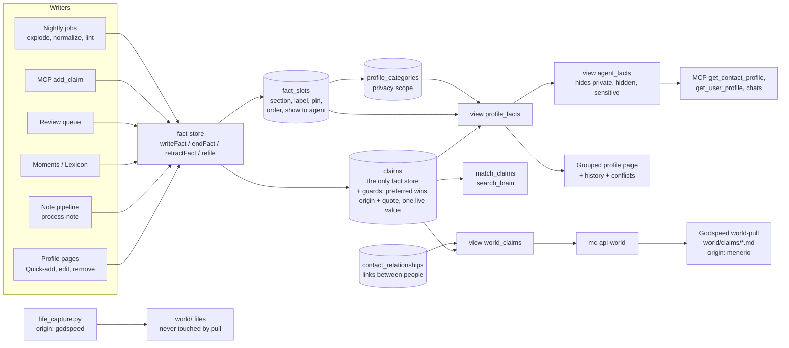

# One fact store: plan

Status: proposal, 2026-09-28. Nothing in this document has been built.
Scope: Menerio (this repo) and the Godspeed `world/` mirror.

How to read the markers:

- **VERIFIED** means I read the code or migration named next to it.
- **UNVERIFIED** means I did not read it, or it depends on production state I cannot see. Every production number is UNVERIFIED unless a query in this document produced it, and none has been run.
- Paths are relative to the repo named in the section. Line numbers are approximate.

---

## 1. Summary for Michael

1. Keep one list of dated facts, `claims`. Every fact about you or a person lives there, once.
2. The grouped profile page becomes a view over those facts. A small table remembers only how each *kind* of fact is shown for a person: its section, its label, whether it is pinned, and whether assistants see it. For example: "Languages → Identity, pinned".
3. Why: today's bridge copies facts back and forth between two lists. It still shows old values as current, rewrites history when you edit, and never shows facts added about you by assistants. It can drift again whenever a background job runs.
4. With one list, a fact cannot appear twice. A new value keeps the old one as "was true until". Assistants, search and Godspeed all read the same thing.
5. Your typed words stay protected. The same rule that guards the profile list today moves onto the facts themselves.
6. Relationships between people stay in their own table. They link two people, and that works well already.
7. Cost: about eight small stages over roughly two to three weeks of work. Each stage ships alone with a backup, a count check and a way back. No fact is deleted until the last stage, and even then it is archived first.
8. Godspeed: the pull becomes a straight copy of the facts, and existing files keep their ids. Its hourly pull needs to learn paging first (see Risk R1).
9. You decide (section 7): what "edit" and "remove" mean by default, whether private sections may leave Menerio for the Godspeed git repo, whether assistants must always quote you, and whether a machine may ever end a fact you typed.
10. Separately, I found a bug that can lose facts today: the tidy-up job deletes rows it then cannot re-insert (Risk R2). It is worth fixing first, whatever you decide here.

---

## 2. Current system map

### 2.1 The three stores

| Store | What it holds | Dates | Embedding | Protection of human words |
|---|---|---|---|---|
| `claims` (migrations `20260811091414`, `20260901090000`, `…094000`, `…098000`) | `subject_type` self/contact/entity, `subject_id`, `attribute`, `value`, `valid_from`/`valid_to`, `confidence`, `cardinality`, `evidence_quote`, `review_by`, `source_type`/`source_id`, `origin` (default `'menerio'`), `embedding` | yes | yes (`match_claims`) | **none**: only the `claims_updated_at` trigger. VERIFIED. |
| `profile_entries` + `profile_categories` | undated `label`/`value`, `category_id`, `contact_id` (NULL = self), `is_pinned`, `show_to_agent`, `rank`, `sort_order`, `linked_note_id`, `origin` (default `'unverified'`), `evidence_quote`, `derived_from_claim_id`. Categories are per subject (`contact_id`) and carry `visibility_scope` ('private' hides the section from agents). | no | no | `world_preferred_wins` and `world_preferred_survives_delete` (`20260816120000`, redefined `20260916120000`). VERIFIED. |
| `contact_relationships` | `source_*`/`target_*` (contact or self), `label`, `custom_label`, `pair_key`, `origin`, `evidence_quote`, `evidence_note_id`, `valid_from`/`valid_to`, `rank`; plus the `relationship_rejections` ledger and `relationship_evidence` | yes | no | the same preferred triggers. VERIFIED. |

Claims have **no foreign key on `subject_id`** (it points at a contact, an entity or nothing) and **no uniqueness constraint** of any kind. VERIFIED.

### 2.2 Triggers on `profile_entries` today (final active set, from migrations)

These come from the edge-case research pass over the migrations. I read the three marked ones myself; the rest are UNVERIFIED against production (see R5).

| Trigger | When | Does |
|---|---|---|
| `trg_a_profile_entries_atomize` | BEFORE INSERT | Splits a multi-fact value into sibling rows (`20260820213200`). |
| `trg_profile_entries_canonicalize` | BEFORE INSERT/UPDATE | Resolves the canonical label. An unknown field goes to the review queue and the row is dropped (`20260816020759`). |
| `trg_profile_entries_preferred_wins` | BEFORE INSERT/UPDATE | A human row becomes `rank='preferred'`. A machine update of a preferred row gets its label and value put back. VERIFIED. |
| `trg_profile_entries_prevent_duplicate_fact` | BEFORE INSERT/UPDATE | Duplicate guard: drops the row by returning NULL (`20260815231856`). |
| `trg_profile_entries_quality_guard` | BEFORE INSERT/UPDATE | Drops empty, "none", or value-equals-label rows (`20260809131242`). |
| `trg_profile_entry_require_origin` | BEFORE INSERT/UPDATE | Origin must be from the allowed list; a new `unverified` row is refused; automated origins need a quote of 10+ characters (`20260928121000`). VERIFIED. |
| `trg_profile_entries_preferred_delete` | BEFORE DELETE | A machine delete of a preferred row is cancelled. |
| `profile_entries_enqueue_normalization`, `trg_profile_entries_mark_audit_dirty` | AFTER any write | Feed cron jobs 4 and 16. |
| `trg_profile_entry_sync_claim` | AFTER UPDATE OF value, label | **Overwrites the linked live claim in place** and clears its embedding (`20260928120000`). VERIFIED. |
| `trg_profile_entry_end_claim` | AFTER DELETE | If this was the last row showing a claim, sets that claim's `valid_to`. VERIFIED. |

Unique indexes: `profile_entries_no_exact_duplicate` and `profile_entries_unique_profile_fact` (`20260724111157`, `20260724181849`).

### 2.3 Writers and readers, and what each becomes

"Fact store" below means the new module `supabase/functions/_shared/fact-store.ts` and its SQL function (section 3.5). "View" means `profile_facts` or `agent_facts` (section 3.3).

**Edge functions and shared modules**

| Caller | Store(s) touched today | What it does today | Target |
|---|---|---|---|
| `normalize-profile/index.ts` `writeProfileEntrySafely` (~214-427); actions `write_profile_entry`, `accept_profile_entry`, `bulk_profile_reviews` | writes entries | Every manual add ("Add a fact", section add, owner suggestions) and every review-queue accept. Runs the canonical label, name guard, skill guard and dedup, then INSERTs. Sets no claim. | Calls `writeFact()`. Keeps its guards (label canonicalization, name guard, blocked labels), now applied before the claim insert. |
| `normalize-profile` `explodeBags` (~598-720), nightly cron job 15 at `40 3 * * *` | deletes and inserts entries | Splits "bag" rows. **Drops `derived_from_claim_id`**, so the end-claim trigger closes the claim, and the pieces are promoted later as new claims. VERIFIED from report; UNVERIFIED line-level. | Operates on claims. Inserts the pieces with the bag's origin, quote, source and `valid_from`, then retracts the bag, all in one transaction. Never touches `rank='preferred'` claims; for those it queues a review suggestion. |
| `normalize-profile` actions `plan`/`backfill`/`apply`/`rollback` → `_shared/profile-normalization.ts` | deletes, updates and inserts entries | The normalizer. Merges duplicates and fixes labels and sections. Its canonical insert and its restore set **no origin** (R2). VERIFIED. | Label and section changes become **slot** edits (no claim change). Merging duplicate values becomes retracting a non-preferred exact duplicate, or a review suggestion. |
| `admin-normalize/index.ts` (cron job 4, `22 */6`) | via `applyNormalization` | Drains normalization jobs. | Same, over claims and slots. Its dirty-marking trigger moves to `claims` and `fact_slots`. |
| `process-note/index.ts` `prepareSuggestionForInsert` (~517-633), `generateProfileSuggestions` (~1341, dedup reads ~1765-1790), relationships (~1957-2185), promote call (~2851-2890) | writes entries (`ai_note`) and relationships; reads entries for dedup; fires `promote-profile-entries` | The note pipeline. | Auto-apply calls `writeFact({origin:'ai_note', evidence_quote, source_type:'note'})`. Dedup reads `profile_facts` (current) plus the rejection ledger. The promote call is removed. Relationships are unchanged. |
| `_shared/moment-profile-extraction.ts` (~261-327, ~487-620); `extract-moment-profile`; `backfill-moment-profile-extraction` | writes entries (`ai_moment`) and relationships | Facts from timeline moments. | `writeFact({origin:'ai_moment', source_type:'moment'})`. |
| `enrich-person-from-lexicon/index.ts` (~188-202, ~660-727) | writes entries (`ai_lexicon`) and relationships | "Enrich from notes & timeline". | `writeFact({origin:'ai_lexicon'})`. `claims.source_type` gains `'lexicon'` (CHECK change). |
| `backfill-profile-extraction/index.ts` | none directly (re-posts notes) | Re-runs the note pipeline. | Unchanged. |
| `classify-profile-fact/index.ts` | none | Returns label, value and section for Quick-add. | Unchanged. |
| `generate-profile-suggestions/index.ts` | reads categories and owner entries | Owner suggestions. | Reads `profile_facts`. |
| `promote-profile-entries/index.ts` + `_shared/promote-entries.ts` + `_shared/adopt-claims.ts` | entries → claims, and claims → entries | The bridge. | **Retired** in stage 7. |
| `profile-audit/index.ts` + RPC `profile_audit_apply_merge` (cron job 16, `50 */6`) | merges entries | Duplicate audit. | Retired. The unique live-value index (section 3.2) makes exact duplicates impossible. Near-duplicates go to the claims lint. |
| `profile-lint/index.ts` (cron job 11, `20 3`) | deletes entries (repair); relationships | Nightly lint. | Claims lint, **report-only** for claims; relationship repair unchanged. Whether the live cron sends `repair:true` is UNVERIFIED. |
| `profile-reconcile/index.ts` (cron job 12, `17 */2`) | moves entries to self, updates and deletes them; relationships | Folds contact duplicates of self. It **orphans those contacts' claims** (reported; UNVERIFIED line-level). | Moves claims and slots to self (`subject_type='self'`, `subject_id=NULL`) in the same transaction. The entry sections are retired. |
| `review-queue-bulk/index.ts` (keep ~282-316, `unknown_profile_field` ~566-625, revert ~738-810) | writes and deletes entries; relationships | Bulk review. | Keep calls `writeFact`. Revert calls `retractFact(claim_id)` (the item's `target_entity_id` now holds a claim id; see stage 4 mapping). |
| `conversation-chat/index.ts` (~113, 240-251) | reads entries (no visibility filter) | Person context in chat. | Reads `agent_facts`, which also closes today's visibility gap. |
| `note-chat/index.ts` (~483), `_shared/read-tools.ts` `loadPersonProfile` (~193-243), chat tool `get_person_profile` | reads entries and relationships (no sensitivity filter) | Person context in chat. | Reads `agent_facts`; relationships are filtered on the contact's visibility. |
| `_shared/read-tools.ts` `search_claims` → `match_claims` | reads claims | Chat search. | Unchanged. It now covers every fact, because every fact is a claim. |
| `_shared/user-profile.ts` `getUserProfile` | reads self entries (ignores `show_to_agent`) | "Who is the user" digest for chats. | Reads `agent_facts` for self, current rows only. |
| `_shared/people-sync-core.ts` / `people-vault.ts` (`github-people-sync`) | reads contact entries (`select *`) | GitHub people vault export. | Reads `profile_facts` (current rows; pinned first). |
| `merge-contacts` → SQL `merge_contacts_atomic` (`20260908120002`) + trigger `contact_merge_move_references` (`20260923170100`) | moves and deletes entries; moves claims; relationships | Contact merge. Deleting a duplicate entry **ends its claim before the claim is moved**, and a merge into self leaves the claims behind (trigger WHEN clause). Reported. | Moves claims and slots itself. Identical live values are folded, keeping the earliest. Merge into self re-points to `subject_type='self'`. The entry part is deleted in stage 7. |
| `delete-my-account`, `admin-delete-user` | none directly | Rely on foreign-key cascades to `auth.users` (`20260916120000` adds them to every public table with `user_id`). | `fact_slots` gets its own `ON DELETE CASCADE`. |
| `mc-api-world/index.ts` + views `world_entities`, `world_events`, `world_claims` (`20260901098000`); `_shared/world-records.ts` `toWorldClaim` | reads the union of all three stores | Godspeed pull endpoint. Filters sensitive contacts only; **no `ai_visibility` filter on claims, and no private-section filter** (VERIFIED, `mc-api-world/index.ts:136-160` and the view SQL). | `world_claims` = claims plus relationships only (section 3.4). Add the `ai_visibility` filter; the private-section filter depends on Q4. |
| `backfill-claim-embeddings/index.ts` | writes claim embeddings | Manual backfill; no cron (reported). | Scheduled every 10 minutes. Skips claims about hidden or sensitive subjects (section 3.6). |

**MCP tools (`supabase/functions/menerio-mcp/index.ts`)**

| Tool | Today | Target |
|---|---|---|
| `add_claim` (~4029-4135, `_shared/claims.ts` `addClaimWithSupersede` ~263-331) | Inserts a claim, then closes the older one (valid_to = UTC today). Evidence quote optional. Origin not set, so it gets `'menerio'`. No value dedup. Loosely creates contacts from names. Never writes entries; the claim reaches the page only through adoption, contacts only. VERIFIED from report; UNVERIFIED line-level. | Calls `writeFact({origin:'mcp'})`. Requires `evidence_quote` (Q7). Same value again is a no-op. Uses the user's day, not UTC. Will not close a `preferred` claim; adds a second live value instead (Q8). Ambiguous names are refused, as in `get_claims`. |
| `get_claims` (~4171-4232) | claims, visibility-filtered | Unchanged, or reads `agent_facts`. |
| `get_contact_profile` (~1913-2037) | curated entries plus live claims, skips entries whose claim was printed (the 09-28 fix). Returns early, without claims, when the contact has no non-private sections (reported). | Reads `agent_facts` for the contact, grouped by section. One source, so no dedup logic. `detail:'curated'` = `show_to_agent`. Shows "two answers" flags and history on request. |
| `get_user_profile` (~2819-3051) | self entries only; **never reads claims** | `agent_facts` for self. Relationships are unchanged (and its self-as-source gap is fixed separately; see R9). |
| `get_contact_context` (~1783-1908), `search_contacts` (~1712-1745) | entries | `agent_facts`. |
| `search_brain` (~3673-3774) → `match_claims` | claims only; unpromoted entries invisible | Unchanged. It now sees every fact. |
| `get_entity_context` (~3957) | entity claims | Unchanged. |

**Frontend**

| File | Today | Target |
|---|---|---|
| `src/hooks/useProfile.ts` (owner page; queries ~89-117, `upsertEntry` ~191, `deleteEntry` ~210) | reads and writes self entries directly. Delete **ends** the claim. | New `useFacts(subject)` over `profile_facts`, with mutations through the RPC `fact_write`/`fact_end`/`fact_retract` and direct slot updates. |
| `src/hooks/useContactProfile.ts` (queries ~51-85, backfill effect ~87-141, adoption effect ~143-167, upsert ~209-253, delete ~255-276) | reads and writes contact entries; runs `promote-profile-entries` on open. Delete **deletes** the claim. | Same `useFacts`. The adoption effect is deleted. |
| `src/components/people/ContactProfileTab.tsx`, `profile/QuickAddFact.tsx`, `profile/CompactCategorySection.tsx`, `profile/PinnedHighlights.tsx`, `src/components/profile/ProfileSections.tsx`, `EntryForm.tsx`, `ExportTab.tsx`, `ProfileCompleteness.tsx` | render entries | Render `profile_facts` rows. The grouping key becomes `slot_id`; each slot gets a "History (n)" disclosure and a "two answers" badge. |
| `src/lib/profile-categories.ts` `ensureProfileCategory` | client insert of a category | Unchanged (categories stay). |
| `src/hooks/useProfileSummary.ts` | counts entries | Counts current `profile_facts`. |
| `src/hooks/useAiFootprint.ts` (~44, 123, 151) | entries by `linked_note_id`; deletes them | Claims where `source_type='note' AND source_id=:note`; "remove" = `fact_retract`. |
| `src/components/people/RelationshipsSection.tsx` (~110, ~153) | reads Gender/Pronouns entries across subjects; writes Gender via `write_profile_entry` | Reads `profile_facts` (attribute `gender`/`pronouns`); writes through `fact_write`. |
| `src/pages/ReviewQueue.tsx` (accept ~229-305, revert ~150-193, `add_claim` ~635-672) | entries via normalize-profile or direct insert; revert deletes the entry | Through `normalize-profile` (now `writeFact`); revert = `fact_retract`. |
| `src/hooks/useClaims.ts`, `src/components/facts/FactsPanel.tsx`, `components/world/EntityDetail.tsx` | claims for entity pages; `useAddClaim` sets no cardinality, origin or embedding | `useAddClaim` is replaced by `fact_write`. `FactsPanel`'s history pattern is reused on person pages. |
| `src/pages/World.tsx`, `src/hooks/useWorld.ts` (~94-110), `src/lib/world-claims.ts` | `world_claims` view | Unchanged API; the view is redefined. `groupClaims` should prefer current rows (reported as not excluding closed claims). |
| `src/lib/query-persister.ts` (`buster: "account-v3"`) | persists query results to IndexedDB for 7 days | Bump the buster when the row shape changes (stage 3). |

**Offline / desktop.** PowerSync syncs **only `notes`**. VERIFIED: `src/sync/schema.ts` defines one table, and publication `powersync` in `20260710120000` lists only `public.notes`. The sync rules live in the PowerSync dashboard (`docs/offline-first.md`). `src-tauri` has no profile code. Nothing in PowerSync changes. The only offline surface is the query persister above.

**Godspeed** (section 6 has the details)

- **What actually runs** is the kit runner `~/.local/bin/mc-notebook-sync`, from the public `teach-it-once-kit`. It calls `tools/notebook-sync.py` (up) and `tools/world-pull.py` (down). VERIFIED: `godspeed-engine/scripts/sync-menerio-run.sh:123-131` `exec`s it; lines 157-229 (the engine's `sync_menerio.py` and `world_pull.py`) are unreachable.
- The kit's `world-pull.py` makes one request with `?limit=2000` and **does not page**. VERIFIED: `tools/world-pull.py:391-392`.
- `life_capture.py` writes `origin: godspeed` atoms and never calls Menerio. The pull never touches those files.
- Nothing pushes facts from Godspeed into Menerio. Notes go up, and `_shared/mc-source.ts` refuses fact extraction from `godspeed` notes (reported).

---

## 3. Target architecture

### 3.1 The rule

**A fact is a claim.** One row in `claims` per value per period, about self, a contact or an entity. Everything else is one of these:

- a **slot**: how one attribute of one subject is displayed;
- a **category**: a section on the page, with its privacy scope;
- a **view**: a way to read the claims.

Relationships between two people stay in `contact_relationships` (section 3.8).

Where each attribute lives:

| Attribute | Lives on | Why |
|---|---|---|
| value, dates, confidence, cardinality, source, evidence quote, embedding | `claims` | They describe one value in one period. |
| "a human typed this" | `claims.origin = 'user_manual'` and `claims.rank = 'preferred'` | It belongs to the words, so it must survive every display change. |
| category (section) | `fact_slots.category_id` | Filing belongs to "Languages for this person", not to one language. A new value inherits it. |
| label (display name) | `fact_slots.label` | Same reason. The attribute key is the stable machine name; the label is how the page says it. |
| pin | `fact_slots.is_pinned` | Per attribute (Q3). |
| sort order | `fact_slots.sort_order` | Per attribute. |
| show to assistants | `fact_slots.show_to_agent` | Per attribute. |
| privacy scope | `profile_categories.visibility_scope` (unchanged) | A private section hides everything filed in it. |

**Why the slot is keyed by attribute and not by claim id.** A display row keyed by claim id (option C as posed) dies with the claim. Every new value (Berlin → London) arrives with no section, no label, no pin and no assistant flag, so something must "adopt" it again. That is today's bridge in miniature. Keyed by `(subject, attribute)`, the new value simply appears where the old one was, pinned if it was pinned.

### 3.2 Schema (draft DDL)

```sql
-- 1. claims gains what profile_entries knew and claims did not.
ALTER TABLE public.claims
  ADD COLUMN IF NOT EXISTS rank text NOT NULL DEFAULT 'normal'
    CHECK (rank IN ('preferred','normal'));
-- source_type gains 'lexicon'; origin becomes checked against the same list profile_entries uses,
-- plus the legacy 'menerio' that 20+ existing claims carry. Nothing is rewritten.
ALTER TABLE public.claims DROP CONSTRAINT IF EXISTS claims_source_type_check;
ALTER TABLE public.claims ADD CONSTRAINT claims_source_type_check
  CHECK (source_type IN ('note','moment','manual','ai','lexicon'));
ALTER TABLE public.claims ADD CONSTRAINT claims_origin_known CHECK (origin IN
  ('user_manual','unverified','menerio','ai_note','ai_moment','ai_lexicon',
   'review_queue','import','mcp','api','normalizer')) NOT VALID;  -- VALIDATE after a count shows 0 violations

-- 2. One live copy of a value per subject and attribute. Closed history rows are exempt.
--    Pre-check (stage 1) must return 0 before this is created.
CREATE UNIQUE INDEX claims_one_live_value ON public.claims
  (user_id, subject_type, coalesce(subject_id, '00000000-0000-0000-0000-000000000000'::uuid),
   attribute, lower(btrim(value)))
  WHERE valid_to IS NULL;

-- 3. How an attribute of a subject is displayed.
CREATE TABLE public.fact_slots (
  id            uuid PRIMARY KEY DEFAULT gen_random_uuid(),
  user_id       uuid NOT NULL DEFAULT auth.uid() REFERENCES auth.users(id) ON DELETE CASCADE,
  subject_type  text NOT NULL CHECK (subject_type IN ('self','contact','entity')),
  subject_id    uuid,
  attribute     text NOT NULL,             -- normalizeAttribute() output, same key as claims.attribute
  label         text NOT NULL,             -- what the page prints, e.g. "Favourite foods"
  category_id   uuid REFERENCES public.profile_categories(id) ON DELETE SET NULL,
  is_pinned     boolean NOT NULL DEFAULT false,
  show_to_agent boolean NOT NULL DEFAULT false,
  sort_order    integer NOT NULL DEFAULT 0,
  created_at    timestamptz NOT NULL DEFAULT now(),
  updated_at    timestamptz NOT NULL DEFAULT now(),
  CONSTRAINT fact_slots_subject_pair CHECK (
    (subject_type = 'self' AND subject_id IS NULL) OR (subject_type <> 'self' AND subject_id IS NOT NULL))
);
CREATE UNIQUE INDEX fact_slots_one_per_attribute ON public.fact_slots
  (user_id, subject_type, coalesce(subject_id, '00000000-0000-0000-0000-000000000000'::uuid), attribute);
CREATE INDEX fact_slots_category ON public.fact_slots (category_id);
-- RLS: the same four owner policies as claims (auth.uid() = user_id). No admin policy (claims has none).
-- A trigger checks that category_id belongs to the same user and subject (contact_id matches
-- subject_id, or is NULL for self). ON DELETE SET NULL on the category means deleting a section
-- no longer deletes facts; they fall back to "Other" (today a category delete cascades to its entries).

-- 4. The permanent lookup from an old profile entry id to the claim that now holds its fact.
CREATE TABLE public.profile_entry_claim_map (
  entry_id  uuid PRIMARY KEY,
  claim_id  uuid NOT NULL,
  user_id   uuid NOT NULL REFERENCES auth.users(id) ON DELETE CASCADE,
  how       text NOT NULL CHECK (how IN ('already_linked','same_id','folded_into','reported_conflict')),
  created_at timestamptz NOT NULL DEFAULT now()
);

-- 5. "This was wrong, do not suggest it again." The claims twin of relationship_rejections.
CREATE TABLE public.claim_rejections (
  id uuid PRIMARY KEY DEFAULT gen_random_uuid(),
  user_id uuid NOT NULL REFERENCES auth.users(id) ON DELETE CASCADE,
  subject_type text NOT NULL, subject_id uuid, attribute text NOT NULL,
  value_key text NOT NULL,            -- lower(btrim(value)), the same key as claims_one_live_value
  reason text, created_at timestamptz NOT NULL DEFAULT now()
);
CREATE UNIQUE INDEX claim_rejections_key ON public.claim_rejections
  (user_id, subject_type, coalesce(subject_id, '00000000-0000-0000-0000-000000000000'::uuid), attribute, value_key);
```

Before stage 1, check whether `ai_suggestion_suppressions` already does what `claim_rejections` would; if it does, reuse it (UNVERIFIED).

### 3.3 The views

```sql
-- Everything the owner may see: the grouped page, history, conflicts.
CREATE VIEW public.profile_facts WITH (security_invoker = on) AS
SELECT
  c.id                AS claim_id,
  c.user_id, c.subject_type, c.subject_id,
  CASE WHEN c.subject_type = 'contact' THEN c.subject_id END AS contact_id,
  c.attribute, c.value, c.valid_from, c.valid_to,
  (c.valid_to IS NULL OR c.valid_to > public.user_today(c.user_id))      AS is_current,
  c.confidence, c.cardinality, c.origin, c.rank, c.evidence_quote,
  c.source_type, c.source_id, c.review_by, c.created_at, c.updated_at,
  s.id                AS slot_id,
  coalesce(s.label, initcap(replace(c.attribute, '-', ' ')))            AS label,
  s.category_id, cat.slug AS category_slug, cat.name AS category_name,
  coalesce(cat.visibility_scope, 'all')                                  AS visibility_scope,
  coalesce(s.is_pinned, false)     AS is_pinned,
  coalesce(s.show_to_agent, false) AS show_to_agent,
  coalesce(s.sort_order, 0)        AS sort_order,
  -- "two live answers": more than one current value on a single-valued attribute
  (count(*) FILTER (WHERE (c.valid_to IS NULL OR c.valid_to > public.user_today(c.user_id))
                      AND c.cardinality = 'one')
     OVER (PARTITION BY c.user_id, c.subject_type, c.subject_id, c.attribute)) > 1 AS has_conflict
FROM public.claims c
LEFT JOIN public.fact_slots s
  ON s.user_id = c.user_id AND s.subject_type = c.subject_type
 AND s.subject_id IS NOT DISTINCT FROM c.subject_id AND s.attribute = c.attribute
LEFT JOIN public.profile_categories cat ON cat.id = s.category_id;

-- What assistants, chats, search and the Godspeed mirror may see.
CREATE VIEW public.agent_facts WITH (security_invoker = on) AS
SELECT f.* FROM public.profile_facts f
WHERE f.visibility_scope <> 'private'
  AND (
    f.subject_type = 'self'
    OR (f.subject_type = 'contact' AND EXISTS (
          SELECT 1 FROM public.contacts ct
           WHERE ct.id = f.subject_id AND ct.user_id = f.user_id AND ct.merged_into IS NULL
             AND ct.is_sensitive IS NOT TRUE AND ct.ai_visibility = 'visible'))
    OR (f.subject_type = 'entity' AND EXISTS (
          SELECT 1 FROM public.entities e
           WHERE e.id = f.subject_id AND e.user_id = f.user_id
             AND coalesce(e.ai_visibility, 'visible') = 'visible'))  -- column name UNVERIFIED
  );
```

Correctness by construction:

- Each claim appears in `profile_facts` exactly once. The join to a slot cannot multiply rows, because a slot is unique per `(subject, attribute)`.
- A claim with no slot still appears, under "Other". Nothing is hidden and nothing is shown twice.
- No sync job can fall behind, because there is nothing to sync.

`user_today()` exists (`20260901096000`). Its cost per row is fine at this scale (hundreds of rows, 3 accounts). If it ever matters, compute `is_current` in the client.

### 3.4 `world_claims`, redefined

```sql
CREATE OR REPLACE VIEW public.world_claims WITH (security_invoker = on) AS
  SELECT c.id, c.user_id, 'claim'::text AS source_table, c.subject_type AS subject_kind, c.subject_id,
         coalesce(cat.slug, 'other') AS category, c.attribute, c.value, NULL::uuid AS object_id,
         c.valid_from, c.valid_to, c.confidence, c.cardinality, c.review_by,
         c.source_type AS source_kind, c.source_id AS source_ref, c.origin, c.rank,
         c.evidence_quote, c.created_at, c.updated_at
    FROM public.claims c
    LEFT JOIN public.fact_slots s ON s.user_id = c.user_id AND s.subject_type = c.subject_type
          AND s.subject_id IS NOT DISTINCT FROM c.subject_id AND s.attribute = c.attribute
    LEFT JOIN public.profile_categories cat ON cat.id = s.category_id
   WHERE coalesce(cat.visibility_scope, 'all') <> 'private'      -- only if Q4 = "exclude"
  UNION ALL
  SELECT r.id, r.user_id, 'contact_relationship', r.source_type, r.source_id, 'relationship',
         'relationship', COALESCE(NULLIF(btrim(r.custom_label), ''), r.label), r.target_id,
         r.valid_from, r.valid_to, 'likely', 'many', NULL::date, NULL::text, NULL::uuid,
         r.origin, r.rank, r.evidence_quote, r.created_at, r.updated_at
    FROM public.contact_relationships r;
```

Same columns as today (VERIFIED against `20260901098000`), so `mc-api-world` and `toWorldClaim` need no shape change. The profile-entry arm is gone. `rank` is now real for claims instead of the hard-coded `'normal'`.

`mc-api-world` `fetchClaims` also gains `ai_visibility` filtering on `subject_id` and `object_id`: contacts and entities that are hidden, on top of today's sensitive list.

### 3.5 One write path

`supabase/functions/_shared/fact-store.ts` is a pure planner plus a thin writer. It is exposed to the browser as the SQL functions `fact_write`, `fact_end`, `fact_retract` and `fact_refile` (SECURITY INVOKER, so RLS applies). It is exposed to edge functions directly.

| Operation | Meaning | Database effect |
|---|---|---|
| `writeFact(subject, label or attribute, value, origin, evidence, source, valid_from?)` | "This is true." | Canonicalize the label (`profile-canonical-schema.ts`), split bags (atomize logic moved from the trigger into TS), refuse rejected values (`claim_rejections`), then ensure a slot exists (placement from `placeClaim` / `classify-profile-fact`). Insert the claim; if the same value is already current, return the existing claim. For `cardinality='one'`: close the older non-preferred value at `valid_from` (or the user's today). **Never close a preferred value from a machine**: insert alongside it, which surfaces as `has_conflict`. |
| `endFact(claim_id, date)` | "No longer true since …" | `valid_to = date`. The row stays as history. |
| `retractFact(claim_id, reason)` | "This was never true / extracted wrongly." | Delete the claim, and add `(subject, attribute, value)` to `claim_rejections` so the note pipeline does not bring it back. |
| `correctFact(claim_id, new_value)` | "Typo." | Update in place. A human only; the words guard (below) forbids it for machines on preferred rows. |
| `refile(slot_id, category_id / label / pin / sort / show_to_agent)` | Display only. | Update `fact_slots`. Machines may re-file; that is what `world/menerio-bridge.md` allows. |

### 3.6 Guards move onto `claims`

| Today on `profile_entries` | Target on `claims` |
|---|---|
| `world_preferred_wins` / `world_preferred_survives_delete` | New `claim_preferred_wins` (BEFORE INSERT/UPDATE) and `claim_preferred_survives_delete` (BEFORE DELETE), same "human = `auth.uid()` IS NOT NULL" test as today. On a machine UPDATE of a preferred claim it puts back `attribute`, `value`, `valid_from` and **`valid_to`**: closing a human's fact is demoting it (Q8). `subject_id` may change (merge is re-filing). Deletes are cancelled unless cascade or owner gone (copy the `20260916120000` exceptions). |
| `profile_entry_require_origin` | `claim_require_origin`: origin in the list, and automated origins (`ai_*`, `mcp`, `api`, `import`, `normalizer`) need `evidence_quote` of 10+ characters. `unverified` and `menerio` are refused on INSERT except inside the migration (`SET LOCAL menerio.fact_migration = 'on'`). Enforced from stage 5, once `add_claim` sends quotes. |
| `profile_entry_quality_guard` | `claim_quality_guard`: **raises** a named error instead of silently returning NULL. Silent drops are why `promote-profile-entries` needed its "a guard trigger dropped the row" checks. |
| duplicate guard + two unique indexes | `claims_one_live_value` unique index + `writeFact` returning the existing row. |
| canonicalize, atomize | In `writeFact` (TS). One implementation, tested, with visible results. |
| enqueue normalization, mark audit dirty | Re-attach to `claims` and `fact_slots` (normalization only; audit is retired). |
| `profile_entry_sync_claim`, `profile_entry_end_claim` | Dropped in stage 7. |

**Embeddings and privacy.** Today a hidden contact's facts are never embedded, because entries have no embedding and promotion refuses those contacts (`_shared/promote-entries.ts:195-199`, VERIFIED). Embedding sends the text to the embedding provider. So in the target:

- Claims whose subject is sensitive or hidden keep `embedding = NULL`.
- `backfill-claim-embeddings` skips them.
- When a contact becomes visible, the backfill embeds their claims.
- When a contact becomes hidden, a trigger on `contacts` sets their claims' embeddings to NULL.

`match_claims` already filters these contacts at query time (`20260901099000`, VERIFIED); this adds the write-time half.

### 3.7 UI behaviour

- **Grouped list.** `profile_facts WHERE is_current` for the subject. Grouped by `category_slug` in taxonomy order, then by `slot_id`. Several current values under one slot display as one line ("Languages: German, English"), exactly as `groupEntriesByLabel` does today.
- **Add a fact.** Quick-add is unchanged up to the chip (`classify-profile-fact`). Saving calls `fact_write` with `origin='user_manual'`. The slot is created in the chosen section if it is new. The claim exists immediately, embedded asynchronously.
- **Edit.** The pencil offers two actions (Q1):
  - "It changed": `writeFact` with a `valid_from` date; the old value becomes history.
  - "Fix a mistake": `correctFact`.
  - The label and section are edited on the slot (today the label is read-only, and there is no way to move a fact to another section).
- **Remove.** Two actions (Q2):
  - "No longer true": `endFact`.
  - "Was wrong": `retractFact`.
  - Owner and contact pages behave the same (today they differ; VERIFIED in `useContactProfile.ts` and reported for `useProfile.ts`).
- **History.** Each slot has "History (n)" listing closed claims: "Berlin, until 2026-03-01". This is `FactsPanel`'s pattern, which today only entity pages have.
- **Multi-value facts.** `cardinality='many'` (from `attribute_rules`) allows several current values, with no conflict.
- **Two live answers.** `has_conflict` shows a badge with "Keep this one" (ends the other) and "Both are true" (sets `cardinality='many'` on the slot's attribute for this subject, via the claims' `cardinality`).

### 3.8 Relationships stay separate

They are links between two subjects, with a direction and an inverse (`pair_key`), a rejection ledger, an adjudication judge, and their own card and graph uses. Claims have no object column. Folding relationships in would mean:

- adding `object_type`/`object_id` to claims;
- porting `relationship_pair_key`, the inverse labels, the rejection guard and the dedup guard;
- rewriting `RelationshipsSection`, the review-queue relationship paths, `profile-lint`/`profile-reconcile` repair, and `world_claims`' relationship arm.

In exchange it would gain nothing that is broken today. Relationships already have dates, origin, rank and evidence, and they never duplicated into claims: `add_claim` refuses the reserved attributes and adoption skips them (VERIFIED, `adopt-claims.ts`).

The only overlap is text entries in the "Relationships & Family" section (e.g. a wedding date, or "married"). Those are facts about one person and become claims like any other. They are **not** converted into links automatically (Q11), because turning a name into a contact link is a judgment.

### 3.9 Self

Self uses the same model: `subject_type='self'`, `subject_id NULL`, with categories where `contact_id IS NULL`. This fixes today's gap: a self fact written by `add_claim` never reaches the Profile page or `get_user_profile` (VERIFIED: `adopt-claims.ts` skips non-contact claims; `get_user_profile` reads entries only).

### 3.10 Data flow



---

## 4. Options compared

Scale for all options: about 172 contact entries and 210 live contact claims on 2026-09-28, plus self rows (count UNVERIFIED), across 3 accounts. Performance is not a deciding factor for any option.

### (A) Keep two stores with the 09-28 bridge

Concrete failures I can point to in the code today:

1. **A superseded value keeps showing as current.**
   - `add_claim` closes the old claim (`valid_to`) and inserts the new one.
   - `planAdoptions` adopts the new claim as a new row.
   - The old row still points at the closed claim, and the page never looks at `valid_to` (VERIFIED: `useContactProfile.ts` selects `*` from `profile_entries` with no claim join).
   - The page shows "Berlin" and "London" side by side.
   - `get_contact_profile` prints London as a dated fact and Berlin as an undated row, because Berlin's claim is not among the printed live claims (VERIFIED in the `fd713da` diff).
2. **Editing rewrites history.** `profile_entry_sync_claim` overwrites the live claim's value in place (VERIFIED). "Was true until" is lost for every edit made on the page.
3. **Self is left out.** Adoption is contact-only (`adopt-claims.ts`, `subject_type !== "contact"` → skip; VERIFIED). A fact about you written by an assistant never reaches your Profile page or `get_user_profile`.
4. **The nightly bag split churns ids.**
   - `explodeBags` drops `derived_from_claim_id` (reported), so the claim is ended and the pieces are re-promoted as new claims.
   - Godspeed sees deletions and new files every time. `world_pull.py`'s `still_carried` logic exists to paper over exactly this.
5. **Silent guard drops.**
   - An adopted row can be dropped by a BEFORE trigger. `promote-profile-entries` records "a guard trigger dropped the row" only in its JSON response, which no caller reads.
   - The claim stays live for agents and invisible on the page.
6. **Hidden and sensitive contacts can never converge.** Their entries are refused promotion by design, so for them there are permanently two stores.
7. **Deleting behaves differently per page.** The contact page deletes the claim; the owner page only ends it.
8. **Two writers per fact.** Entries write down into claims (promote) and claims write up into entries (adopt). The label ↔ attribute mapping is lossy in both directions (`canonicalProfileLabel` vs `normalizeAttribute`). It stays correct only while every job runs in the right order.

Scored against the criteria:

- MCP readers: see different things depending on the tool.
- Godspeed: three arms and id churn.
- Guards: human-words protection only on entries.
- Search: misses every unpromoted entry.
- Effort: zero now, recurring forever.

**Not recommended.**

### (B) Claims only; the grouped list is a pure view, with display columns on `claims`

Correctness is good: no second store. The failure is where the display settings live.

- Pin, section, label, order and show-to-assistants sit on each value.
- When a new value supersedes an old one, the new claim starts unpinned, in the fallback section, hidden from assistants, unless every writer copies them forward.
- Every writer includes `add_claim`, the note pipeline and nightly jobs, so the settings will be forgotten somewhere.
- History rows carry stale display settings.
- A multi-value attribute can have half its values pinned.

**Concrete failure:** pin "Location", let an assistant record a move, and the pin is gone.

Effort is similar to E.

### (C) Claims plus a thin display table keyed by claim id

This is the same as B with the columns moved out, and it has the same failure. A new claim has no display row until something "adopts" it; that something is today's adoption job. A missed adoption means the fact lands in "Other" (if the view left-joins) or disappears (if it inner-joins). **Not recommended in this shape.**

### (D) `profile_entries` only; drop claims

This loses:

- dates, history and supersede;
- cardinality and review dates;
- evidence-backed embeddings: `search_brain` and chat search run on `match_claims`, and entries have no embedding;
- entity facts (`subject_type='entity'`), which have no home in `profile_entries`;
- `add_claim`/`get_claims`/`get_entity_context`;
- the dated Godspeed atoms: 310 pulled claim files carry `valid_from`/`review_by`.

It contradicts the direction set in `20260901093000`. **Concrete failure:** "where did Michael live in 2025" becomes unanswerable. **Rejected.**

### (E) Claims plus a display table keyed by `(subject, attribute)`: **recommended**

This is option C, with the display row attached to the attribute, not to the value. It is what section 3 describes.

| Criterion | E |
|---|---|
| Duplicates / drift | Impossible by construction: one row per claim in the view, and a unique live value per slot. No sync jobs. |
| What assistants read | `agent_facts`: one source, dated, with conflicts flagged. `show_to_agent` and private sections are honoured everywhere, which is not true today (`getUserProfile`, `loadPersonProfile` and `conversation-chat` ignore them). |
| Godspeed | `world_claims` becomes claims plus relationships: a one-to-one copy. Migrated entries keep their id (stage 2), so no file is deleted. |
| History and dates | Every change is a new row. "Was true until" is visible on every profile. |
| Guards and human words | Moved onto `claims` (section 3.6), and made loud instead of silent. |
| Search | Every fact is embedded, except hidden or sensitive subjects. Today unpromoted entries are invisible to `search_brain`. |
| Privacy | One visibility view (`agent_facts`), write-time embedding exclusion, and `mc-api-world` gains the missing `ai_visibility` filter. |
| Migration risk | Medium. About 30 writer call sites move to one module. The data move is small (hundreds of rows) and additive until stage 7. |
| Failure it can still cause | A new attribute written with no slot shows under "Other" until it is filed. That is visible and harmless; the nightly job files it. |

### (F) Considered and dropped: an event log with claims as a projection

It would give perfect audit history, but it is heavy machinery for hundreds of rows, and claims with `valid_from`/`valid_to` already are the history. Not worth it.

---

## 5. Implementation plan

**Ground rules for every stage:**

- **Migrations.** One file per change in `supabase/migrations/`, with a matching `supabase/rollback/<name>_rollback.sql`. Apply one file at a time through the Supabase management API, and record it by hand: `INSERT INTO supabase_migrations.schema_migrations (version, name, statements) VALUES (...)`. Never use `supabase db push`.
- **Edge functions** are deployed separately, per function, after the migration they need.
- **Pushing to `main`** only rebuilds the frontend preview. Each stage names its frontend part.
- **Backups.** Every stage that moves or deletes data first snapshots the affected tables into schema `fact_backup_<stage>` (`CREATE TABLE fact_backup_s2.claims AS TABLE public.claims;` and likewise for each table). That schema is not exposed to PostgREST. The same rows are also exported as CSV through the management API and kept outside the database.
- **Counts.** Every data move has a "before" and an "after" query, and each named equality must hold before the stage is called done. If an equality fails, run the rollback.
- **Crons.** Pause the profile crons during stages 2-4 (`cron.alter_job(<id>, active := false)` for jobs 4, 11, 12, 15 and 16; the ids are in `docs/CRON_JOBS.md`, and must be confirmed live first).

### Stage 0: Baseline, and fix what can already lose data

**Goal:** know the exact starting numbers. Capture the production-only definitions. Remove the two hazards that would corrupt a migration.

**Touches:**
- `_shared/profile-normalization.ts` and `normalize-profile/index.ts` (R2 fix);
- the kit's `tools/world-pull.py` (R1 fix, in the Godspeed kit repo);
- new `docs/plans/one-fact-store-baseline.md` (results).

**Steps:**
1. **Dump the live trigger and function definitions** into the baseline doc:
   ```sql
   SELECT tgrelid::regclass, tgname, pg_get_triggerdef(t.oid)
     FROM pg_trigger t
    WHERE NOT tgisinternal AND tgrelid IN ('public.profile_entries'::regclass,
          'public.claims'::regclass,'public.contact_relationships'::regclass,'public.profile_categories'::regclass);
   SELECT p.proname, pg_get_functiondef(p.oid) FROM pg_proc p JOIN pg_namespace n ON n.oid=p.pronamespace
    WHERE n.nspname='public' AND (p.proname LIKE 'profile%' OR p.proname LIKE 'world_%' OR p.proname LIKE 'claim%'
          OR p.proname LIKE 'relationship%' OR p.proname = 'merge_contacts_atomic');
   SELECT jobid, jobname, schedule, command, active FROM cron.job;
   ```
   Why: `profile_dedup_sweep` and `profile_subset_label_sweep` exist live but in no migration (reported from `20260923190000`), and the cron bodies are live-only.
2. **Baseline counts** (all saved to the baseline doc):
   ```sql
   -- B1 entries by subject and link state
   SELECT contact_id IS NULL AS is_self, derived_from_claim_id IS NOT NULL AS linked, count(*)
     FROM profile_entries GROUP BY 1,2;
   -- B2 claims by subject, liveness and origin
   SELECT subject_type, valid_to IS NULL AS live, origin, count(*) FROM claims GROUP BY 1,2,3;
   -- B3 linked entries whose words differ from their claim
   SELECT count(*) FROM profile_entries p JOIN claims c ON c.id = p.derived_from_claim_id
    WHERE lower(btrim(p.value)) <> lower(btrim(c.value));
   -- B4 entries shown as current but linked to a closed claim
   SELECT count(*) FROM profile_entries p JOIN claims c ON c.id = p.derived_from_claim_id
    WHERE c.valid_to IS NOT NULL;
   -- B5 claims shown by more than one entry
   SELECT count(*) FROM (SELECT derived_from_claim_id FROM profile_entries
    WHERE derived_from_claim_id IS NOT NULL GROUP BY 1 HAVING count(*) > 1) x;
   -- B6 live claims shown by no entry (contact and self)
   SELECT c.subject_type, count(*) FROM claims c
    WHERE c.valid_to IS NULL AND NOT EXISTS (SELECT 1 FROM profile_entries p WHERE p.derived_from_claim_id = c.id)
    GROUP BY 1;
   -- B7 entries of hidden or sensitive contacts
   SELECT count(*) FROM profile_entries p JOIN contacts ct ON ct.id = p.contact_id
    WHERE ct.is_sensitive OR ct.ai_visibility <> 'visible';
   -- B8 duplicate live values that would break claims_one_live_value
   SELECT count(*) FROM (SELECT user_id, subject_type, subject_id, attribute, lower(btrim(value))
     FROM claims WHERE valid_to IS NULL GROUP BY 1,2,3,4,5 HAVING count(*) > 1) x;
   -- B9 world_claims by arm, and review_queue pending items by type
   SELECT source_table, count(*) FROM world_claims GROUP BY 1;
   SELECT type, status, count(*) FROM review_queue
    WHERE status IN ('pending','pending_review','auto_applied_unreviewed') GROUP BY 1,2;
   -- B10 relationships, entries in private sections, claims orphaned by deleted/merged contacts
   SELECT count(*) FROM contact_relationships;
   SELECT count(*) FROM profile_entries p JOIN profile_categories k ON k.id = p.category_id
    WHERE k.visibility_scope = 'private';
   SELECT count(*) FROM claims c WHERE c.subject_type = 'contact' AND NOT EXISTS
     (SELECT 1 FROM contacts ct WHERE ct.id = c.subject_id AND ct.merged_into IS NULL);
   ```
   Column names `review_queue.type` and `.status` are UNVERIFIED.
3. **R2 fix.** The normalizer and `explodeBags` carry `origin`, `evidence_quote`, `is_pinned`, `rank`, `show_to_agent` and `derived_from_claim_id` through every insert and restore. They insert before they delete. They never write a row without an honest origin.
4. **R1 fix.** The kit's `world-pull.py` pages exactly like the engine's (`limit` + `offset`, `IncompleteAnswer` on a short or missing answer), or is replaced by the engine version.

**Tests:**
- Vitest in `supabase/functions/_shared/__tests__/profile-normalization-origin.test.ts`: the no-survivor path inserts with an origin; a failed insert restores every original column.
- Kit: a paging test with 2 pages.

**Verify live:**
- Run one normalization on a test contact of the test account and check the row counts before and after.
- Run the kit pull with `--dry-run`: the removal list must be empty.

**Rollback:** redeploy the previous function versions (the git SHAs are recorded in the baseline doc).

### Stage 1: Additive schema (no data moves)

**Goal:** the new tables, columns, views and guards exist and are harmless.

**Touches:** migrations (each with a rollback file):
- `20261001120000_claims_gain_rank_and_checks.sql`: `rank`; the `source_type` CHECK; `origin` CHECK `NOT VALID`.
- `20261001121000_fact_slots.sql`: table, indexes, RLS, the category-subject check trigger, updated_at trigger.
- `20261001122000_profile_entry_claim_map_and_rejections.sql`.
- `20261001123000_profile_facts_views.sql`: `profile_facts` and `agent_facts`; `GRANT SELECT` to authenticated and service_role.
- `20261001124000_claim_guards.sql`: `claim_preferred_wins`, `claim_preferred_survives_delete` and `claim_quality_guard`.
  - All three are active from day one. No current writer updates a preferred claim, because no claim is preferred yet; `claims.rank` defaults to `'normal'`.
  - `claim_require_origin` is created but **not attached** until stage 5.
- `20261001125000_claims_one_live_value.sql`: only when B8 = 0. If B8 > 0, list those rows for Michael first; they are true duplicates of one value, and folding them is a stage 2 step.

**Data migration:** none.
- Counts: `claims` and `profile_entries` totals must be the same before and after.
- `fact_slots` must be 0.

**Tests:** a SQL test harness modelled on `scripts/test-merge-review.mjs` + `bootstrap-merge-review-test.sql`, as new `scripts/test-fact-store.mjs` + `scripts/bootstrap-fact-store-test.sql`. It proves:
- a machine update of a preferred claim keeps its value and `valid_to`;
- a machine delete of a preferred claim is cancelled;
- a human update passes;
- the quality guard raises;
- the unique live index allows the same value once live and again as history;
- `profile_facts` returns exactly one row per claim;
- `agent_facts` hides private, hidden and sensitive rows.

**Verify live:**
- `SELECT count(*) FROM profile_facts` = `SELECT count(*) FROM claims` (for each user).
- `agent_facts` ⊆ `profile_facts`.

**Rollback:** the rollback files drop the views, then the tables, then the triggers, then the columns and constraints, in reverse order. No data exists in them yet.

### Stage 2: Backfill: every entry becomes a claim with a slot (additive)

**Goal:** `claims` + `fact_slots` hold every fact and every display setting that `profile_entries` holds. Nothing is deleted.

**Touches:** `20261002120000_backfill_claims_from_entries.sql`. It is a single transaction that runs `SET LOCAL menerio.fact_migration = 'on'` and does the following:

1. **Snapshot** into `fact_backup_s2`: `profile_entries`, `profile_categories`, `claims`, `review_queue`.
2. **Already linked entries** (the ~169 contact entries, plus self; UNVERIFIED):
   - If the words match the claim (B3 complement): map with `how='already_linked'`.
   - If they differ (B3): the entry's words are what you saw on the page, so insert a new claim **with `id = entry.id`**, carrying the entry's words, origin and rank, `valid_from NULL`. Map with `how='reported_conflict'`. The old claim stays. The two show as "two answers" for you to settle. Nothing is overwritten.
   - Entries linked to a **closed** claim (B4) are mapped `already_linked` and will show in history, not in the current list. They are listed for you in the stage report.
3. **Unlinked entries:** insert a claim with **`id = entry.id`**:
   - `subject_type` / `subject_id` from `contact_id` (NULL → self);
   - `attribute = normalize(label)`; reserved attributes (`relationship…`) become `relationship-note`, and the label keeps its words;
   - `value` verbatim (bags included; the migration does not split anything);
   - `valid_from NULL` (Q6) and `created_at = entry.created_at`;
   - `confidence 'likely'`; `cardinality` from `attribute_rules`, else `'one'`;
   - `origin`, `rank` and `evidence_quote` copied;
   - `source_type = 'note'` / `source_id = linked_note_id` when linked, else `'manual'` for `user_manual`, else `'ai'`.
   
   Hidden or sensitive contacts are included; their embedding stays NULL.
   
   Map with `how='same_id'`, or `folded_into` when an identical current value for the same subject and attribute already exists. The earliest claim is kept, and the entry maps to it.
4. **Slots:** one per `(subject, attribute)` from the entries that map to it:
   - `label` = the label of the preferred row, else the most frequent one;
   - `category_id` = that row's category;
   - `is_pinned` = any pinned; `show_to_agent` = any; `sort_order` = min.

   Live contact and self claims with no entry (B6) get slots through `placeClaim`. Its category logic lives in TS, so this part runs as a one-off script (`scripts/backfill-fact-slots.ts`) through the service role, **after** the SQL part, in dry-run first.

**Counts that must hold after stage 2:**
- `count(profile_entry_claim_map)` = `count(profile_entries)` (B1 total).
- Every entry maps to a claim that exists (`LEFT JOIN claims … WHERE claims.id IS NULL` = 0).
- `claims_after` = `claims_before` + (new `same_id` rows) + (new `reported_conflict` rows).
- For every subject, the set of `(label, lower(value))` currently on the old page (entries whose claim is not closed) equals the set of current rows in `profile_facts`. Run this as a SQL `EXCEPT` both ways, which must return 0 rows. The only allowed differences are the B4 rows, listed by id.
- `count(DISTINCT slot per subject, attribute in profile_facts)` = `count(fact_slots)`.
- Every live claim has a slot (0 unslotted), except entity claims.

**Keeping it complete until writers move (stage 4):**
- Add a temporary AFTER INSERT trigger `profile_entry_mirror_to_claim` on `profile_entries`. It does steps 3-4 for each new entry synchronously, with `id` reuse, and writes the map row.
- The existing `sync_claim`/`end_claim` triggers keep edits and deletes flowing.
- The one known history loss (in-place edit) continues until stage 4. That is accepted for the transition; the entry's old words are in `fact_backup_s2`.
- `promote-profile-entries` stays deployed but becomes a no-op for mapped entries.

**Tests:**
- SQL harness cases: linked equal, linked different, linked-to-closed, unlinked, folded, hidden contact, self, reserved label, bag value; each mapped exactly once.
- Vitest for `scripts/backfill-fact-slots.ts` placement.

**Verify live:**
- The counts above.
- Open three contacts and your profile; the page still reads entries, so nothing visible changes.
- `SELECT … FROM profile_facts WHERE subject_id = :someone AND is_current` matches the page by eye.

**Rollback:** `20261002120000_…_rollback.sql`:
1. Drop the mirror trigger.
2. Delete claims whose id is in the map with `how IN ('same_id','reported_conflict')`.
3. Delete all `fact_slots` and all map rows.

The rollback has its own verification: after it, `claims` must equal `fact_backup_s2.claims` (`EXCEPT` both ways = 0).

### Stage 3: Readers switch to the views

**Goal:** the page, assistants and chats read `profile_facts` / `agent_facts`. Writers still write entries, which the mirror trigger forwards.

**Touches:**
- **Frontend:**
  - new `src/hooks/useFacts.ts`;
  - `useProfile.ts` and `useContactProfile.ts` (reads only; the adoption effect is removed);
  - `ProfileSections.tsx`, `CompactCategorySection.tsx`, `PinnedHighlights.tsx`, `ExportTab.tsx`, `useProfileSummary.ts`, `useAiFootprint.ts` (read), `RelationshipsSection.tsx` (read);
  - a history disclosure and a conflict badge;
  - `query-persister.ts` buster → `"account-v4"`;
  - behind a flag in `src/lib/flags.ts` (`facts-view`), default on after one day.
- **MCP (`menerio-mcp/index.ts`):** `get_contact_profile`, `get_user_profile`, `get_contact_context`, `search_contacts`.
- **Shared:** `_shared/read-tools.ts` `loadPersonProfile`, `_shared/user-profile.ts`, `conversation-chat/index.ts`, `_shared/people-sync-core.ts`, `generate-profile-suggestions`.
- **Types:** regenerate `src/integrations/supabase/types.ts` to include `fact_slots`, `profile_facts`, `agent_facts` and the RPCs.

**Data migration:** none.

**Tests:**
- `src/hooks/__tests__/useFacts.test.tsx`: grouping, history and conflict.
- Update `useContactProfile.test.tsx`, `CompactCategorySection.test.tsx`, `people-vault.test.ts`, `useAiFootprint.test.ts`.
- A Deno/Vitest test for the MCP profile formatters from fixture rows, asserting each fact prints once and hidden or private rows never print.

**Verify live:**
- A script `scripts/compare-profile-readers.ts` calls, for each subject, the old formatter (entries) and the new one (view). It diffs the printed `(label, value)` sets; the only allowed differences are the B4 list and the new history lines.
- Run `get_contact_profile` for three contacts and `get_user_profile` through MCP, and compare with the page.

**Rollback:** flip the flag off (frontend), and redeploy the previous function versions. No data changed.

### Stage 4: Writers switch to the fact store

**Goal:** nothing writes `profile_entries` any more.

**Touches:**
- **New:**
  - `_shared/fact-store.ts` (pure planner + writer);
  - migration `20261006120000_fact_write_functions.sql`, with the SQL functions `fact_write`, `fact_end`, `fact_retract`, `fact_correct` and `fact_refile` (SECURITY INVOKER, for the browser).
- **Callers moved:**
  - `normalize-profile` (write, accept, bulk, explode, apply, rollback);
  - `_shared/profile-normalization.ts`;
  - `process-note`, including removing the promote call and reading the rejection ledger in dedup;
  - `_shared/moment-profile-extraction.ts`;
  - `enrich-person-from-lexicon`;
  - `review-queue-bulk`;
  - `admin-normalize`;
  - `profile-lint` (report-only for facts);
  - `profile-reconcile` (the self fold moves claims and slots);
  - `merge_contacts_atomic` (new migration `20261006121000_merge_moves_claims_and_slots.sql`, which also fixes merge-into-self);
  - `menerio-mcp` `add_claim` (fact store; origin `mcp`; UTC → user day);
  - frontend mutations in `useFacts.ts`, `ReviewQueue.tsx`, `useAiFootprint.ts` and `RelationshipsSection.tsx`;
  - `useClaims.useAddClaim` → `fact_write`.
- **Review queue:** pending `add_profile_entry` items carry their fact in the payload and work unchanged. Rows with `target_entity_id` pointing at an entry are rewritten to the mapped claim id (the map exists for this).
  - Pending `normalize_profile_entry` items reference entry ids and a before-state that will no longer apply. They are set to `status='superseded'` and regenerated from facts by the next normalization run.
  - Counts: pending items per type before = after + superseded.

**Freeze entries:** migration `20261006122000_profile_entries_read_only.sql`:
- revoke `INSERT`, `UPDATE`, `DELETE` on `profile_entries` from authenticated;
- add a BEFORE trigger that raises `profile_entries_is_read_only: write facts through fact_write` for the service role too.

That makes a stale browser tab, an old PWA bundle, or a forgotten edge function fail loudly instead of writing to a dead table. Drop the stage 2 mirror trigger in the same file.

**Data migration:**
- The superseded review items (counted).
- Entries written between stage 2 and now are already mirrored. Check: `count(profile_entries)` = `count(profile_entry_claim_map)`.

**Tests:**
- `_shared/__tests__/fact-store.test.ts`:
  - supersede closes a non-preferred single value;
  - never closes a preferred one (a conflict instead);
  - same value is a no-op;
  - many-valued attributes add;
  - a rejected value is refused;
  - bag splitting;
  - origin and quote rules.
- Update `normalization-callers.test.ts`, `profile-normalization-spend.test.ts`, `promote-entries.test.ts` (deleted in stage 7) and `profile-insert-suppression.test.ts`.
- SQL harness: merge moves claims and slots; merge into self moves claims to self.
- A grep test (`scripts/check-no-profile-entry-writes.mjs`, wired into `npm test`) that fails if any file outside `supabase/migrations`/`supabase/rollback` contains `.from("profile_entries").insert|update|delete|upsert`.

**Verify live:**
- Add, edit ("changed" and "typo"), end, retract, pin and move a fact on a test contact.
- Each produces exactly the expected `claims` / `fact_slots` rows, and `profile_entries` is unchanged (count stays the same for 24 hours).
- Process one test note: its facts arrive as claims with `origin='ai_note'` and a quote.

**Rollback:** `20261006122000_…_rollback.sql` restores the grants, drops the read-only trigger and restores the mirror trigger. Then redeploy the previous functions. Facts written through the fact store during the window stay in `claims`; the rollback adds a reverse mirror (claims → entries, with `derived_from_claim_id`) so the old page shows them. This is the only messy rollback, so hold stage 4 for 48 hours before stage 5.

### Stage 5: Enforce the rules on claims; move the nightly jobs back on

**Goal:** the origin-and-quote rule and the human-words rule hold on the only fact store; the crons run again.

**Touches:**
- migration `20261009120000_claims_require_origin.sql`: attach `claim_require_origin`, and `VALIDATE CONSTRAINT claims_origin_known` after a count of violations = 0;
- `add_claim` requires `evidence_quote` (Q7) and its tool description says why;
- re-enable cron jobs 4, 11 and 15; retire 16 (audit) and the entry sections of 12;
- add a cron for `backfill-claim-embeddings` (every 10 minutes, `x-cron-key via call_edge`);
- `docs/CRON_JOBS.md` update.

**Data migration:** none. Counts: `SELECT count(*) FROM claims WHERE <origin rule violated>` must be 0 for rows created after stage 4. Legacy rows are exempt, because the trigger checks INSERT and machine UPDATE only.

**Tests:**
- SQL harness: an automated insert without a quote raises; `user_manual` without a quote passes; `unverified` insert raises outside the migration flag.
- Vitest: `add_claim` refuses without a quote.

**Verify live:**
- A nightly run's report: bags split with pieces carrying the source quote; no preferred claim changed (`updated_at` of preferred claims unchanged, apart from embedding updates).

**Rollback:** detach the trigger (rollback file); re-pause crons.

### Stage 6: Godspeed mirror goes one-to-one

**Goal:** `world_claims` = claims + relationships, with the privacy filters; Godspeed files unchanged in identity.

**Touches:**
- migration `20261012120000_world_claims_is_claims.sql` (section 3.4), with a rollback restoring `20260901098000`'s text;
- `mc-api-world/index.ts` (`ai_visibility` filter);
- `_shared/world-records.ts` (pass `rank` and `category` through; tests in `world-records.test.ts`, `mc-visibility.test.ts`);
- the Godspeed changes in section 6.

**Data migration:** none in Menerio. In Godspeed, the files rewrite in place.

**Counts:**
- Before: `SELECT source_table, count(*) FROM world_claims` (B9).
- After: `claim` rows = `count(claims)` (minus private, if Q4 = exclude); `profile_entry` rows = 0; `contact_relationship` rows unchanged.
- The dry-run pull must show:
  - **removals = 0**, or exactly the private-section rows if Q4 = exclude, listed by id beforehand;
  - new files = claims that were never mirrored before (B6-type rows, and the `reported_conflict` rows).

**Tests:** engine `scripts/tests/test_world_pull.py` gains cases for a claim that used to be an entry (same id, now dated fields); `rank: preferred` on a claim; a `category` line.

**Verify live:**
- Run the kit pull with `--dry-run` and read the plan.
- Then `--apply` and `git diff --stat world/claims`: only modifications (plus the expected new files), and no deletions.

**Rollback:**
- Rollback migration restores the previous view.
- The pull re-applies from it.
- The mass-removal guard (the engine's `>20 and >half` rule) protects against a bad intermediate state. The kit version must have the same guard (R1).

### Stage 7: Retire the old store

**Goal:** one store in code and schema.

**Touches:**
- delete `supabase/functions/promote-profile-entries/`, `_shared/promote-entries.ts`, `_shared/adopt-claims.ts` and their tests;
- remove `profile-audit` and its cron and RPCs, if Q9 = retire;
- migration `20261020120000_retire_profile_entries.sql`:
  - drop the bridge triggers and every entry trigger;
  - `ALTER TABLE profile_entries RENAME TO profile_entries_archive`;
  - revoke all from authenticated;
  - keep `profile_entry_claim_map`.
- regenerate `types.ts`;
- update `docs/DATA_MODEL.md`.

Dropping the archive is a separate migration after the retention period (Q10), preceded by a CSV export.

**Counts:**
- `count(profile_entries_archive)` = B1 total + entries written between stage 0 and 4. This must equal `count(profile_entry_claim_map)`.
- Every map row's claim exists or was retracted on purpose. Check against `claim_rejections` + the stage logs.

**Tests:**
- `npm test` passes with the deleted modules gone.
- The grep test from stage 4 now also fails on any `profile_entries` read.

**Verify live:**
- A week of normal use with no `profile_entries_is_read_only` errors in the logs before this stage.

**Rollback:** rename back and restore triggers from the stage 1-4 migrations (the rollback file holds the text). Code rollback is a revert of the stage 7 commit.

### Effort (rough)

| Stage | Effort |
|---|---|
| 0 | 1 day |
| 1 | 1 day |
| 2 | 1-2 days (the verification queries are most of it) |
| 3 | 2-3 days |
| 4 | 3-4 days (about 30 call sites) |
| 5 | 1 day |
| 6 | 1 day + Godspeed |
| 7 | half a day |

Total: roughly two to three weeks of focused work.

---

## 6. Godspeed changes

Paths below are in the Godspeed engine repo (`MichaelZelbel/godspeed-engine`, mounted as `dev/godspeed-engine/` and gitignored in `godspeed`), the kit (`teach-it-once-kit`, **public**), and `godspeed` itself.

1. **Which pull to change.** The kit's `tools/world-pull.py` is what runs every hour (VERIFIED, section 2.3). Change it, or make the kit call the engine's `scripts/world_pull.py`, which is better tested (68 tests, reported). Recommended: one implementation. The kit runner should call the engine version when it is present, and the kit copy should be brought up to it (paging, empty-answer guard, atomic writes, duplicate ranking). Until that is done, stage 6 must not ship (R1).
2. **`world_pull.py` / `world-pull.py`:**
   - `render_claim`: remove the "a profile entry has no dates at all" special case (engine ~178-181). Undated claims still render as `--undated` because `valid_from` is NULL; nothing else changes.
   - Write `category:` when present (new line, optional). It is display filing, useful for `world/INDEX.md` grouping.
   - Write `rank:` for claims as sent; today claims always arrive `normal`.
   - Keep the `still_carried` removal-notice logic until a month after stage 4. Its reason (blob claims re-minted under new ids by the bag split) disappears with stage 5, but it is harmless.
   - Ids stay plain UUIDs. Stage 2 gives every migrated entry a claim with the **same id**, so the file matched by `menerio_id` is rewritten in place and no file is deleted. Whether the pull keeps the old path when `valid_from` stays NULL is UNVERIFIED line-level: it matches existing files by `menerio_id`, and the filename is only computed for new files. Confirm with the dry run in stage 6.
   - No change to `origin: godspeed` handling: the pull never touches those files.
3. **World views** (Menerio side): section 3.4. `world_entities` and `world_events` are unchanged.
4. **`world/menerio-bridge.md`** (in `godspeed`) — replace the "Who owns a file" paragraph about protection with:
   > Menerio keeps every fact as one dated claim. A fact Michael typed carries `written_by: human` and `rank: preferred`; Menerio's database refuses to let any background job change its words, end it or delete it (`claim_preferred_wins`). When a machine learns a different value, both stay current and both are mirrored, and Michael settles it in Menerio. Relationships between people come from their own table and arrive as `attribute: relationship` with an `object:`.

   Also add one line under "World facts come down": "The pull is a one-to-one copy of Menerio's claims and relationships; the profile's sections are display only and arrive as `category:`."
5. **`world/README.md`**: document the optional `category:` field in the claim spec.
6. **`life_capture.py`**: no change. It never calls Menerio. It keeps closing only `origin: godspeed` claims.
7. **The kit's `notebook-sync.py`** already skips `origin: menerio` files when pushing notes up (reported), so the new files cannot loop back. No change.

---

## 7. Risks and open questions

### Risks

- **R1: the running pull does not page. HIGH, and present today.**
  - The kit's `world-pull.py` requests `?limit=2000` once (VERIFIED). If PostgREST's `max_rows` is below that (Supabase's default is 1000; this project's setting is UNVERIFIED), any kind above the cap is silently truncated.
  - The pull then deletes the missing files as "removed in Menerio". The only protection is the mass-removal guard, and whether the kit has the engine's guard is UNVERIFIED.
  - Claims history grows under this plan (every change keeps its old row), so the cap will be reached sooner.
  - Mitigation: stage 0 step 4, before anything else.
- **R2: the normalizer can lose facts today. HIGH, and present today.** VERIFIED by reading:
  - `_shared/profile-normalization.ts` `applyNormalization` deletes non-survivors first (~1059-1069). When there is no survivor, it inserts a canonical row **without `origin`** (~1090-1101). The column default is `'unverified'` (`20260809202823:39`), and since `20260809204443` a new `unverified` row is refused.
  - Its `restoreDeleted` upsert (~1042-1055) also omits `origin`, so it is refused too. The deleted rows are gone, and their claims are only ended.
  - `rollbackNormalization` (~1189-1225) and `explodeBags` have the same shape (reported).
  - Mitigation: stage 0 step 3. Search the function logs for `canonical insert failed` and `restore after failed apply` to learn whether this has already happened. If it has, `fact_backup` cannot help, because those rows predate it; ask Supabase for a point-in-time restore window (UNVERIFIED which plan tier this project is on).
- **R3: a production schema that differs from the migrations.** Live-only functions and cron bodies exist (reported from `20260923190000` and `docs/CRON_JOBS.md`). Stage 0 step 1 captures them; every later migration is written against that dump, not against the repo alone.
- **R4: rollback of stage 4 is the messy one.** Facts written through the fact store during the window must be shown by the old page. Mitigation: the reverse mirror in the rollback file, and a 48-hour hold.
- **R5: the trigger inventory in 2.2** comes from reading migrations in order. Confirm it against the stage 0 dump before stage 1.
- **R6: old browser bundles.** An open tab or installed PWA from before stage 4 writes `profile_entries` directly. The read-only trigger makes that fail with a readable message instead of losing the fact silently. The user retypes it after a reload.
- **R7: visibility regressions.** Moving hidden contacts' facts into claims widens the table that search reads. Mitigations:
  - `match_claims` already filters (VERIFIED);
  - embeddings stay NULL for them (section 3.6);
  - `agent_facts` is the only reader for assistants;
  - the stage 3 formatter test asserts hidden rows never print.
- **R8: existing gaps this plan closes on the way.**
  - `get_contact_profile` returns no claims when a contact has no non-private sections;
  - `loadPersonProfile` / `conversation-chat` ignore sensitivity;
  - `mc-api-world` does not filter `ai_visibility` on claims (VERIFIED);
  - private sections reach the Godspeed git repo today (VERIFIED: the view has no scope filter);
  - `useAddClaim` writes claims with no cardinality, origin or embedding.

  These are reported, not all read line-level; each is fixed in the stage that rewrites that reader.
- **R9: out of scope, noticed.**
  - `get_user_profile` ignores relationships stored with self as the source (reported);
  - the rejection ledger is only written by the UI delete, not by review-queue remove or block (reported);
  - `add_claim` creates contacts from loose names (reported).

  Worth separate small fixes.

### Questions for Michael (each answerable in one sentence)

| # | Question | My recommendation |
|---|---|---|
| Q1 | When you change a fact's value on the page, should the old value be kept as history by default ("It changed"), with "Fix a typo" as the second button? | Yes. |
| Q2 | Should "remove" offer "No longer true" (kept as history, the default) and "Was wrong" (deleted, and never suggested again)? | Yes. |
| Q3 | Is it fine that pinning applies to a whole line (all your languages), not to one value? | Yes. |
| Q4 | Should facts in sections you marked private stop being copied into the Godspeed git repo? (Today they are copied; the files would be removed at the next pull, and git history keeps old copies.) | Yes, exclude them. |
| Q5 | Should facts about people you hid from AI live in the same fact list, but never be embedded, searched or mirrored? | Yes. |
| Q6 | For facts that never had a date, should "valid from" stay empty instead of being stamped with the day they were entered? | Yes, leave it empty. Nothing invented. |
| Q7 | Should assistants be refused when they add a fact without quoting the words it came from? | Yes. |
| Q8 | If a machine learns a different value for something you typed, should both stay visible as "two answers" for you to settle, rather than the machine ending yours? | Yes. |
| Q9 | May the duplicate-audit job be retired once the database makes exact duplicates impossible, keeping the nightly lint as a report? | Yes. |
| Q10 | How long should the archived old table be kept before it is dropped? | 60 days. |
| Q11 | Should text facts in "Relationships & Family" stay text facts, rather than being turned into links between people automatically? | Yes. |
| Q12 | Where a profile row and its claim say different things today (count B3), should both be kept as "two answers" for you to settle? | Yes. |
