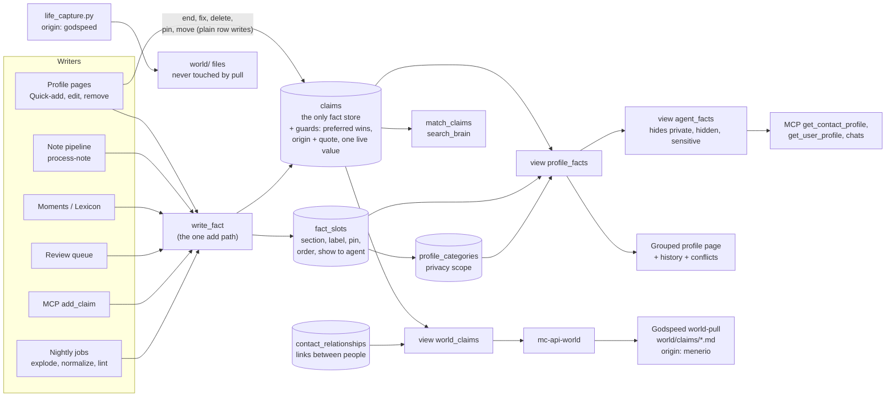

# One fact store: plan

Status: proposal, 2026-09-28, reviewed five times (section 8). Nothing in this document has been built.
Scope: Menerio (this repo) and the Godspeed `world/` mirror.

How to read the markers:

- **VERIFIED** means I read the code or migration named next to it.
- **UNVERIFIED** means I did not read it, or it depends on production state I cannot see. Every production number is UNVERIFIED unless a query in this document produced it, and none has been run.
- Paths are relative to the repo named in the section. Line numbers are approximate.

---

## 1. Summary for Michael

1. Keep one list of dated facts, `claims`. Every fact about you or a person lives there, once.
2. The grouped profile page becomes a view over those facts. A small table remembers only how each *kind* of fact is shown for a person: its section, its label, whether it is pinned, and whether assistants see it. For example: "Languages → Identity, pinned".
3. Why: today's bridge copies facts back and forth between two lists. It still shows old values as current, rewrites history when you edit, and never shows facts added about you by assistants. It can drift again whenever a background job runs.
4. With one list, a fact cannot appear twice. A new value keeps the old one as "was true until". Assistants, search and Godspeed all read the same thing.
5. Your typed words stay protected. The same rule that guards the profile list today moves onto the facts themselves.
6. Relationships between people stay in their own table. They link two people, and that works well already.
7. Cost: about eight small stages over roughly two to three weeks of work; the biggest one (stage 4) ships as several small deploys. Each ships alone with a backup, a count check and a way back. No fact is deleted until the last stage, and even then it is archived first.
8. Godspeed: the pull becomes a straight copy of the facts, and existing files keep their ids. Its hourly pull needs to learn paging first (see Risk R1).
9. Decided (section 7): changing a fact keeps the old value as history; removing offers "not true any more" and "this was wrong"; private sections stay out of the Godspeed repo.
10. Separately, I found a bug that can lose facts today: the tidy-up job deletes rows it then cannot re-insert (Risk R2). It is worth fixing first, whatever you decide here.

---

## 2. Current system map

### 2.1 The three stores

| Store | What it holds | Dates | Embedding | Protection of human words |
|---|---|---|---|---|
| `claims` (migrations `20260811091414`, `20260901090000`, `…094000`, `…098000`) | `subject_type` self/contact/entity, `subject_id`, `attribute`, `value`, `valid_from`/`valid_to`, `confidence`, `cardinality`, `evidence_quote`, `review_by`, `source_type`/`source_id`, `origin` (default `'menerio'`), `embedding` | yes | yes (`match_claims`) | **none**: only the `claims_updated_at` trigger. VERIFIED. |
| `profile_entries` + `profile_categories` | undated `label`/`value`, `category_id`, `contact_id` (NULL = self), `is_pinned`, `show_to_agent`, `rank`, `sort_order`, `linked_note_id`, `origin` (default `'unverified'`), `evidence_quote`, `derived_from_claim_id`. Categories are per subject (`contact_id`) and carry `visibility_scope` ('private' hides the section from agents). | no | no | `world_preferred_wins` and `world_preferred_survives_delete` (`20260816120000`, redefined `20260916120000`). VERIFIED. |
| `contact_relationships` | `source_*`/`target_*` (contact or self), `label`, `custom_label`, `pair_key`, `origin`, `evidence_quote`, `evidence_note_id`, `valid_from`/`valid_to`, `rank`; plus the `relationship_rejections` ledger and `relationship_evidence` | yes | no | the same preferred triggers. VERIFIED. |

Claims have **no foreign key on `subject_id`** (it points at a contact, an entity or nothing) and **no uniqueness constraint** of any kind. VERIFIED.

### 2.2 Triggers on `profile_entries` today (final active set, from migrations)

These come from the edge-case research pass over the migrations. I read the three marked ones myself; the rest are UNVERIFIED against production (see R5).

| Trigger | When | Does |
|---|---|---|
| `trg_a_profile_entries_atomize` | BEFORE INSERT | Splits a multi-fact value into sibling rows (`20260820213200`). |
| `trg_profile_entries_canonicalize` | BEFORE INSERT/UPDATE | Resolves the canonical label. An unknown field goes to the review queue and the row is dropped (`20260816020759`). |
| `trg_profile_entries_preferred_wins` | BEFORE INSERT/UPDATE | A human row becomes `rank='preferred'`. A machine update of a preferred row gets its label and value put back. VERIFIED. |
| `trg_profile_entries_prevent_duplicate_fact` | BEFORE INSERT/UPDATE | Duplicate guard: drops the row by returning NULL (`20260815231856`). |
| `trg_profile_entries_quality_guard` | BEFORE INSERT/UPDATE | Drops empty, "none", or value-equals-label rows (`20260809131242`). |
| `trg_profile_entry_require_origin` | BEFORE INSERT/UPDATE | Origin must be from the allowed list; a new `unverified` row is refused; automated origins need a quote of 10+ characters (`20260928121000`). VERIFIED. |
| `trg_profile_entries_preferred_delete` | BEFORE DELETE | A machine delete of a preferred row is cancelled. |
| `profile_entries_enqueue_normalization`, `trg_profile_entries_mark_audit_dirty` | AFTER any write | Feed cron jobs 4 and 16. |
| `trg_profile_entry_sync_claim` | AFTER UPDATE OF value, label | **Overwrites the linked live claim in place** and clears its embedding (`20260928120000`). VERIFIED. |
| `trg_profile_entry_end_claim` | AFTER DELETE | If this was the last row showing a claim, sets that claim's `valid_to`. VERIFIED. |

Unique indexes: `profile_entries_no_exact_duplicate` and `profile_entries_unique_profile_fact` (`20260724111157`, `20260724181849`).

### 2.3 Writers and readers, and what each becomes

"Fact store" below means the new module `supabase/functions/_shared/fact-store.ts` and its SQL function (section 3.5). "View" means `profile_facts` or `agent_facts` (section 3.3).

**Edge functions and shared modules**

| Caller | Store(s) touched today | What it does today | Target |
|---|---|---|---|
| `normalize-profile/index.ts` `writeProfileEntrySafely` (~214-427); actions `write_profile_entry`, `accept_profile_entry`, `bulk_profile_reviews` | writes entries | Every manual add ("Add a fact", section add, owner suggestions) and every review-queue accept. Runs the canonical label, name guard, skill guard and dedup, then INSERTs. Sets no claim. | Calls `writeFact()`. Keeps its guards (label canonicalization, name guard, blocked labels), now applied before the claim insert. |
| `normalize-profile` `explodeBags` (~598-720), nightly cron job 15 at `40 3 * * *` | deletes and inserts entries | Splits "bag" rows. **Drops `derived_from_claim_id`**, so the end-claim trigger closes the claim, and the pieces are promoted later as new claims. VERIFIED from report; UNVERIFIED line-level. | Operates on claims. Inserts the pieces with the bag's origin, quote, source and `valid_from`, then retracts the bag, all in one transaction. Never touches `rank='preferred'` claims; for those it queues a review suggestion. |
| `normalize-profile` actions `plan`/`backfill`/`apply`/`rollback` → `_shared/profile-normalization.ts` | deletes, updates and inserts entries | The normalizer. Merges duplicates and fixes labels and sections. Its canonical insert and its restore set **no origin** (R2). VERIFIED. | Label and section changes become **slot** edits (no claim change). Merging duplicate values becomes retracting a non-preferred exact duplicate, or a review suggestion. |
| `admin-normalize/index.ts` (cron job 4, `22 */6`) | via `applyNormalization` | Drains normalization jobs. | Same, over claims and slots. Its dirty-marking trigger moves to `claims` and `fact_slots`. |
| `process-note/index.ts` `prepareSuggestionForInsert` (~517-633), `generateProfileSuggestions` (~1341, dedup reads ~1765-1790), relationships (~1957-2185), promote call (~2851-2890) | writes entries (`ai_note`) and relationships; reads entries for dedup; fires `promote-profile-entries` | The note pipeline. | Auto-apply calls `writeFact({origin:'ai_note', evidence_quote, source_type:'note'})`. Dedup reads `profile_facts` (current) plus the "never suggest again" suppressions. The promote call is removed. Relationships are unchanged. |
| `_shared/moment-profile-extraction.ts` (~261-327, ~487-620); `extract-moment-profile`; `backfill-moment-profile-extraction` | writes entries (`ai_moment`) and relationships | Facts from timeline moments. | `writeFact({origin:'ai_moment', source_type:'moment'})`. |
| `enrich-person-from-lexicon/index.ts` (~188-202, ~660-727) | writes entries (`ai_lexicon`) and relationships | "Enrich from notes & timeline". | `writeFact({origin:'ai_lexicon'})`. `claims.source_type` gains `'lexicon'` (CHECK change). |
| `backfill-profile-extraction/index.ts` | none directly (re-posts notes) | Re-runs the note pipeline. | Unchanged. |
| `classify-profile-fact/index.ts` | none | Returns label, value and section for Quick-add. | Unchanged. |
| `generate-profile-suggestions/index.ts` | reads categories and owner entries | Owner suggestions. | Reads `profile_facts`. |
| `promote-profile-entries/index.ts` + `_shared/promote-entries.ts` + `_shared/adopt-claims.ts` | entries → claims, and claims → entries | The bridge. | **Retired** in stage 7. |
| `profile-audit/index.ts` + RPC `profile_audit_apply_merge` (cron job 16, `50 */6`) | merges entries | Duplicate audit. | Retired. The unique live-value index (section 3.2) makes exact duplicates impossible. Near-duplicates go to the claims lint. |
| `profile-lint/index.ts` (cron job 11, `20 3`) | deletes entries (repair); relationships | Nightly lint. | Claims lint, **report-only** for claims; relationship repair unchanged. Whether the live cron sends `repair:true` is UNVERIFIED. |
| `profile-reconcile/index.ts` (cron job 12, `17 */2`) | moves entries to self, updates and deletes them; relationships | Folds contact duplicates of self. It **orphans those contacts' claims** (reported; UNVERIFIED line-level). | Moves claims and slots to self (`subject_type='self'`, `subject_id=NULL`) in the same transaction. The entry sections are retired. |
| `review-queue-bulk/index.ts` (keep ~282-316, `unknown_profile_field` ~566-625, revert ~738-810) | writes and deletes entries; relationships | Bulk review. | Keep calls `writeFact`. Revert deletes the claim (the item's `target_entity_id` now holds a claim id; see stage 4). |
| `conversation-chat/index.ts` (~113, 240-251) | reads entries (no visibility filter) | Person context in chat. | Reads `agent_facts`, which also closes today's visibility gap. |
| `note-chat/index.ts` (~483), `_shared/read-tools.ts` `loadPersonProfile` (~193-243), chat tool `get_person_profile` | reads entries and relationships (no sensitivity filter) | Person context in chat. | Reads `agent_facts`; relationships are filtered on the contact's visibility. |
| `_shared/read-tools.ts` `search_claims` → `match_claims` | reads claims | Chat search. | Unchanged caller. It now covers every fact, so `match_claims` gains the private-section and entity filters in stage 1 (section 3.6). |
| `_shared/user-profile.ts` `getUserProfile` | reads self entries (ignores `show_to_agent`) | "Who is the user" digest for chats. | Reads `agent_facts` for self, current rows only. |
| `_shared/people-sync-core.ts` / `people-vault.ts` (`github-people-sync`) | reads contact entries (`select *`) | GitHub people vault export. | Reads `profile_facts` (current rows; pinned first). |
| `merge-contacts` → SQL `merge_contacts_atomic` (`20260908120002`) + trigger `contact_merge_move_references` (`20260923170100`) | moves and deletes entries; moves claims; relationships | Contact merge. Deleting a duplicate entry **ends its claim before the claim is moved**, and a merge into self leaves the claims behind (trigger WHEN clause). Reported. | Moves claims and slots itself. Identical live values are folded, keeping the earliest. Merge into self re-points to `subject_type='self'`. The entry part is deleted in stage 7. |
| `delete-my-account`, `admin-delete-user` | none directly | Rely on foreign-key cascades to `auth.users` (`20260916120000` adds them to every public table with `user_id`). | `fact_slots` gets its own `ON DELETE CASCADE`. |
| `mc-api-world/index.ts` + views `world_entities`, `world_events`, `world_claims` (`20260901098000`); `_shared/world-records.ts` `toWorldClaim` | reads the union of all three stores | Godspeed pull endpoint. Filters sensitive contacts only; **no `ai_visibility` filter on claims, and no private-section filter** (VERIFIED, `mc-api-world/index.ts:136-160` and the view SQL). | `world_claims` = claims plus relationships only (section 3.4). Add the `ai_visibility` filter; the private-section filter depends on Q4. |
| `backfill-claim-embeddings/index.ts` | writes claim embeddings | Manual backfill; no cron (reported). | Scheduled every 10 minutes. Skips claims about hidden or sensitive subjects (section 3.6). |

**MCP tools (`supabase/functions/menerio-mcp/index.ts`)**

| Tool | Today | Target |
|---|---|---|
| `add_claim` (~4029-4135, `_shared/claims.ts` `addClaimWithSupersede` ~263-331) | Inserts a claim, then closes the older one (valid_to = UTC today). Evidence quote optional. Origin not set, so it gets `'menerio'`. No value dedup. Loosely creates contacts from names. Never writes entries; the claim reaches the page only through adoption, contacts only. VERIFIED from report; UNVERIFIED line-level. | Calls `writeFact({origin:'mcp'})`. Requires `evidence_quote` (Q7). Same value again is a no-op. Uses the user's day, not UTC. Will not close a `preferred` claim; adds a second live value instead (Q8). Ambiguous names are refused, as in `get_claims`. |
| `get_claims` (~4171-4232) | claims, visibility-filtered | Unchanged, or reads `agent_facts`. |
| `get_contact_profile` (~1913-2037) | curated entries plus live claims, skips entries whose claim was printed (the 09-28 fix). Returns early, without claims, when the contact has no non-private sections (reported). | Reads `agent_facts` for the contact, grouped by section. One source, so no dedup logic. `detail:'curated'` = `show_to_agent`. Shows "two answers" flags and history on request. |
| `get_user_profile` (~2819-3051) | self entries only; **never reads claims** | `agent_facts` for self. Relationships are unchanged (and its self-as-source gap is fixed separately; see R9). |
| `get_contact_context` (~1783-1908), `search_contacts` (~1712-1745) | entries | `agent_facts`. |
| `search_brain` (~3673-3774) → `match_claims` | claims only; unpromoted entries invisible | Unchanged caller. It now sees every fact, filtered like `agent_facts` (section 3.6). |
| `get_entity_context` (~3957) | entity claims | Unchanged. |

**Frontend**

| File | Today | Target |
|---|---|---|
| `src/hooks/useProfile.ts` (owner page; queries ~89-117, `upsertEntry` ~191, `deleteEntry` ~210) | reads and writes self entries directly. Delete **ends** the claim. | New `useFacts(subject)` over `profile_facts`, adds through the `write_fact` edge action (with the user's JWT), end/correct/delete as direct `claims` updates, display changes as direct `fact_slots` updates. |
| `src/hooks/useContactProfile.ts` (queries ~51-85, backfill effect ~87-141, adoption effect ~143-167, upsert ~209-253, delete ~255-276) | reads and writes contact entries; runs `promote-profile-entries` on open. Delete **deletes** the claim. | Same `useFacts`. The adoption effect is deleted. |
| `src/components/people/ContactProfileTab.tsx`, `profile/QuickAddFact.tsx`, `profile/CompactCategorySection.tsx`, `profile/PinnedHighlights.tsx`, `src/components/profile/ProfileSections.tsx`, `EntryForm.tsx`, `ExportTab.tsx`, `ProfileCompleteness.tsx` | render entries | Render `profile_facts` rows. The grouping key becomes `slot_id`; each slot gets a "History (n)" disclosure and a "two answers" badge. |
| `src/lib/profile-categories.ts` `ensureProfileCategory` | client insert of a category | Unchanged (categories stay). |
| `src/hooks/useProfileSummary.ts` | counts entries | Counts current `profile_facts`. |
| `src/hooks/useAiFootprint.ts` (~44, 123, 151) | entries by `linked_note_id`; deletes them | Claims where `source_type='note' AND source_id=:note`; "remove" = delete the claim (the trigger records the suppression). |
| `src/components/people/RelationshipsSection.tsx` (~110, ~153) | reads Gender/Pronouns entries across subjects; writes Gender via `write_profile_entry` | Reads `profile_facts` (attribute `gender`/`pronouns`); writes through `write_fact`. |
| `src/pages/ReviewQueue.tsx` (accept ~229-305, revert ~150-193, `add_claim` ~635-672) | entries via normalize-profile or direct insert; revert deletes the entry | Through `normalize-profile` (now `writeFact`); revert = delete the claim. |
| `src/hooks/useClaims.ts`, `src/components/facts/FactsPanel.tsx`, `components/world/EntityDetail.tsx` | claims for entity pages; `useAddClaim` sets no cardinality, origin or embedding | `useAddClaim` is replaced by `write_fact`. `FactsPanel`'s history pattern is reused on person pages. |
| `src/pages/World.tsx`, `src/hooks/useWorld.ts` (~94-110), `src/lib/world-claims.ts` | `world_claims` view | Unchanged API; the view is redefined. `groupClaims` should prefer current rows (reported as not excluding closed claims). |
| `src/lib/query-persister.ts` (`buster: "account-v3"`) | persists query results to IndexedDB for 7 days | Bump the buster when the row shape changes (stage 3). |

**Offline / desktop.** PowerSync syncs **only `notes`**. VERIFIED: `src/sync/schema.ts` defines one table, and publication `powersync` in `20260710120000` lists only `public.notes`. The sync rules live in the PowerSync dashboard (`docs/offline-first.md`). `src-tauri` has no profile code. Nothing in PowerSync changes. The only offline surface is the query persister above.

**Godspeed** (section 6 has the details)

- **What actually runs** is the kit runner `~/.local/bin/mc-notebook-sync`, from the public `teach-it-once-kit`. It calls `tools/notebook-sync.py` (up) and `tools/world-pull.py` (down). VERIFIED: `godspeed-engine/scripts/sync-menerio-run.sh:123-131` `exec`s it; lines 157-229 (the engine's `sync_menerio.py` and `world_pull.py`) are unreachable.
- The kit's `world-pull.py` makes one request with `?limit=2000` and **does not page**. VERIFIED: `tools/world-pull.py:391-392`.
- `life_capture.py` writes `origin: godspeed` atoms and never calls Menerio. The pull never touches those files.
- Nothing pushes facts from Godspeed into Menerio. Notes go up, and `_shared/mc-source.ts` refuses fact extraction from `godspeed` notes (reported).

---

## 3. Target architecture

### 3.1 The rule

**A fact is a claim.** One row in `claims` per value per period, about self, a contact or an entity. Everything else is one of these:

- a **slot**: how one attribute of one subject is displayed;
- a **category**: a section on the page, with its privacy scope;
- a **view**: a way to read the claims.

Relationships between two people stay in `contact_relationships` (section 3.8).

Where each attribute lives:

| Attribute | Lives on | Why |
|---|---|---|
| value, dates, confidence, cardinality, source, evidence quote, embedding | `claims` | They describe one value in one period. |
| "a human typed this" | `claims.origin = 'user_manual'` and `claims.rank = 'preferred'` | It belongs to the words, so it must survive every display change. |
| category (section) | `fact_slots.category_slug` | Filing belongs to "Languages for this person", not to one language. A new value inherits it. |
| label (display name) | `fact_slots.label` | Same reason. The attribute key is the stable machine name; the label is how the page says it. |
| pin | `fact_slots.is_pinned` | Per attribute (Q3). |
| one answer or several | `fact_slots.cardinality` (NULL = use `attribute_rules`, else `'one'`) | "Both are true" is about this person's attribute, and the next new value must respect it. |
| show to assistants | `fact_slots.show_to_agent` | Per attribute. |
| privacy scope | `profile_categories.visibility_scope` (unchanged) | A private section hides everything filed in it. |

**Why the slot is keyed by attribute and not by claim id.** A display row keyed by claim id (option C as posed) dies with the claim. Every new value (Berlin → London) arrives with no section, no label, no pin and no assistant flag, so something must "adopt" it again. That is today's bridge in miniature. Keyed by `(subject, attribute)`, the new value simply appears where the old one was, pinned if it was pinned.

### 3.2 Schema (draft DDL)

```sql
-- 1. claims gains what profile_entries knew and claims did not.
ALTER TABLE public.claims
  ADD COLUMN IF NOT EXISTS rank text NOT NULL DEFAULT 'normal'
    CHECK (rank IN ('preferred','normal'));
-- source_type gains 'lexicon'; origin becomes checked against the same list profile_entries uses,
-- plus the legacy 'menerio' that 20+ existing claims carry. Nothing is rewritten.
ALTER TABLE public.claims DROP CONSTRAINT IF EXISTS claims_source_type_check;
ALTER TABLE public.claims ADD CONSTRAINT claims_source_type_check
  CHECK (source_type IN ('note','moment','manual','ai','lexicon'));
ALTER TABLE public.claims ADD CONSTRAINT claims_origin_known CHECK (origin IN
  ('user_manual','unverified','menerio','ai_note','ai_moment','ai_lexicon',
   'review_queue','import','mcp','api','normalizer')) NOT VALID;  -- VALIDATE after a count shows 0 violations

-- 2. One live copy of a value per subject and attribute. Closed history rows are exempt.
--    Pre-check (stage 1) must return 0 before this is created.
--    The value is indexed as a hash: a b-tree entry holds at most ~2.7 KB, and a long value
--    would otherwise make the index creation, or a later insert, fail.
CREATE UNIQUE INDEX claims_one_live_value ON public.claims
  (user_id, subject_type, coalesce(subject_id, '00000000-0000-0000-0000-000000000000'::uuid),
   attribute, md5(lower(btrim(value))))
  WHERE valid_to IS NULL;

-- 3. How an attribute of a subject is displayed. The only new table.
CREATE TABLE public.fact_slots (
  id            uuid PRIMARY KEY DEFAULT gen_random_uuid(),
  user_id       uuid NOT NULL DEFAULT auth.uid() REFERENCES auth.users(id) ON DELETE CASCADE,
  subject_type  text NOT NULL CHECK (subject_type IN ('self','contact','entity')),
  subject_id    uuid,
  attribute     text NOT NULL,             -- normalizeAttribute() output, same key as claims.attribute
  label         text NOT NULL,             -- what the page prints, e.g. "Favourite foods"
  category_slug text,                      -- 'food', 'identity' ... NULL = "Other"
  cardinality   text CHECK (cardinality IN ('one','many')),   -- NULL = attribute_rules decides
  is_pinned     boolean NOT NULL DEFAULT false,
  show_to_agent boolean NOT NULL DEFAULT false,
  created_at    timestamptz NOT NULL DEFAULT now(),
  updated_at    timestamptz NOT NULL DEFAULT now(),
  CONSTRAINT fact_slots_subject_pair CHECK (
    (subject_type = 'self' AND subject_id IS NULL) OR (subject_type <> 'self' AND subject_id IS NOT NULL))
);
CREATE UNIQUE INDEX fact_slots_one_per_attribute ON public.fact_slots
  (user_id, subject_type, coalesce(subject_id, '00000000-0000-0000-0000-000000000000'::uuid), attribute);
-- RLS: the same four owner policies as claims (auth.uid() = user_id). No admin policy (claims has none).
```

**Why a slug and not a category id.** `profile_categories` has one row per section *per person* (`contact_id`), so a category id only works for one subject. A slug:

- needs no "is this section the same person's?" check;
- needs no section row created before a fact can be filed;
- survives a contact merge unchanged.

The view joins the subject's own `profile_categories` row by `(user_id, contact_id, slug)` for its name, icon and **privacy scope**. When no row exists, the section name comes from the taxonomy (`src/lib/profile-taxonomy.ts`, mirrored in `CATEGORY_DISPLAY`) and the scope is `'all'`.

Deleting a section no longer deletes facts; they fall back to "Other". Today a category delete cascades to its entries.

**No other new tables:**

- **Entry-to-claim lookup.** Stage 2 sets `profile_entries.derived_from_claim_id` on *every* entry, so that column is the permanent lookup from an old entry to its claim. It is kept in the archived table.
- **"This was wrong, never suggest it again".** This reuses `ai_suggestion_suppressions` (`20260424235610`: `suggestion_type`, `normalized_value`, `suppression_key`, unique per user). It uses a new `suggestion_type = 'claim'` and the key `subject_type:subject_id:attribute:lower(btrim(value))`.

### 3.3 The views

```sql
-- Everything the owner may see: the grouped page, history, conflicts.
CREATE VIEW public.profile_facts WITH (security_invoker = on) AS
SELECT
  c.id                AS claim_id,
  c.user_id, c.subject_type, c.subject_id,
  CASE WHEN c.subject_type = 'contact' THEN c.subject_id END AS contact_id,
  c.attribute, c.value, c.valid_from, c.valid_to,
  -- Started (a future-dated change is not current yet) and not ended.
  ((c.valid_from IS NULL OR c.valid_from <= public.user_today(c.user_id))
   AND (c.valid_to IS NULL OR c.valid_to > public.user_today(c.user_id))) AS is_current,
  c.confidence, c.cardinality, c.origin, c.rank, c.evidence_quote,
  c.source_type, c.source_id, c.review_by, c.created_at, c.updated_at,
  s.id                AS slot_id,
  coalesce(s.label, initcap(replace(c.attribute, '-', ' ')))            AS label,
  s.category_slug, cat.name AS category_name,                            -- NULL name: the UI uses the taxonomy
  coalesce(cat.visibility_scope, 'all')                                  AS visibility_scope,
  coalesce(s.is_pinned, false)     AS is_pinned,
  coalesce(s.show_to_agent, false) AS show_to_agent,
  -- "two live answers": more than one current value on a single-valued attribute.
  -- The slot's per-person override wins, so "Both are true" only has to change the slot.
  (count(*) FILTER (WHERE (c.valid_from IS NULL OR c.valid_from <= public.user_today(c.user_id))
                      AND (c.valid_to IS NULL OR c.valid_to > public.user_today(c.user_id))
                      AND coalesce(s.cardinality, c.cardinality) = 'one')
     OVER (PARTITION BY c.user_id, c.subject_type, c.subject_id, c.attribute)) > 1 AS has_conflict
FROM public.claims c
LEFT JOIN public.fact_slots s
  ON s.user_id = c.user_id AND s.subject_type = c.subject_type
 AND s.subject_id IS NOT DISTINCT FROM c.subject_id AND s.attribute = c.attribute
LEFT JOIN public.profile_categories cat
  ON cat.user_id = c.user_id AND cat.slug = s.category_slug
 AND cat.contact_id IS NOT DISTINCT FROM (CASE WHEN c.subject_type = 'contact' THEN c.subject_id END);
-- profile_categories_user_contact_slug_idx is unique on (user, coalesce(contact), slug), so this join
-- cannot multiply rows (index reported from 20260412183355; confirm in the stage 0 dump).

-- What assistants, chats, search and the Godspeed mirror may see.
CREATE VIEW public.agent_facts WITH (security_invoker = on) AS
SELECT f.* FROM public.profile_facts f
WHERE f.visibility_scope <> 'private'
  AND (
    f.subject_type = 'self'
    OR (f.subject_type = 'contact' AND EXISTS (
          SELECT 1 FROM public.contacts ct
           WHERE ct.id = f.subject_id AND ct.user_id = f.user_id AND ct.merged_into IS NULL
             AND ct.is_sensitive IS NOT TRUE AND ct.ai_visibility = 'visible'))
    OR (f.subject_type = 'entity' AND EXISTS (
          SELECT 1 FROM public.entities e
           WHERE e.id = f.subject_id AND e.user_id = f.user_id
             AND e.ai_visibility = 'visible' AND e.is_sensitive IS NOT TRUE))
             -- entities carry both flags (VERIFIED, 20260811091414:11-12)
  );
```

Correctness by construction:

- Each claim appears in `profile_facts` exactly once. The join to a slot cannot multiply rows, because a slot is unique per `(subject, attribute)`.
- A claim with no slot still appears, under "Other". Nothing is hidden and nothing is shown twice.
- No sync job can fall behind, because there is nothing to sync.

`user_today()` exists (`20260901096000`). Its cost per row is fine at this scale (hundreds of rows, 3 accounts). If it ever matters, compute `is_current` in the client.

### 3.4 `world_claims`, redefined

```sql
CREATE OR REPLACE VIEW public.world_claims WITH (security_invoker = on) AS
  SELECT f.claim_id AS id, f.user_id, 'claim'::text AS source_table, f.subject_type AS subject_kind, f.subject_id,
         coalesce(f.category_slug, 'other') AS category, f.attribute, f.value, NULL::uuid AS object_id,
         f.valid_from, f.valid_to, f.confidence, f.cardinality, f.review_by,
         f.source_type AS source_kind, f.source_id AS source_ref, f.origin, f.rank,
         f.evidence_quote, f.created_at, f.updated_at
    FROM public.profile_facts f
   WHERE f.visibility_scope <> 'private'      -- Q4, decided: private sections stay in Menerio
     -- A fact about a deleted or merged-away subject is never mirrored (fifth review).
     AND (f.subject_type = 'self'
       OR (f.subject_type = 'contact' AND EXISTS (SELECT 1 FROM public.contacts ct
             WHERE ct.id = f.subject_id AND ct.merged_into IS NULL))
       OR (f.subject_type = 'entity' AND EXISTS (SELECT 1 FROM public.entities e
             WHERE e.id = f.subject_id)))
  UNION ALL
  SELECT r.id, r.user_id, 'contact_relationship', r.source_type, r.source_id, 'relationship',
         'relationship', COALESCE(NULLIF(btrim(r.custom_label), ''), r.label), r.target_id,
         r.valid_from, r.valid_to, 'likely', 'many', NULL::date, NULL::text, NULL::uuid,
         r.origin, r.rank, r.evidence_quote, r.created_at, r.updated_at
    FROM public.contact_relationships r;
```

Same columns as today (VERIFIED against `20260901098000`), so `mc-api-world` and `toWorldClaim` need no shape change. The profile-entry arm is gone. `rank` is now real for claims instead of the hard-coded `'normal'`.

`mc-api-world` `fetchClaims` also gains `ai_visibility` filtering on `subject_id` and `object_id`: contacts and entities that are hidden, on top of today's sensitive list.

**The views filter nothing by user.** They are `security_invoker`, so in the browser RLS restricts them to the signed-in user. Every service-role reader (`mc-api-world`, MCP, chats, cron jobs) bypasses RLS and must keep its explicit `.eq("user_id", …)`, as `mc-api-world` does today. A test in stage 3 asserts it for each rewritten reader.

### 3.5 One write path

Only **adding** a fact needs shared logic: label canonicalization, bag splitting, dedup, slot placement and supersede. So:

- Adding has exactly one implementation, `supabase/functions/_shared/fact-store.ts` `writeFact()` (a pure planner plus a thin writer).
- The browser reaches it through one edge action, the existing `normalize-profile` `write_profile_entry`, renamed `write_fact`.
- Everything else is a plain row write, protected by RLS and the claim triggers.
- There are **no SQL copies** of the write logic; two implementations would drift, which is the problem being solved.

| Operation | Meaning | How |
|---|---|---|
| `writeFact(subject, label or attribute, value, origin, evidence, source, valid_from?)` | "This is true." | Edge function. Canonicalize the label (`profile-canonical-schema.ts`), split bags (the atomize logic moves from the trigger into TS), refuse suppressed values, and ensure a slot exists (placement from `placeClaim` / `classify-profile-fact`). Then insert the claim; if the same value is already current, return the existing claim. Cardinality comes from the slot, else `attribute_rules`, else `'one'`, and is copied onto the claim. For `'one'`, close the older current value at `valid_from` (or the user's today). **A machine never closes a preferred value**: it inserts alongside, which surfaces as `has_conflict`. |
| end: "No longer true since …" | | Browser: `update claims set valid_to = :date`. The row stays as history. |
| retract: "This was wrong." | | Browser: `delete from claims`. An AFTER DELETE trigger writes the suppression row when `auth.uid()` is set, so a human's "wrong" is remembered without a second call and the note pipeline does not bring it back. |
| correct: "Typo." | | Browser: `update claims set value`. The words guard (3.6) refuses this for machines on preferred rows. |
| refile: section, label, pin, show to assistants | Display only. | Browser or job: `update fact_slots`. Machines may re-file; that is what `world/menerio-bridge.md` allows. |

**Human or machine is decided by whose credentials make the write. This must be kept.**

- The words guard, like today's `world_preferred_wins`, treats a write as human when `auth.uid()` is set.
- `normalize-profile` writes with the **service-role** client (VERIFIED, `normalize-profile/index.ts:724`). Today that is harmless: a human add is marked by `origin='user_manual'`, and human edits go straight from the browser.
- Under this plan, `writeFact` can *close* an older value. Done with the service role, a human's own "It changed" would be refused on any value they typed before.
- So `write_fact` must write with a client built from the caller's JWT when a user calls it, and with the service role only for jobs.
- **The rule is general, not only for `write_fact` (fourth review).** Every edge action a human triggers by a click writes facts with a client built from the caller's JWT. That includes `normalize-profile` accept and bulk, and `review-queue-bulk` keep and revert. `review-queue-bulk` builds its client from the service-role key today (VERIFIED, `review-queue-bulk/index.ts:89`). Without the rule, a queue "Revert" deletes the claim as a machine: no suppression is written, and the note pipeline suggests the same fact again.
- A test asserts this for each of those actions: a human replaces their own preferred value, and a human revert writes a suppression.

### 3.6 Guards move onto `claims`

| Today on `profile_entries` | Target on `claims` |
|---|---|
| `world_preferred_wins` / `world_preferred_survives_delete` | New `claim_preferred_wins` (BEFORE INSERT/UPDATE) and `claim_preferred_survives_delete` (BEFORE DELETE), with the same "human = `auth.uid()` IS NOT NULL" test as today. **Which writes make a claim preferred:** a human INSERT, an `origin='user_manual'` INSERT, or a human UPDATE that changes `value` or `attribute`. That last case also sets `origin='user_manual'`, because the words are now the human's; the old `evidence_quote` stays as provenance. Without this, a corrected machine fact would be `rank: preferred` but `written_by: machine` in Godspeed. A human who only ends a machine fact does not turn it into "typed by a human". **Machine UPDATE of a preferred claim:** puts back `attribute`, `value`, `valid_from` and **`valid_to`**, because closing a human's fact is demoting it (Q8). `subject_id` may change (a merge is re-filing). **Deletes:** cancelled unless cascade or owner gone (copy the `20260916120000` exceptions). |
| `profile_entry_require_origin` | `claim_require_origin`: origin in the list, and automated origins (`ai_*`, `mcp`, `api`, `import`, `normalizer`) need `evidence_quote` of 10+ characters. `unverified` and `menerio` are refused on INSERT except inside the migration (`SET LOCAL menerio.fact_migration = 'on'`). Enforced from stage 5, once `add_claim` sends quotes. |
| `profile_entry_quality_guard` | `claim_quality_guard`: **raises** a named error instead of silently returning NULL. Silent drops are why `promote-profile-entries` needed its "a guard trigger dropped the row" checks. |
| duplicate guard + two unique indexes | `claims_one_live_value` unique index + `writeFact` returning the existing row. |
| canonicalize, atomize | In `writeFact` (TS). One implementation, tested, with visible results. |
| enqueue normalization, mark audit dirty | Re-attach to `claims` and `fact_slots` (normalization only; audit is retired). |
| `profile_entry_sync_claim`, `profile_entry_end_claim` | Dropped in stage 7. |
| `profile_entries.contact_id … ON DELETE CASCADE` (deleting a person deletes their rows) | `claims.subject_id` has no foreign key, so this must be explicit (fifth review): `claims_follow_subject_delete`, AFTER DELETE on `contacts` and on `entities`, deletes that subject's claims and slots. The preferred-delete guard lets it through (as the entry guard does for a cascade today), and the suppression trigger skips it (otherwise deleting a person writes a "never suggest again" row for every fact about them). It runs while `menerio.subject_delete = 'on'` is set locally by the trigger itself. A merge is not a delete: `merge_contacts_atomic` moves the claims before it removes the duplicate. |

**Embeddings and privacy.** Today a hidden contact's facts are never embedded, because entries have no embedding and promotion refuses those contacts (`_shared/promote-entries.ts:195-199`, VERIFIED). Embedding sends the text to the embedding provider. So in the target:

- Claims whose subject is sensitive or hidden are not embedded.
- `backfill-claim-embeddings` skips them.
- When a contact becomes visible, the backfill embeds their claims.
- Hiding a contact later needs no extra machinery. The vector stays in Menerio's own database, and `match_claims` already refuses to return it (`20260901099000`, VERIFIED).

**Search must hide what `agent_facts` hides (fourth review).** `match_claims` filters hidden and sensitive **contacts** only (VERIFIED, `20260901099000:72-81`). It does not filter private sections, and it does not filter hidden or sensitive **entities**. Stage 2 turns every private-section entry into a claim, so without a fix those facts become searchable by assistants through `search_brain` and chat search. (Promotion does not check private sections today either, VERIFIED in `_shared/promote-entries.ts`, so part of this leak already exists.) So:

- Stage 1 redefines `match_claims` with the same three exclusions as `agent_facts`: private section (through the slot and its category), hidden or sensitive contact, hidden or sensitive entity. `get_claims` reads through the same filter.
- Claims filed in a private section are not embedded, just like claims about hidden subjects.
- The stage 1 harness asserts that a private-section claim and a hidden entity's claim are never returned by `match_claims`.

**One source for "one value or several" (fourth review).** Today the rules exist three times: the `attribute_rules` table and two TypeScript copies (the table's own comment says "keep all three in sync", `20260901090000:48`). `writeFact` reads the table only; stage 4 deletes the two TypeScript copies and their callers read the table (or a cached copy of it loaded once per request).

### 3.7 UI behaviour

- **Grouped list.** `profile_facts WHERE is_current` for the subject. Grouped by `category_slug` in taxonomy order, then by `slot_id`. Several current values under one slot display as one line ("Languages: German, English"), exactly as `groupEntriesByLabel` does today.
- **Add a fact.** Quick-add is unchanged up to the chip (`classify-profile-fact`). Saving calls `write_fact` with `origin='user_manual'`, using the user's JWT. The slot is created in the chosen section if it is new. The claim exists immediately, embedded asynchronously.
- **Edit.** The pencil offers two actions (Q1):
  - "It changed": `writeFact` with a `valid_from` date; the old value becomes history.
  - "Fix a mistake": update the value in place.
  - The label and section are edited on the slot (today the label is read-only, and there is no way to move a fact to another section).
- **Remove.** Two actions (Q2):
  - "No longer true": set `valid_to`.
  - "Was wrong": delete the claim; the value is remembered as "do not suggest again".
  - Owner and contact pages behave the same (today they differ; VERIFIED in `useContactProfile.ts` and reported for `useProfile.ts`).
- **History.** Each slot has "History (n)" listing closed claims: "Berlin, until 2026-03-01". This is `FactsPanel`'s pattern, which today only entity pages have.
- **Multi-value facts.** `cardinality='many'` (from `attribute_rules`) allows several current values, with no conflict.
- **Two live answers.** `has_conflict` shows a badge with "Keep this one" (ends the other) and "Both are true" (sets `fact_slots.cardinality='many'` only; the view and `writeFact` both read the slot first, so the badge clears and the next value is added, not swapped in).

### 3.8 Relationships stay separate

They are links between two subjects, with a direction and an inverse (`pair_key`), a rejection ledger, an adjudication judge, and their own card and graph uses. Claims have no object column. Folding relationships in would mean:

- adding `object_type`/`object_id` to claims;
- porting `relationship_pair_key`, the inverse labels, the rejection guard and the dedup guard;
- rewriting `RelationshipsSection`, the review-queue relationship paths, `profile-lint`/`profile-reconcile` repair, and `world_claims`' relationship arm.

In exchange it would gain nothing that is broken today. Relationships already have dates, origin, rank and evidence, and they never duplicated into claims: `add_claim` refuses the reserved attributes and adoption skips them (VERIFIED, `adopt-claims.ts`).

The only overlap is text entries in the "Relationships & Family" section (e.g. a wedding date, or "married"). Those are facts about one person and become claims like any other. They are **not** converted into links automatically (Q11), because turning a name into a contact link is a judgment.

### 3.9 Self

Self uses the same model: `subject_type='self'`, `subject_id NULL`, with categories where `contact_id IS NULL`. This fixes today's gap: a self fact written by `add_claim` never reaches the Profile page or `get_user_profile` (VERIFIED: `adopt-claims.ts` skips non-contact claims; `get_user_profile` reads entries only).

### 3.10 Data flow



---

## 4. Options compared

Scale for all options: about 172 contact entries and 210 live contact claims on 2026-09-28, plus self rows (count UNVERIFIED), across 3 accounts. Performance is not a deciding factor for any option.

### (A) Keep two stores with the 09-28 bridge

Concrete failures I can point to in the code today:

1. **A superseded value keeps showing as current.**
   - `add_claim` closes the old claim (`valid_to`) and inserts the new one.
   - `planAdoptions` adopts the new claim as a new row.
   - The old row still points at the closed claim, and the page never looks at `valid_to` (VERIFIED: `useContactProfile.ts` selects `*` from `profile_entries` with no claim join).
   - The page shows "Berlin" and "London" side by side.
   - `get_contact_profile` prints London as a dated fact and Berlin as an undated row, because Berlin's claim is not among the printed live claims (VERIFIED in the `fd713da` diff).
2. **Editing rewrites history.** `profile_entry_sync_claim` overwrites the live claim's value in place (VERIFIED). "Was true until" is lost for every edit made on the page.
3. **Self is left out.** Adoption is contact-only (`adopt-claims.ts`, `subject_type !== "contact"` → skip; VERIFIED). A fact about you written by an assistant never reaches your Profile page or `get_user_profile`.
4. **The nightly bag split churns ids.**
   - `explodeBags` drops `derived_from_claim_id` (reported), so the claim is ended and the pieces are re-promoted as new claims.
   - Godspeed sees deletions and new files every time. `world_pull.py`'s `still_carried` logic exists to paper over exactly this.
5. **Silent guard drops.**
   - An adopted row can be dropped by a BEFORE trigger. `promote-profile-entries` records "a guard trigger dropped the row" only in its JSON response, which no caller reads.
   - The claim stays live for agents and invisible on the page.
6. **Hidden and sensitive contacts can never converge.** Their entries are refused promotion by design, so for them there are permanently two stores.
7. **Deleting behaves differently per page.** The contact page deletes the claim; the owner page only ends it.
8. **Two writers per fact.** Entries write down into claims (promote) and claims write up into entries (adopt). The label ↔ attribute mapping is lossy in both directions (`canonicalProfileLabel` vs `normalizeAttribute`). It stays correct only while every job runs in the right order.

Scored against the criteria:

- MCP readers: see different things depending on the tool.
- Godspeed: three arms and id churn.
- Guards: human-words protection only on entries.
- Search: misses every unpromoted entry.
- Effort: zero now, recurring forever.

**Not recommended.**

### (B) Claims only; the grouped list is a pure view, with display columns on `claims`

Correctness is good: no second store. The failure is where the display settings live.

- Pin, section, label, order and show-to-assistants sit on each value.
- When a new value supersedes an old one, the new claim starts unpinned, in the fallback section, hidden from assistants, unless every writer copies them forward.
- Every writer includes `add_claim`, the note pipeline and nightly jobs, so the settings will be forgotten somewhere.
- History rows carry stale display settings.
- A multi-value attribute can have half its values pinned.

**Concrete failure:** pin "Location", let an assistant record a move, and the pin is gone.

Effort is similar to E.

### (C) Claims plus a thin display table keyed by claim id

This is the same as B with the columns moved out, and it has the same failure. A new claim has no display row until something "adopts" it; that something is today's adoption job. A missed adoption means the fact lands in "Other" (if the view left-joins) or disappears (if it inner-joins). **Not recommended in this shape.**

### (D) `profile_entries` only; drop claims

This loses:

- dates, history and supersede;
- cardinality and review dates;
- evidence-backed embeddings: `search_brain` and chat search run on `match_claims`, and entries have no embedding;
- entity facts (`subject_type='entity'`), which have no home in `profile_entries`;
- `add_claim`/`get_claims`/`get_entity_context`;
- the dated Godspeed atoms: 310 pulled claim files carry `valid_from`/`review_by`.

It contradicts the direction set in `20260901093000`. **Concrete failure:** "where did Michael live in 2025" becomes unanswerable. **Rejected.**

### (E) Claims plus a display table keyed by `(subject, attribute)`: **recommended**

This is option C, with the display row attached to the attribute, not to the value. It is what section 3 describes.

| Criterion | E |
|---|---|
| Duplicates / drift | Impossible by construction: one row per claim in the view, and a unique live value per slot. No sync jobs. |
| What assistants read | `agent_facts`: one source, dated, with conflicts flagged. `show_to_agent` and private sections are honoured everywhere, which is not true today (`getUserProfile`, `loadPersonProfile` and `conversation-chat` ignore them). |
| Godspeed | `world_claims` becomes claims plus relationships: a one-to-one copy. Migrated entries keep their id (stage 2), so their files are rewritten in place. Only entries folded into an identical fact, and the rows Q4 excludes, are removed, and both are counted first. |
| History and dates | Every change is a new row. "Was true until" is visible on every profile. |
| Guards and human words | Moved onto `claims` (section 3.6), and made loud instead of silent. |
| Search | Every fact is embedded, except hidden or sensitive subjects. Today unpromoted entries are invisible to `search_brain`. |
| Privacy | One visibility view (`agent_facts`), write-time embedding exclusion, and `mc-api-world` gains the missing `ai_visibility` filter. |
| Migration risk | Medium. About 30 writer call sites move to one module. The data move is small (hundreds of rows) and additive until stage 7. |
| Failure it can still cause | A new attribute written with no slot shows under "Other" until it is filed. That is visible and harmless; the nightly job files it. |

### (F) Considered and dropped: an event log with claims as a projection

It would give perfect audit history, but it is heavy machinery for hundreds of rows, and claims with `valid_from`/`valid_to` already are the history. Not worth it.

---

## 5. Implementation plan

**Ground rules for every stage:**

- **Migrations.** One file per change in `supabase/migrations/`, with a matching `supabase/rollback/<name>_rollback.sql`. Apply one file at a time through the Supabase management API, and record it by hand: `INSERT INTO supabase_migrations.schema_migrations (version, name, statements) VALUES (...)`. Never use `supabase db push`.
- **Edge functions** are deployed separately, per function, after the migration they need.
- **Pushing to `main`** only rebuilds the frontend preview. Each stage names its frontend part.
- **Backups.** Every stage that moves or deletes data first snapshots the affected tables into schema `fact_backup_<stage>` (`CREATE TABLE fact_backup_s2.claims AS TABLE public.claims;` and likewise for each table). That schema is not exposed to PostgREST. The same rows are also exported as CSV through the management API and kept outside the database.
- **Counts.** Every data move has a "before" and an "after" query, and each named equality must hold before the stage is called done. If an equality fails, run the rollback.
- **Crons.** Pause the profile crons during stages 2-4 (`cron.alter_job(<id>, active := false)` for jobs 4, 11, 12, 15 and 16; the ids are in `docs/CRON_JOBS.md`, and must be confirmed live first).

### Stage 0: Baseline, and fix what can already lose data

**Goal:** know the exact starting numbers. Capture the production-only definitions. Remove the two hazards that would corrupt a migration.

**Touches:**
- `_shared/profile-normalization.ts` and `normalize-profile/index.ts` (R2 fix);
- the kit's `tools/world-pull.py` (R1 fix, in the Godspeed kit repo);
- new `docs/plans/one-fact-store-baseline.md` (results).

**Steps:**
1. **Dump the live trigger and function definitions** into the baseline doc:
   ```sql
   SELECT tgrelid::regclass, tgname, pg_get_triggerdef(t.oid)
     FROM pg_trigger t
    WHERE NOT tgisinternal AND tgrelid IN ('public.profile_entries'::regclass,
          'public.claims'::regclass,'public.contact_relationships'::regclass,'public.profile_categories'::regclass);
   SELECT p.proname, pg_get_functiondef(p.oid) FROM pg_proc p JOIN pg_namespace n ON n.oid=p.pronamespace
    WHERE n.nspname='public' AND (p.proname LIKE 'profile%' OR p.proname LIKE 'world_%' OR p.proname LIKE 'claim%'
          OR p.proname LIKE 'relationship%' OR p.proname = 'merge_contacts_atomic');
   SELECT jobid, jobname, schedule, command, active FROM cron.job;
   ```
   Why: `profile_dedup_sweep` and `profile_subset_label_sweep` exist live but in no migration (reported from `20260923190000`), and the cron bodies are live-only.
2. **Baseline counts** (all saved to the baseline doc):
   ```sql
   -- B1 entries by subject and link state
   SELECT contact_id IS NULL AS is_self, derived_from_claim_id IS NOT NULL AS linked, count(*)
     FROM profile_entries GROUP BY 1,2;
   -- B2 claims by subject, liveness and origin
   SELECT subject_type, valid_to IS NULL AS live, origin, count(*) FROM claims GROUP BY 1,2,3;
   -- B3 linked entries whose words differ from their claim
   SELECT count(*) FROM profile_entries p JOIN claims c ON c.id = p.derived_from_claim_id
    WHERE lower(btrim(p.value)) <> lower(btrim(c.value));
   -- B4 entries shown as current but linked to a closed claim
   SELECT count(*) FROM profile_entries p JOIN claims c ON c.id = p.derived_from_claim_id
    WHERE c.valid_to IS NOT NULL;
   -- B5 claims shown by more than one entry
   SELECT count(*) FROM (SELECT derived_from_claim_id FROM profile_entries
    WHERE derived_from_claim_id IS NOT NULL GROUP BY 1 HAVING count(*) > 1) x;
   -- B6 live claims shown by no entry (contact and self)
   SELECT c.subject_type, count(*) FROM claims c
    WHERE c.valid_to IS NULL AND NOT EXISTS (SELECT 1 FROM profile_entries p WHERE p.derived_from_claim_id = c.id)
    GROUP BY 1;
   -- B7 entries of hidden or sensitive contacts
   SELECT count(*) FROM profile_entries p JOIN contacts ct ON ct.id = p.contact_id
    WHERE ct.is_sensitive OR ct.ai_visibility <> 'visible';
   -- B8 duplicate live values that would break claims_one_live_value
   SELECT count(*) FROM (SELECT user_id, subject_type, subject_id, attribute, lower(btrim(value))
     FROM claims WHERE valid_to IS NULL GROUP BY 1,2,3,4,5 HAVING count(*) > 1) x;
   -- B9 world_claims by arm, and review_queue pending items by type
   SELECT source_table, count(*) FROM world_claims GROUP BY 1;
   SELECT type, status, count(*) FROM review_queue
    WHERE status IN ('pending','pending_review','auto_applied_unreviewed') GROUP BY 1,2;
   -- B10 relationships, entries in private sections, claims orphaned by deleted/merged contacts
   SELECT count(*) FROM contact_relationships;
   SELECT count(*) FROM profile_entries p JOIN profile_categories k ON k.id = p.category_id
    WHERE k.visibility_scope = 'private';
   SELECT count(*) FROM claims c WHERE c.subject_type = 'contact' AND NOT EXISTS
     (SELECT 1 FROM contacts ct WHERE ct.id = c.subject_id AND ct.merged_into IS NULL);
   -- B11 legacy entries the new claim quality guard would refuse (carried over under the
   --     migration flag, then listed for Michael), and entries that stage 2 would fold
   SELECT count(*) FROM profile_entries
    WHERE btrim(value) = '' OR lower(btrim(value)) IN ('none','n/a','unknown','-')
       OR lower(btrim(value)) = lower(btrim(label));
   SELECT count(*) - count(DISTINCT (user_id, contact_id, lower(regexp_replace(btrim(label), '\s+', '-', 'g')),
                                     lower(btrim(value))))
     FROM profile_entries WHERE derived_from_claim_id IS NULL;
   -- B12 who owns the tables (stage 2 disables their triggers, which needs the owner)
   SELECT relname, pg_get_userbyid(relowner) FROM pg_class
    WHERE relname IN ('profile_entries','claims','fact_slots') AND relnamespace = 'public'::regnamespace;
   -- B13 the longest values (the unique index hashes them; this documents why)
   SELECT 'claims', max(octet_length(value)) FROM claims
   UNION ALL SELECT 'profile_entries', max(octet_length(value)) FROM profile_entries;
   -- B14 private-section claims and hidden-entity claims that match_claims returns today
   SELECT count(*) FROM claims c JOIN profile_entries p ON p.derived_from_claim_id = c.id
     JOIN profile_categories k ON k.id = p.category_id
    WHERE k.visibility_scope = 'private' AND c.embedding IS NOT NULL;
   SELECT count(*) FROM claims c JOIN entities e ON e.id = c.subject_id
    WHERE c.subject_type = 'entity' AND (e.ai_visibility <> 'visible' OR e.is_sensitive);
   ```
   Column names `review_queue.type` and `.status` are UNVERIFIED.
3. **R2 fix.** The normalizer and `explodeBags` carry `origin`, `evidence_quote`, `is_pinned`, `rank`, `show_to_agent` and `derived_from_claim_id` through every insert and restore. They insert before they delete. They never write a row without an honest origin.
4. **R1 fix.** The kit's `world-pull.py` pages exactly like the engine's (`limit` + `offset`, `IncompleteAnswer` on a short or missing answer), or is replaced by the engine version.

**Tests:**
- Vitest in `supabase/functions/_shared/__tests__/profile-normalization-origin.test.ts`: the no-survivor path inserts with an origin; a failed insert restores every original column.
- Kit: a paging test with 2 pages.

**Verify live:**
- Run one normalization on a test contact of the test account and check the row counts before and after.
- Run the kit pull with `--dry-run`: the removal list must be empty.

**Rollback:** redeploy the previous function versions (the git SHAs are recorded in the baseline doc).

### Stage 1: Additive schema (no data moves)

**Goal:** the new table, columns, views and guards exist and are harmless.

**Touches:** migrations, each with a rollback file:
- `20261001120000_claims_gain_rank_and_checks.sql`
  - adds `rank`, the `source_type` CHECK, and the `origin` CHECK `NOT VALID`;
  - redefines `world_claims` so its claim arm reports `c.rank` instead of the hard-coded `'normal'`. This is needed before stage 2: from then on every profile row reaches Godspeed through the claim arm, and must not arrive demoted.
- `20261001121000_fact_slots.sql`: the table, index, RLS and the updated_at trigger.
- `20261001123000_profile_facts_views.sql`: `profile_facts` and `agent_facts`, with `GRANT SELECT` to authenticated and service_role.
- `20261001124000_claim_guards.sql`: `claim_preferred_wins`, `claim_preferred_survives_delete`, `claim_quality_guard`, and the AFTER DELETE suppression trigger.
  - All of them are active from day one. No current writer updates a preferred claim, because none is preferred yet; `claims.rank` defaults to `'normal'`.
  - `claim_quality_guard` does not apply while `menerio.fact_migration = 'on'`, so that legacy rows can be carried over. It is the only guard with that exception.
  - `claim_require_origin` is created but **not attached** until stage 5.
- `20261001125000_claims_one_live_value.sql`: created only if B8 = 0. If B8 > 0, the rows are listed for Michael first. They are exact duplicates of one value, and folding them happens in stage 2.
- `20261001126000_match_claims_hides_like_agent_facts.sql` (fourth review): `match_claims` gains the private-section and hidden/sensitive-entity exclusions. This must be live before stage 2, which is when private-section entries become claims. `backfill-claim-embeddings` skips private-section claims from the same deploy.
- `20261001127000_claims_follow_subject_delete.sql` (fifth review): the AFTER DELETE triggers on `contacts` and `entities` from section 3.6. They also clean up today's orphans going forward; existing orphans (B10) are listed for Michael, not deleted.

**Data migration:** none. Counts that must hold:
- `claims` and `profile_entries` totals are unchanged.
- `fact_slots` has 0 rows.
- `world_claims` by arm is unchanged (B9), apart from `rank` on claim rows.

**Tests:** a SQL harness modelled on `scripts/test-merge-review.mjs` + `bootstrap-merge-review-test.sql`, as new `scripts/test-fact-store.mjs` + `scripts/bootstrap-fact-store-test.sql`. It proves that:
- a machine update of a preferred claim keeps its value and `valid_to`;
- a machine delete of a preferred claim is cancelled;
- a human update passes, and a human that only ends a machine claim does not make it preferred;
- the quality guard raises;
- a human delete writes a suppression row and a machine delete does not;
- the unique live index allows the same value once live and again as history;
- `profile_facts` returns exactly one row per claim, including a subject with a section row and one without;
- `agent_facts` hides private, hidden and sensitive rows;
- `match_claims` never returns a private-section claim or a hidden entity's claim;
- a future-dated value is not current yet, and does not raise `has_conflict` against the value it replaces;
- "Both are true" on the slot alone clears `has_conflict`;
- deleting a contact (as a signed-in user and as the service role) deletes its claims and slots, including preferred ones, and writes no suppression rows;
- a 5 KB value can be inserted (the hashed index).

**Verify live:**
- `SELECT count(*) FROM profile_facts` equals `SELECT count(*) FROM claims`, per user.
- `agent_facts` is a subset of `profile_facts`.

**Rollback:** the rollback files run in reverse order: drop the views, the table, the triggers, then the columns and constraints, and restore `world_claims` from `20260901098000`. None of these hold data yet.

### Stage 2: Backfill: every entry becomes a claim with a slot (additive)

**Goal:** `claims` and `fact_slots` hold every fact and every display setting that `profile_entries` holds, and every entry names its claim. Nothing is deleted.

**Before this stage:**
- Stage 0's pull fix (R1) must be live. From this stage on, Godspeed sees every profile row through the claim arm.
- Reusing ids keeps that a rewrite of the same files, not a delete-and-create (see "Godspeed effect" below).
- Pause the profile crons.

**Touches:** `20261002120000_backfill_claims_from_entries.sql`. It is one transaction that sets `SET LOCAL menerio.fact_migration = 'on'` and runs `ALTER TABLE public.profile_entries DISABLE TRIGGER USER` (re-enabled at the end of the same transaction).

Why the triggers are disabled: step 5 updates every entry. Without this, that update would run the old BEFORE UPDATE guards on legacy rows:
- the origin rule for AI rows without a quote raises;
- canonicalize and the quality guard can silently drop the update;
- the audit and normalization triggers would queue work for every row.

Foreign-key checks are system triggers and stay on.

Steps:

1. **Snapshot** into `fact_backup_s2`: `profile_entries`, `profile_categories`, `claims`, `review_queue`, `ai_suggestion_suppressions`.
2. **Entries already linked to a claim.** There are about 169 contact entries plus the self rows (UNVERIFIED).
   - **Words match** (the complement of B3): nothing to do.
   - **Words differ** (B3): the entry's words are what you saw on the page.
     - Insert a new claim **with `id = entry.id`**, carrying the entry's words, origin and rank, and `valid_from NULL`.
     - Point the entry at it.
     - The old claim stays, and the two show as "two answers" for you to settle. Nothing is overwritten.
   - **Linked to a closed claim** (B4): leave the link. These rows move to history, not the current list, and the stage report lists them for you.
3. **Unlinked entries:** insert a claim **with `id = entry.id`**:
   - `subject_type` / `subject_id` from `contact_id` (NULL → self);
   - `attribute = normalize(label)`. A reserved attribute (`relationship…`) becomes `relationship-note`; the label keeps its words.
     The SQL here must produce exactly what `normalizeAttribute()` (`_shared/claims.ts:55`) produces, or the next value written by `writeFact` lands on a second line. Before the migration runs, a script computes the attribute for every distinct entry label with the TypeScript function and diffs it against the SQL expression; the diff must be empty (fourth review);
   - `value` verbatim, bags included (the migration splits nothing);
   - `valid_from NULL` (Q6), `created_at = entry.created_at`;
   - `confidence 'likely'`; `cardinality` from `attribute_rules`, else `'one'`;
   - `origin`, `rank` and `evidence_quote` copied;
   - `source_type = 'note'` and `source_id = linked_note_id` when linked; else `'manual'` for `user_manual`; else `'ai'`.

   **When an identical current value already exists** for the same subject and attribute, no claim is inserted. The entry is pointed at the earliest existing claim ("folded"). These are counted, and they are the only Godspeed file removals this plan causes.

   Hidden or sensitive contacts are included; their claims are not embedded.
4. **Slots:** one per `(subject, attribute)`, built from its entries:
   - `label` = the label of the preferred row, else the most frequent label;
   - `category_slug` = that row's section slug;
   - `is_pinned` = any pinned; `show_to_agent` = any;
   - `cardinality` = NULL, unless the entries already hold two different current values for a single-valued attribute: those stay as "two answers".
5. **Link:** set `derived_from_claim_id` on every entry from steps 2 and 3. From here on that column *is* the entry-to-claim lookup.
6. **Claims no entry shows (B6).** After stage 0 these are mostly self claims, because adoption was contact-only.
   - A dry run of `placeClaim` (TS) produces their slot rows as a reviewed SQL file.
   - That file is applied as the next migration, `20261002121000_slots_for_unshown_claims.sql`.
   - One mechanism (SQL files), and the placement is still decided by the one TS implementation.

**Counts that must hold after stage 2:**
- `SELECT count(*) FROM profile_entries WHERE derived_from_claim_id IS NULL` = 0.
- Every link points at an existing claim: `LEFT JOIN claims … WHERE claims.id IS NULL` = 0.
- `claims_after` = `claims_before` + (unlinked − folded) + B3.
- For every subject, the set of `(label, lower(value))` currently on the old page (entries whose claim is not closed) equals the set of current rows in `profile_facts`.
  - Run this as a SQL `EXCEPT` both ways; it must return 0 rows.
  - The only allowed differences are the B4 rows and the new self claims from step 6, each listed by id.
- `count(fact_slots)` = the number of distinct `(subject, attribute)` pairs over the non-entity claims, so every non-entity claim has a slot.
- `world_claims`: `profile_entry` rows = 0; `claim` rows = `count(claims)`.

**Godspeed effect.** This is the stage where Godspeed notices the switch; stage 6 only tidies up. Every former `profile_entry` row now arrives as a `claim` row with the **same id**, so the pull rewrites the same file. Run the kit pull with `--dry-run` right after the migration:
- removals must equal exactly the folded ids;
- the rest must be rewrites, plus new files for the step 2 conflict claims and the step 6 self claims;
- only then run `--apply`.

**Keeping it complete until writers move (stage 4):**
- `trg_zz_profile_entry_mirror` (BEFORE INSERT on `profile_entries`).
  - Its name sorts last, so it runs only if no earlier guard dropped the row.
  - It does steps 3 and 4 for the new row: the claim takes `NEW.id`, and it sets `NEW.derived_from_claim_id`.
  - If an identical current value already exists (the entry guards compare labels, the claim index compares attributes, so this can happen), it links to that claim instead of inserting. Otherwise `claims_one_live_value` would raise, and the note pipeline's insert would fail instead of being quietly deduplicated as today.
  - A row that arrives already linked (adoption from `promote-profile-entries`) only gets its slot ensured.
- `trg_profile_entry_mirror_display` (AFTER UPDATE OF `label`, `category_id`, `is_pinned`, `show_to_agent`) copies display changes onto the slot.
- The existing `sync_claim`/`end_claim` triggers keep value edits and deletes flowing. The known history loss from in-place edits continues until stage 4, and is accepted for the transition; the old words are in `fact_backup_s2`.

**Tests:**
- SQL harness cases, each ending with exactly one link: linked and equal, linked and different, linked to a closed claim, unlinked, folded, hidden contact, self, reserved label, bag value, legacy AI row without a quote, "none"-valued legacy row.
- Mirror cases: a new entry creates its claim and slot; an entry dropped by the duplicate guard creates nothing; a pin change reaches the slot.

**Verify live:**
- The counts above, and the Godspeed dry run.
- Open three contacts and your profile. The page still reads entries, so nothing visible changes.
- `SELECT … FROM profile_facts WHERE subject_id = :someone AND is_current` matches the page by eye.

**Rollback:** `20261002120000_…_rollback.sql`:
1. Drop both mirror triggers.
2. Restore `profile_entries.derived_from_claim_id` from `fact_backup_s2`.
3. Delete the claims whose id equals an entry id and is absent from `fact_backup_s2.claims`, then the step 6 slots and all `fact_slots`.

Verification of the rollback: `claims` equals `fact_backup_s2.claims`, and `profile_entries` equals `fact_backup_s2.profile_entries`, each by `EXCEPT` both ways = 0. The next pull restores the old files (same ids).

### Stage 3: Assistants, chats and exports read the views

**Goal:** everything outside the browser reads `agent_facts` / `profile_facts`. The page is unchanged; it moves in stage 4, with its writes.

**Why not the page now.** A page that reads the view but still writes entries would depend on the mirror for every pin, move and edit. A page that reads and writes the same store in one step has no such gap.

**Touches:**
- **MCP (`menerio-mcp/index.ts`):** `get_contact_profile`, `get_user_profile`, `get_contact_context`, `search_contacts`.
- **Shared and other functions:** `_shared/read-tools.ts` `loadPersonProfile`, `_shared/user-profile.ts`, `conversation-chat/index.ts`, `_shared/people-sync-core.ts`, `generate-profile-suggestions`.
- **Types:** regenerate `src/integrations/supabase/types.ts` to include `fact_slots`, `profile_facts` and `agent_facts`.

**Data migration:** none.

**Tests:**
- A Vitest test for the MCP and chat profile formatters, built from fixture rows. It asserts that:
  - each fact prints once;
  - hidden, sensitive and private rows never print;
  - every service-role query carries a `user_id` filter.
- Update `people-vault.test.ts`.

**Verify live:**
- A script, `scripts/compare-profile-readers.ts`, runs the old formatter (entries) and the new one (view) for each subject and diffs the printed `(label, value)` sets. The only allowed differences are the B4 list, the new self claims and the history lines.
- Run `get_contact_profile` for three contacts and `get_user_profile` through MCP, and compare with the page.

**Rollback:** redeploy the previous function versions. No data changed.

### Stage 4: The page and every writer switch to claims

**Goal:** the page reads and writes facts, and nothing writes `profile_entries` any more.

**How it ships: three small deploys, not one (fourth review).** The first draft of this stage deployed about 30 call sites and the page at once, with the messiest rollback of the plan. It now ships in three steps. The stage 2 mirror triggers carry everything the not-yet-moved writers do, so each step is safe alone:

- **4a, the page.** `useFacts`, the page components, `useAiFootprint`, `RelationshipsSection`, `ReviewQueue`, `useAddClaim` → `write_fact`, the `write_fact` action itself (JWT client), and the persister buster. Browser writes to `profile_entries` stop. Background jobs still write entries, and the mirror copies them into claims and slots. The foreign key `derived_from_claim_id → claims` is dropped here (the column stays), so a "Was wrong" delete never rewrites an entry. Hold 48 hours.
- **4b, the background writers, one function per deploy**, in this order: `process-note`, moments, lexicon enrichment, `review-queue-bulk`, `normalize-profile` (accept, bulk, explode, apply, rollback) with `admin-normalize`, `profile-lint`, `profile-reconcile`, `add_claim`, and the merge migration. Each deploy is checked with the "Verify live" steps below for that writer before the next one.
- **4c, the freeze.** Only once the grep test finds no writer left: the read-only migration below, and the mirror triggers are dropped.

In the window between 4a and 4c, the old-row readers that are not yet moved (e.g. the note pipeline's dedup) can see an entry whose claim was ended on the page. At worst they skip a suggestion; they cannot resurrect a value, because the mirror links to an existing claim instead of inserting one.

There is **no feature flag**. With entries frozen in 4c, a flag turned off would send the old page to a table that refuses writes. The way back is each step's rollback.

**Touches:**
- **New:**
  - `_shared/fact-store.ts`: a pure planner plus a writer. It takes a Supabase client, so a human call uses the caller's JWT (section 3.5).
  - `src/hooks/useFacts.ts`.
- **Frontend** (step 4a, no flag):
  - `useProfile.ts`, `useContactProfile.ts` (the adoption and backfill effects are removed);
  - `ProfileSections.tsx`, `CompactCategorySection.tsx`, `PinnedHighlights.tsx`, `EntryForm.tsx` (two edit actions, plus label and section editing), `ExportTab.tsx`, `useProfileSummary.ts`, `useAiFootprint.ts`, `RelationshipsSection.tsx`, `ReviewQueue.tsx`;
  - `useClaims.useAddClaim` → `write_fact`;
  - a "History (n)" disclosure and a "two answers" badge;
  - the `query-persister.ts` buster → `"account-v4"`.
- **Edge functions:**
  - `normalize-profile`: `write_fact` (renamed from `write_profile_entry`, which stays as an alias until stage 7 so an old open tab can still add a fact), accept, bulk, explode, apply, rollback;
  - `_shared/profile-normalization.ts`;
  - `process-note`: the promote call is removed, and dedup reads the suppressions;
  - `_shared/moment-profile-extraction.ts`, `enrich-person-from-lexicon`, `review-queue-bulk`, `admin-normalize`;
  - `profile-lint` (report-only for facts);
  - `profile-reconcile` (the self fold moves claims and slots);
  - `menerio-mcp` `add_claim` (fact store, origin `mcp`, the user's day instead of UTC).
- **SQL:** `20261006121000_merge_moves_claims_and_slots.sql`. It rewrites `merge_contacts_atomic` to move claims and slots, and fixes merge into self.
- **Review queue:**
  - Pending `add_profile_entry` items carry their fact in the payload and work unchanged.
  - A `target_entity_id` that points at an entry is rewritten to that entry's `derived_from_claim_id`.
  - Pending `normalize_profile_entry` items reference entry ids and a before-state that no longer applies. They are set to `status='superseded'`, and the next normalization run regenerates them from facts.
  - Count: pending items per type before = after + superseded.

**Freeze entries (step 4c):** `20261006122000_profile_entries_read_only.sql`:
- revoke `INSERT`, `UPDATE` and `DELETE` on `profile_entries` from authenticated;
- add a BEFORE trigger that raises `profile_entries_is_read_only: write facts through write_fact` for the service role too;
- drop both mirror triggers.

The foreign key `derived_from_claim_id → claims` was already dropped in step 4a (`20261006120000_entries_drop_claim_fk.sql`); the column stays.

Why drop that foreign key: its `ON DELETE SET NULL` rewrites the entry row whenever a claim is deleted. Against a read-only table, that makes every "Was wrong" delete fail. The archive should also keep the historical link even after the claim is gone.

The freeze makes a stale browser tab, an old PWA bundle or a forgotten edge function fail loudly instead of writing to a dead table.

**Data migration:** the superseded review items, counted as above. Check: `count(profile_entries WHERE derived_from_claim_id IS NULL)` = 0.

**Tests:**
- `_shared/__tests__/fact-store.test.ts`:
  - supersede closes a non-preferred single value;
  - a machine never closes a preferred value (a conflict instead);
  - a human replaces their own preferred value (JWT client);
  - the same value again is a no-op;
  - many-valued attributes add;
  - a suppressed value is refused;
  - bags are split;
  - the origin and quote rules hold.
- `src/hooks/__tests__/useFacts.test.tsx`: grouping, history and conflicts.
- Update `useContactProfile.test.tsx`, `CompactCategorySection.test.tsx`, `useAiFootprint.test.ts`, `normalization-callers.test.ts`, `profile-normalization-spend.test.ts` and `profile-insert-suppression.test.ts`.
- SQL harness: a merge moves claims and slots; a merge into self moves claims to self; a claim delete succeeds against the frozen table.
- A grep test, `scripts/check-no-profile-entry-writes.mjs`, wired into `npm test`. It fails if any file outside `supabase/migrations` and `supabase/rollback` contains `.from("profile_entries").insert|update|delete|upsert`.

**Verify live:**
- On a test contact and on your own profile, try each action: add, "It changed", "Fix a mistake", "No longer true", "Was wrong", pin, and move to another section. Each produces exactly the expected `claims` / `fact_slots` rows.
- The `profile_entries` count stays the same for 24 hours.
- Process one test note. Its facts arrive as claims with `origin='ai_note'` and a quote.

**Rollback** (per step; usually only the last step deployed is rolled back):
1. 4c: the rollback file restores the grants, drops the read-only trigger, and restores the mirror triggers.
2. 4b: redeploy that one function's previous version. Its facts written in the meantime are claims already, and the mirror is still there.
3. 4a: redeploy the previous frontend, and restore the foreign key (rows whose claim was deleted in the window get `derived_from_claim_id = NULL` first).
   Facts written from the page since 4a exist only as claims. Bring them back onto the old page with the adoption direction that already exists: `promote-profile-entries` with `include_contacts`, which is still deployed until stage 7. Add a one-off SQL insert for self claims, which adoption skips.
   Pins and moves made since 4a are lost on this rollback. They are listed from `fact_slots.updated_at`.

The profile crons stay paused from stage 2 until the writer each one drives has moved in 4b; each cron is switched back on right after its writer's deploy is verified, instead of all at once in stage 5. Hold 4c for 48 hours before stage 5.

### Stage 5: Enforce the rules on claims; turn the nightly jobs back on

**Goal:** the origin-and-quote rule and the human-words rule hold on the only fact store, and the crons run again.

**Touches:**
- `20261009120000_claims_require_origin.sql`: attach `claim_require_origin`, and `VALIDATE CONSTRAINT claims_origin_known` once a count of violations is 0;
- `add_claim` requires `evidence_quote` (Q7), and its tool description says why;
- confirm cron jobs 4, 11 and 15 are back on (each was re-enabled in 4b after its writer moved); retire job 16 (audit) and the entry sections of job 12;
- add a cron for `backfill-claim-embeddings`: every 10 minutes, `x-cron-key via call_edge`;
- update `docs/CRON_JOBS.md`.

**Data migration:** none. Count: `SELECT count(*) FROM claims WHERE <origin rule violated>` must be 0 for rows created after stage 4. Legacy rows are exempt, because the trigger checks INSERT and machine UPDATE only.

**Tests:**
- SQL harness: an automated insert without a quote raises; `user_manual` without a quote passes; an `unverified` insert raises outside the migration flag.
- Vitest: `add_claim` refuses a fact without a quote.

**Verify live:** read one nightly run's report.
- Bags were split, and the pieces carry the source quote.
- No preferred claim changed: the `updated_at` of preferred claims is unchanged, apart from embedding updates.

**Rollback:** detach the trigger (rollback file), and pause the crons again.

### Stage 6: Godspeed mirror: tidy up and close the privacy gaps

**Goal:** `world_claims` is literally claims + relationships, with the privacy filters.

Since stage 2 its profile-entry arm has returned nothing, so this stage changes data only through the new filters.

**Touches:**
- `20261012120000_world_claims_is_claims.sql` (section 3.4), with a rollback that restores the stage 1 text;
- `mc-api-world/index.ts` (the `ai_visibility` filter);
- `_shared/world-records.ts`: pass `rank` and `category` through, with tests in `world-records.test.ts` and `mc-visibility.test.ts`;
- the Godspeed changes in section 6.

**Data migration:** none in Menerio.

**Counts:**
- `claim` rows = `count(claims)`, minus the private-section rows if Q4 = exclude, minus the hidden-subject rows.
- `contact_relationship` rows: unchanged, minus hidden-subject rows.
- The dry-run pull's removals must equal exactly those excluded ids, listed beforehand.

**Tests:** the engine's `scripts/tests/test_world_pull.py` gains cases for a former entry id arriving as a claim with the same id, `rank: preferred` on a claim, and a `category:` line.

**Verify live:**
1. Run the kit pull with `--dry-run` and read the plan.
2. Then `--apply`, and check `git diff --stat world/claims`: only the expected removals and modifications.

**Rollback:** the rollback migration restores the previous view, and the next pull re-applies from it.

### Stage 7: Retire the old store

**Goal:** one store, in code and in schema.

**Touches:**
- delete `supabase/functions/promote-profile-entries/`, `_shared/promote-entries.ts`, `_shared/adopt-claims.ts` and their tests;
- remove `profile-audit` and its cron and RPCs, if Q9 = retire;
- `20261020120000_retire_profile_entries.sql`:
  - drop the bridge triggers and every trigger on entries;
  - `ALTER TABLE profile_entries RENAME TO profile_entries_archive`;
  - revoke all from authenticated;
- regenerate `types.ts`;
- update `docs/DATA_MODEL.md`.

Dropping the archive is a separate migration after the retention period (Q10), preceded by a CSV export.

**Counts:**
- `count(profile_entries_archive)` = `count(fact_backup_s2.profile_entries)` + entries mirrored between stage 2 and stage 4.
- Every archived row has a `derived_from_claim_id`.
- Every archived row whose claim no longer exists matches a human delete: a `suggestion_type='claim'` suppression row. Any unmatched row is investigated before the stage continues.

**Tests:**
- `npm test` passes with the deleted modules gone.
- The grep test from stage 4 now also fails on any read of `profile_entries`.

**Verify live:** a week of normal use with no `profile_entries_is_read_only` errors in the logs, before this stage.

**Rollback:** rename the table back and restore its triggers; the rollback file holds their text. The code rollback is a revert of the stage 7 commit.

### Effort (rough)

| Stage | Effort |
|---|---|
| 0 | 1 day |
| 1 | 1 day |
| 2 | 1-2 days (the verification queries are most of it) |
| 3 | 1-2 days |
| 4 | 4-5 days of work (about 30 call sites, plus the page), shipped as 4a, 4b (one function per deploy) and 4c |
| 5 | 1 day |
| 6 | half a day + Godspeed |
| 7 | half a day |

Total: roughly two to three weeks of focused work.

---

## 6. Godspeed changes

Paths below are in the Godspeed engine repo (`MichaelZelbel/godspeed-engine`, mounted as `dev/godspeed-engine/` and gitignored in `godspeed`), the kit (`teach-it-once-kit`, **public**), and `godspeed` itself.

1. **Which pull to change.** The kit's `tools/world-pull.py` is what runs every hour (VERIFIED, section 2.3). Change it, or make the kit call the engine's `scripts/world_pull.py`, which is better tested (68 tests, reported). Recommended: one implementation. The kit runner should call the engine version when it is present, and the kit copy should be brought up to it (paging, empty-answer guard, atomic writes, duplicate ranking). Until that is done, stage 2 must not ship (R1): stage 2 is where Godspeed first sees the change.
2. **`world_pull.py` / `world-pull.py`:**
   - `render_claim`: remove the "a profile entry has no dates at all" special case (engine ~178-181). Undated claims still render as `--undated` because `valid_from` is NULL; nothing else changes.
   - Write `category:` when present (new line, optional). It is display filing, useful for `world/INDEX.md` grouping.
   - Write `rank:` for claims as sent; today claims always arrive `normal`.
   - Keep the `still_carried` removal-notice logic until a month after stage 4. Its reason (blob claims re-minted under new ids by the bag split) disappears with stage 5, but it is harmless.
   - Ids stay plain UUIDs. Stage 2 gives every migrated entry a claim with the **same id**, so the file matched by `menerio_id` is rewritten in place and no file is deleted. Whether the pull keeps the old path when `valid_from` stays NULL is UNVERIFIED line-level: it matches existing files by `menerio_id`, and the filename is only computed for new files. Confirm with the dry run in stage 6.
   - No change to `origin: godspeed` handling: the pull never touches those files.
3. **World views** (Menerio side): section 3.4. `world_entities` and `world_events` are unchanged.
4. **`world/menerio-bridge.md`** (in `godspeed`) — replace the "Who owns a file" paragraph about protection with:
   > Menerio keeps every fact as one dated claim. A fact Michael typed carries `written_by: human` and `rank: preferred`; Menerio's database refuses to let any background job change its words, end it or delete it (`claim_preferred_wins`). When a machine learns a different value, both stay current and both are mirrored, and Michael settles it in Menerio. Relationships between people come from their own table and arrive as `attribute: relationship` with an `object:`.

   Also add one line under "World facts come down": "The pull is a one-to-one copy of Menerio's claims and relationships; the profile's sections are display only and arrive as `category:`."
5. **`world/README.md`**: document the optional `category:` field in the claim spec.
6. **`life_capture.py`**: no change. It never calls Menerio. It keeps closing only `origin: godspeed` claims.
7. **The kit's `notebook-sync.py`** already skips `origin: menerio` files when pushing notes up (reported), so the new files cannot loop back. No change.

---

## 7. Risks and open questions

### Risks

- **R1: the running pull does not page. HIGH, and present today.**
  - The kit's `world-pull.py` requests `?limit=2000` once (VERIFIED). If PostgREST's `max_rows` is below that (Supabase's default is 1000; this project's setting is UNVERIFIED), any kind above the cap is silently truncated.
  - The pull then deletes the missing files as "removed in Menerio". The only protection is the mass-removal guard, and whether the kit has the engine's guard is UNVERIFIED.
  - Claims history grows under this plan (every change keeps its old row), so the cap will be reached sooner.
  - Mitigation: stage 0 step 4, before anything else.
- **R2: the normalizer can lose facts today. HIGH, and present today.** VERIFIED by reading:
  - `_shared/profile-normalization.ts` `applyNormalization` deletes non-survivors first (~1059-1069). When there is no survivor, it inserts a canonical row **without `origin`** (~1090-1101). The column default is `'unverified'` (`20260809202823:39`), and since `20260809204443` a new `unverified` row is refused.
  - Its `restoreDeleted` upsert (~1042-1055) also omits `origin`, so it is refused too. The deleted rows are gone, and their claims are only ended.
  - `rollbackNormalization` (~1189-1225) and `explodeBags` have the same shape (reported).
  - Mitigation: stage 0 step 3. Search the function logs for `canonical insert failed` and `restore after failed apply` to learn whether this has already happened. If it has, `fact_backup` cannot help, because those rows predate it; ask Supabase for a point-in-time restore window (UNVERIFIED which plan tier this project is on).
- **R3: a production schema that differs from the migrations.** Live-only functions and cron bodies exist (reported from `20260923190000` and `docs/CRON_JOBS.md`). Stage 0 step 1 captures them; every later migration is written against that dump, not against the repo alone.
- **R4: rollback of stage 4 is the messy one.**
  - Facts written during the window exist only as claims.
  - Mitigation: the rollback re-uses the adoption direction that already exists (plus one SQL insert for self), and stage 4 is held for 48 hours.
  - Pins and moves made in the window are lost on rollback; they are listed from `fact_slots.updated_at`.
- **R4b: concurrent writes.**
  - Two writers adding different values to a single-valued fact at the same moment both land as current, which shows as "two answers": visible, not lost.
  - The same value twice hits `claims_one_live_value`; `writeFact` catches 23505 and returns the existing claim.
- **R4c: stage 2 locks `profile_entries`** (`DISABLE TRIGGER` takes an exclusive lock for the transaction).
  - At a few hundred rows this is seconds. Run it with the note crons paused.
  - The role applying migrations must own the table (B12).
- **R4e: search results change shape.**
  - Every profile fact becomes a claim, so `search_brain` (which lists claims first, on page 1) and `get_claims` return several hundred more rows than today.
  - Check after stage 2 with five real questions that answers still include the notes they did before.
  - If claims crowd them out, cap the claim share of page 1 in `searchClaims`.
- **R4d: the words guard depends on the caller's identity** (section 3.5).
  - If any human path ends up writing through the service role, that human can no longer replace their own typed value.
  - The stage 4 test "a human replaces their own preferred value" guards this. Every new human write path needs the same test.
- **R5: the trigger inventory in 2.2** comes from reading migrations in order. Confirm it against the stage 0 dump before stage 1.
- **R6: old browser bundles.** An open tab or installed PWA from before stage 4 writes `profile_entries` directly. The read-only trigger makes that fail with a readable message instead of losing the fact silently. The user retypes it after a reload.
- **R7: visibility regressions.** Moving hidden contacts' facts into claims widens the table that search reads. Mitigations:
  - `match_claims` already filters (VERIFIED);
  - embeddings stay NULL for them (section 3.6);
  - `agent_facts` is the only reader for assistants;
  - the stage 3 formatter test asserts hidden rows never print.
- **R8: existing gaps this plan closes on the way.**
  - `get_contact_profile` returns no claims when a contact has no non-private sections;
  - `loadPersonProfile` / `conversation-chat` ignore sensitivity;
  - `mc-api-world` does not filter `ai_visibility` on claims (VERIFIED);
  - private sections reach the Godspeed git repo today (VERIFIED: the view has no scope filter);
  - `useAddClaim` writes claims with no cardinality, origin or embedding.

  These are reported, not all read line-level; each is fixed in the stage that rewrites that reader.
- **R9: out of scope, noticed.**
  - `get_user_profile` ignores relationships stored with self as the source (reported);
  - the rejection ledger is only written by the UI delete, not by review-queue remove or block (reported);
  - `add_claim` creates contacts from loose names (reported).

  Worth separate small fixes.

### Decisions (settled 2026-09-28)

**Michael answered three of the questions himself**, all as recommended:
- **Q1.** Changing a value keeps the old one as history ("Berlin, until today"). "Fix a typo" is the second button.
- **Q2.** Removing offers two buttons:
  - "Not true any more" moves the fact to history.
  - "This was wrong" deletes it, and Menerio does not suggest it again.
- **Q4.** Facts in sections marked private are **not** copied to the Godspeed repo. Existing copies are removed at the next pull; old git history keeps them.

**The other nine follow from rules Michael already set**, so they were decided without asking:

| # | Decision | Follows from |
|---|---|---|
| Q3 | Pinning applies to a whole line ("Languages"), not to one value. | Pins are display settings, and display lives on the slot. |
| Q5 | Facts about people hidden from AI live in claims but are never embedded, searched or mirrored. | The hide-from-AI setting he already uses. |
| Q6 | Facts that never had a date keep an empty `valid_from`. | "Never invent a fact." |
| Q7 | `add_claim` refuses a fact without a verbatim quote. | "Automated facts need a verbatim evidence quote." |
| Q8 | A machine never ends or changes a fact he typed. A different machine value shows as "two answers". | `world_preferred_wins` and `world/menerio-bridge.md`. |
| Q9 | The duplicate-audit job is retired; the nightly lint stays, report-only. | The unique live-value index makes exact duplicates impossible. |
| Q10 | The archived table is kept 60 days, exported to CSV, then dropped. | "No step may lose a fact": the claims hold every fact, and the archive is a safety copy. |
| Q11 | Text in "Relationships & Family" stays as facts; nothing becomes a link to another person automatically. | Linking a name to a contact is a judgment. |
| Q12 | Where a profile row and its claim disagree today, both are kept as "two answers" for him to settle. | "Never rewrite words a human typed." |

---

## 8. Second review (2026-09-28): what changed and why

I re-read the plan against the code, looking for over-complication and for failure modes. These are the changes.

**Made simpler**

1. **One new table instead of three.**
   - `profile_entry_claim_map` is gone: stage 2 now links *every* entry, so `derived_from_claim_id` is the map.
   - `claim_rejections` is gone: `ai_suggestion_suppressions` already stores "never suggest this again", keyed by type and value.
2. **One add path instead of two.**
   - The first draft had `fact-store.ts` *and* five SQL functions for the browser: two implementations of the same rules, which is the drift this plan exists to remove.
   - Now only adding goes through code. Ending, fixing, deleting and re-filing are plain row writes, guarded by RLS and the claim triggers.
3. **Slots point at a section by slug, not by id.** Sections are stored per person. With a slug there is no cross-person check trigger, no section row to create before filing a fact, and nothing to rewrite on a merge.
4. **No trigger to clear embeddings when a contact is hidden.** Search already refuses those rows, so the trigger protected nothing.

**Fixed: things that would have gone wrong**

5. **Human edits would have counted as machine edits.** `normalize-profile` writes with the service role (VERIFIED, `index.ts:724`). The words guard treats "no user id" as a machine. Every "It changed" on a value you typed would have been refused. The add path now uses the caller's own credentials (section 3.5, R4d).
6. **Godspeed sees the change in stage 2, not stage 6.** Once every entry is linked, the old view already sends each fact through its claim arm, which hard-coded `rank: normal`.
   - Stage 1 now makes that arm report the real rank.
   - The pull fix is now required before stage 2.
   - The dry-run check moved to stage 2.
   - The only file removals this plan causes are counted beforehand: entries folded into an identical fact, and the private or hidden rows of Q4 and stage 6.
7. **The stage 2 update would have hit the old guards.** Linking every entry is an UPDATE. The old origin rule raises on legacy AI rows without a quote, and canonicalize can silently cancel the update. Stage 2 now disables those triggers inside its transaction. A new count (B11) lists legacy rows the new quality guard would refuse.
8. **"Was wrong" would have failed after the freeze.** The link from an entry to its claim is a foreign key with `ON DELETE SET NULL`, so deleting a claim rewrites the frozen entry, and the read-only trigger refuses it. Stage 4 drops that foreign key and keeps the column.
9. **The page moves in one step.** The first draft switched the page's reads in stage 3 and its writes in stage 4. In between, pins and moves would have depended on a mirror that did not copy them. Stage 3 now covers only assistants, chats and exports.
10. **The mirror now copes with the existing guards.** It runs as the last BEFORE INSERT trigger, so a row that a guard drops creates no claim. It also copies pin, section and label changes to the slot.
11. **The stage 4 rollback no longer invents a new reverse mirror.** It reuses the adoption job that already exists, plus one insert for your own facts.
12. **A human who only ends a machine fact no longer turns it into "typed by a human".**

**Considered and kept**

- **A one-evening switch instead of stages 2-4 with mirror triggers.** It is simpler on paper. But it deploys about 15 functions and the page at once, and its rollback has to undo all of them together. Two small triggers for about a week cost less.
- **Two views (`profile_facts`, `agent_facts`) rather than one.** The second is the single place that decides what assistants may see. Today that decision is scattered across six readers, and three of them get it wrong.
- **Relationships stay separate.** Nothing in the second pass changed the reasoning in 3.8.

### Third review (2026-09-28)

**Made simpler**

1. **`fact_slots.sort_order` is dropped.**
   - No screen sets it, and nearly every writer writes 0 (reported in the caller map).
   - Sections follow the taxonomy, and pins give prominence.
   - One column fewer to migrate and mirror.

**Fixed: things that would have gone wrong**

2. **"Both are true" would not have stuck.**
   - It set `cardinality='many'` only on the current claims.
   - The next new value would have read `attribute_rules` ('one') and closed one of them.
   - The slot now carries a per-person cardinality override, read first.
3. **A human fixing a machine's typo stayed "written by machine".**
   - It became `rank: preferred` but kept `origin='ai_note'`, so Godspeed would say `written_by: machine` about words the human wrote.
   - A human value change now also sets `origin='user_manual'`.
4. **Sensitive entities could have reached assistants.** Entities have their own `is_sensitive` flag (VERIFIED, `20260811091414:12`), and `agent_facts` now checks it.
5. **The stage 2 mirror would have broken the note pipeline.**
   - The old entry guards compare labels; the new claim index compares attributes.
   - An entry the old guards let through could hit the index and make the note's insert fail.
   - The mirror now links to the existing claim instead.
6. **Search can be crowded by the new claims** (R4e). Added a check after stage 2.

### Fourth and fifth review (2026-09-28)

**Made simpler**

1. **Stage 4 ships as 4a (page), 4b (one background writer per deploy) and 4c (freeze).** The mirror triggers already carry the writers that have not moved, so each deploy is small and has its own rollback. The profile crons come back one by one as their writer moves.
2. **No feature flag.** A flag turned off after the freeze would send the old page to a read-only table.
3. **"Both are true" lives on the slot only.** The view reads the slot's cardinality first, so the current claims are no longer rewritten.
4. **One copy of the cardinality rules.** `writeFact` reads `attribute_rules`; the two TypeScript copies go in stage 4.

**Fixed: things that would have gone wrong**

5. **Private sections would have become searchable.** `match_claims` filters hidden contacts only (VERIFIED, `20260901099000:72-81`), not private sections and not hidden or sensitive entities. Stage 2 turns every private entry into a claim. Stage 1 now gives `match_claims` the same exclusions as `agent_facts`, and private-section claims are not embedded.
6. **Human clicks through service-role functions counted as machine writes.** Section 3.5 fixed this for `write_fact` only. `review-queue-bulk` uses the service role too (VERIFIED, `index.ts:89`), so a queue "Revert" would write no suppression and the fact would be suggested again. The JWT rule now covers every human-triggered edge action.
7. **Deleting a person would have kept their facts.** Entries are removed with their contact today (a cascade; see `20260916120000:118-128`); claims have no foreign key on `subject_id`. Contacts are deleted from five places (People page, review queue page and bulk, `profile-reconcile`, `mc-api-contacts`). Stage 1 adds `claims_follow_subject_delete` for contacts and entities, which the preferred guard lets through and the suppression trigger skips, and `world_claims` stops mirroring facts whose subject is gone.
8. **The unique live-value index could fail on long values.** It now indexes `md5(lower(btrim(value)))`. B13 records the longest values.
9. **A future-dated change showed as "two answers".** `is_current` now also requires the value to have started.
10. **Stage 2's attribute keys could differ from `normalizeAttribute()`.** A pre-check diffs the SQL keys against the TypeScript function for every label.

**Considered and kept**

- The overall shape: `claims`, one `fact_slots` table, two views, relationships separate. Neither pass found a reason to add or remove a table.

---

## 9. Running this plan

- **One stage per session.** Each stage gets its own fresh session, started from this file. Stage N+1 begins only after stage N is verified live and its counts are recorded in `docs/plans/one-fact-store-baseline.md`.
- **Credentials.**
  - Applying migrations and deploying functions needs the Supabase management token and the project ref (`tjeapelvjlmbxafsmjef`). The cloud sessions that wrote and reviewed this plan had no token, and their network policy blocked `api.supabase.com`.
  - For a cloud session: the environment carries `SUPABASE_ACCESS_TOKEN` as an environment variable, and its network access is **Custom** with `api.supabase.com` and `tjeapelvjlmbxafsmjef.supabase.co` allowed (plus the default package-manager list). Only sessions started after that change see it. A separate token for this work, deleted afterwards, is preferred.
  - Otherwise Michael applies each reviewed migration himself.
  - Stage 0's Godspeed half needs push access to the kit repository (public) and to `godspeed-engine`.
- **Every stage ends the same way:**
  - a pull request with the code, the migration, the rollback file and the tests;
  - the live counts from the stage section, pasted into the pull request;
  - nothing merged or applied until those counts are recorded.

