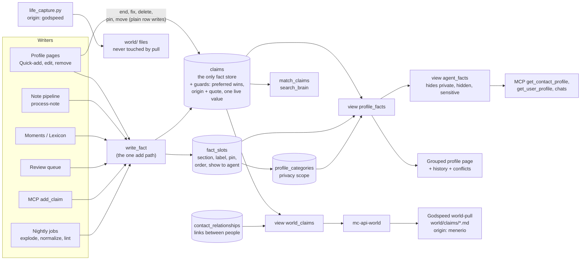

# One fact store: plan

Status: proposal, 2026-09-28, reviewed seven times (section 8). Nothing in this document has been built. Section 5 is the one-go-live layout (sixth review), corrected by the seventh review.
Scope: Menerio (this repo) and the Godspeed `world/` mirror.

How to read the markers:

- **VERIFIED** means I read the code or migration named next to it.
- **UNVERIFIED** means I did not read it, or it depends on production state I cannot see. Every production number is UNVERIFIED unless a query in this document produced it, and none has been run.
- Paths are relative to the repo named in the section. Line numbers are approximate.

---

## 1. Summary for Michael

1. Keep one list of dated facts, `claims`. Every fact about you or a person lives there, once.
2. The grouped profile page becomes a view over those facts. A small table remembers only how each *kind* of fact is shown for a person: its section, its label, whether it is pinned, and whether assistants see it. For example: "Languages → Identity, pinned".
3. Why: today's bridge copies facts back and forth between two lists. It still shows old values as current, rewrites history when you edit, and never shows facts added about you by assistants. It can drift again whenever a background job runs.
4. With one list, a fact cannot appear twice. A new value keeps the old one as "was true until". Assistants, search and Godspeed all read the same thing.
5. Your typed words stay protected. The same rule that guards the profile list today moves onto the facts themselves.
6. Relationships between people stay in their own table. They link two people, and that works well already.
7. How it ships: everything is built and rehearsed first (5-7 days of work, nothing changes in production), then goes live in one sitting of about an hour and is tested straight away. There are no waiting periods between steps. The data switch is one transaction that checks its own counts, there is one rollback script, and the old table is archived, not deleted.
8. Godspeed: the pull becomes a straight copy of the facts, and existing files keep their ids. Its hourly pull learns paging during the build (see Risk R1).
9. Decided (section 7): changing a fact keeps the old value as history; removing offers "not true any more" and "this was wrong"; private sections stay out of the Godspeed repo.
10. Separately, I found a bug that can lose facts today: the tidy-up job deletes rows it then cannot re-insert (Risk R2). The rewrite replaces that code, and the job is paused from the start of go-live.
11. Facts that assistants recorded but that never showed on a profile (about 200 about you) are not put on the page silently. They land in a private "To review" section, because some may be facts you deleted before the 09-28 fix.

---

## 2. Current system map

### 2.1 The three stores

| Store | What it holds | Dates | Embedding | Protection of human words |
|---|---|---|---|---|
| `claims` (migrations `20260811091414`, `20260901090000`, `…094000`, `…098000`) | `subject_type` self/contact/entity, `subject_id`, `attribute`, `value`, `valid_from`/`valid_to`, `confidence`, `cardinality`, `evidence_quote`, `review_by`, `source_type`/`source_id`, `origin` (default `'menerio'`), `embedding` | yes | yes (`match_claims`) | **none**: only the `claims_updated_at` trigger. VERIFIED. |
| `profile_entries` + `profile_categories` | undated `label`/`value`, `category_id`, `contact_id` (NULL = self), `is_pinned`, `show_to_agent`, `rank`, `sort_order`, `linked_note_id`, `origin` (default `'unverified'`), `evidence_quote`, `derived_from_claim_id`. Categories are per subject (`contact_id`) and carry `visibility_scope` ('private' hides the section from agents). | no | no | `world_preferred_wins` and `world_preferred_survives_delete` (`20260816120000`, redefined `20260916120000`). VERIFIED. |
| `contact_relationships` | `source_*`/`target_*` (contact or self), `label`, `custom_label`, `pair_key`, `origin`, `evidence_quote`, `evidence_note_id`, `valid_from`/`valid_to`, `rank`; plus the `relationship_rejections` ledger and `relationship_evidence` | yes | no | the same preferred triggers. VERIFIED. |

Claims have **no foreign key on `subject_id`** (it points at a contact, an entity or nothing) and **no uniqueness constraint** of any kind. VERIFIED.

### 2.2 Triggers on `profile_entries` today (final active set, from migrations)

These come from the edge-case research pass over the migrations. I read the three marked ones myself; the rest are UNVERIFIED against production (see R5).

| Trigger | When | Does |
|---|---|---|
| `trg_a_profile_entries_atomize` | BEFORE INSERT | Splits a multi-fact value into sibling rows (`20260820213200`). |
| `trg_profile_entries_canonicalize` | BEFORE INSERT/UPDATE | Resolves the canonical label. An unknown field goes to the review queue and the row is dropped (`20260816020759`). |
| `trg_profile_entries_preferred_wins` | BEFORE INSERT/UPDATE | A human row becomes `rank='preferred'`. A machine update of a preferred row gets its label and value put back. VERIFIED. |
| `trg_profile_entries_prevent_duplicate_fact` | BEFORE INSERT/UPDATE | Duplicate guard: drops the row by returning NULL (`20260815231856`). |
| `trg_profile_entries_quality_guard` | BEFORE INSERT/UPDATE | Drops empty, "none", or value-equals-label rows (`20260809131242`). |
| `trg_profile_entry_require_origin` | BEFORE INSERT/UPDATE | Origin must be from the allowed list; a new `unverified` row is refused; automated origins need a quote of 10+ characters (`20260928121000`). VERIFIED. |
| `trg_profile_entries_preferred_delete` | BEFORE DELETE | A machine delete of a preferred row is cancelled. |
| `profile_entries_enqueue_normalization`, `trg_profile_entries_mark_audit_dirty` | AFTER any write | Feed cron jobs 4 and 16. |
| `trg_profile_entry_sync_claim` | AFTER UPDATE OF value, label | **Overwrites the linked live claim in place** and clears its embedding (`20260928120000`). VERIFIED. |
| `trg_profile_entry_end_claim` | AFTER DELETE | If this was the last row showing a claim, sets that claim's `valid_to`. VERIFIED. |

Unique indexes: `profile_entries_no_exact_duplicate` and `profile_entries_unique_profile_fact` (`20260724111157`, `20260724181849`).

### 2.3 Writers and readers, and what each becomes

"Fact store" below means the new module `supabase/functions/_shared/fact-store.ts` and its SQL function (section 3.5). "View" means `profile_facts` or `agent_facts` (section 3.3).

**Edge functions and shared modules**

| Caller | Store(s) touched today | What it does today | Target |
|---|---|---|---|
| `normalize-profile/index.ts` `writeProfileEntrySafely` (~214-427); actions `write_profile_entry`, `accept_profile_entry`, `bulk_profile_reviews` | writes entries | Every manual add ("Add a fact", section add, owner suggestions) and every review-queue accept. Runs the canonical label, name guard, skill guard and dedup, then INSERTs. Sets no claim. | Calls `writeFact()`. Keeps its guards (label canonicalization, name guard, blocked labels), now applied before the claim insert. |
| `normalize-profile` `explodeBags` (~598-720), nightly cron job 15 at `40 3 * * *` | deletes and inserts entries | Splits "bag" rows. **Drops `derived_from_claim_id`**, so the end-claim trigger closes the claim, and the pieces are promoted later as new claims. VERIFIED from report; UNVERIFIED line-level. | Operates on claims. Inserts the pieces with the bag's origin, quote, source and `valid_from`, then retracts the bag, all in one transaction. Never touches `rank='preferred'` claims; for those it queues a review suggestion. |
| `normalize-profile` actions `plan`/`backfill`/`apply`/`rollback` → `_shared/profile-normalization.ts` | deletes, updates and inserts entries | The normalizer. Merges duplicates and fixes labels and sections. Its canonical insert and its restore set **no origin** (R2). VERIFIED. | Label and section changes become **slot** edits (no claim change). Merging duplicate values becomes retracting a non-preferred exact duplicate, or a review suggestion. |
| `admin-normalize/index.ts` (cron job 4, `22 */6`) | via `applyNormalization` | Drains normalization jobs. | Same, over claims and slots. Its dirty-marking trigger moves to `claims` and `fact_slots`. |
| `process-note/index.ts` `prepareSuggestionForInsert` (~517-633), `generateProfileSuggestions` (~1341, dedup reads ~1765-1790), relationships (~1957-2185), promote call (~2851-2890) | writes entries (`ai_note`) and relationships; reads entries for dedup; fires `promote-profile-entries` | The note pipeline. | Auto-apply calls `writeFact({origin:'ai_note', evidence_quote, source_type:'note'})`. Dedup reads `profile_facts` (current) plus the "never suggest again" suppressions. The promote call is removed. Relationships are unchanged. |
| `_shared/moment-profile-extraction.ts` (~261-327, ~487-620); `extract-moment-profile`; `backfill-moment-profile-extraction` | writes entries (`ai_moment`) and relationships | Facts from timeline moments. | `writeFact({origin:'ai_moment', source_type:'moment'})`. |
| `enrich-person-from-lexicon/index.ts` (~188-202, ~660-727) | writes entries (`ai_lexicon`) and relationships | "Enrich from notes & timeline". | `writeFact({origin:'ai_lexicon'})`. `claims.source_type` gains `'lexicon'` (CHECK change). |
| `backfill-profile-extraction/index.ts` | none directly (re-posts notes) | Re-runs the note pipeline. | Unchanged. |
| `classify-profile-fact/index.ts` | none | Returns label, value and section for Quick-add. | Unchanged. |
| `generate-profile-suggestions/index.ts` | reads categories and owner entries | Owner suggestions. | Reads `profile_facts`. |
| `promote-profile-entries/index.ts` + `_shared/promote-entries.ts` + `_shared/adopt-claims.ts` | entries → claims, and claims → entries | The bridge. | **Retired** at go-live (B3, B5). |
| `profile-audit/index.ts` + RPC `profile_audit_apply_merge` (cron job 16, `50 */6`) | merges entries | Duplicate audit. | Retired. The unique live-value index (section 3.2) makes exact duplicates impossible. Near-duplicates go to the claims lint. |
| `profile-lint/index.ts` (cron job 11, `20 3`) | deletes entries (repair); relationships | Nightly lint. | Claims lint, **report-only** for claims; relationship repair unchanged. Whether the live cron sends `repair:true` is UNVERIFIED. |
| `profile-reconcile/index.ts` (cron job 12, `17 */2`) | moves entries to self, updates and deletes them; relationships | Folds contact duplicates of self. It **orphans those contacts' claims** (reported; UNVERIFIED line-level). | Moves claims and slots to self (`subject_type='self'`, `subject_id=NULL`) in the same transaction. The entry sections are retired. |
| `review-queue-bulk/index.ts` (keep ~282-316, `unknown_profile_field` ~566-625, revert ~738-810) | writes and deletes entries; relationships | Bulk review. | Keep calls `writeFact`. Revert deletes the claim (the item's `target_entity_id` now holds a claim id; switch step 11). |
| `conversation-chat/index.ts` (~113, 240-251) | reads entries (no visibility filter) | Person context in chat. | Reads `agent_facts`, which also closes today's visibility gap. |
| `note-chat/index.ts` (~483), `_shared/read-tools.ts` `loadPersonProfile` (~193-243), chat tool `get_person_profile` | reads entries and relationships (no sensitivity filter) | Person context in chat. | Reads `agent_facts`; relationships are filtered on the contact's visibility. |
| `_shared/read-tools.ts` `search_claims` → `match_claims` | reads claims | Chat search. | Unchanged caller. It now covers every fact, so `match_claims` gains the private-section and entity filters in the schema migration (section 3.6). |
| `_shared/user-profile.ts` `getUserProfile` | reads self entries (ignores `show_to_agent`) | "Who is the user" digest for chats. | Reads `agent_facts` for self, current rows only. |
| `_shared/people-sync-core.ts` / `people-vault.ts` (`github-people-sync`) | reads contact entries (`select *`) | GitHub people vault export. | Reads `profile_facts` (current rows; pinned first). |
| `merge-contacts` → SQL `merge_contacts_atomic` (`20260908120002`) + trigger `contact_merge_move_references` (`20260923170100`) | moves and deletes entries; moves claims; relationships | Contact merge. Deleting a duplicate entry **ends its claim before the claim is moved**, and a merge into self leaves the claims behind (trigger WHEN clause). Reported. | Moves claims and slots itself. Identical live values are folded, keeping the earliest. Merge into self re-points to `subject_type='self'`. The entry part is removed at go-live. When it folds identical values it writes no suppression row (section 3.6). |
| `delete-my-account`, `admin-delete-user` | none directly | Rely on foreign-key cascades to `auth.users` (`20260916120000` adds them to every public table with `user_id`). | `fact_slots` gets its own `ON DELETE CASCADE`. |
| `mc-api-world/index.ts` + views `world_entities`, `world_events`, `world_claims` (`20260901098000`); `_shared/world-records.ts` `toWorldClaim` | reads the union of all three stores | Godspeed pull endpoint. Filters sensitive contacts only; **no `ai_visibility` filter on claims, and no private-section filter** (VERIFIED, `mc-api-world/index.ts:136-160` and the view SQL). | `world_claims` = claims plus relationships only (section 3.4). Add the `ai_visibility` filter; the private-section filter depends on Q4. |
| `backfill-claim-embeddings/index.ts` | writes claim embeddings | Manual backfill; no cron (reported). | Scheduled every 10 minutes. Skips claims about hidden or sensitive subjects (section 3.6). |

**MCP tools (`supabase/functions/menerio-mcp/index.ts`)**

| Tool | Today | Target |
|---|---|---|
| `add_claim` (~4029-4135, `_shared/claims.ts` `addClaimWithSupersede` ~263-331) | Inserts a claim, then closes the older one (valid_to = UTC today). Evidence quote optional. Origin not set, so it gets `'menerio'`. No value dedup. Loosely creates contacts from names. Never writes entries; the claim reaches the page only through adoption, contacts only. VERIFIED from report; UNVERIFIED line-level. | Calls `writeFact({origin:'mcp'})`. Requires `evidence_quote` (Q7). Same value again is a no-op. Uses the user's day, not UTC. Will not close a `preferred` claim; adds a second live value instead (Q8). Ambiguous names are refused, as in `get_claims`. |
| `get_claims` (~4171-4232) | claims, visibility-filtered | Unchanged, or reads `agent_facts`. |
| `get_contact_profile` (~1913-2037) | curated entries plus live claims, skips entries whose claim was printed (the 09-28 fix). Returns early, without claims, when the contact has no non-private sections (reported). | Reads `agent_facts` for the contact, grouped by section. One source, so no dedup logic. `detail:'curated'` = `show_to_agent`. Shows "two answers" flags and history on request. |
| `get_user_profile` (~2819-3051) | self entries only; **never reads claims** | `agent_facts` for self. Relationships are unchanged (and its self-as-source gap is fixed separately; see R9). |
| `get_contact_context` (~1783-1908), `search_contacts` (~1712-1745) | entries | `agent_facts`. |
| `search_brain` (~3673-3774) → `match_claims` | claims only; unpromoted entries invisible | Unchanged caller. It now sees every fact, filtered like `agent_facts` (section 3.6). |
| `get_entity_context` (~3957) | entity claims | Unchanged. |

**Frontend**

| File | Today | Target |
|---|---|---|
| `src/hooks/useProfile.ts` (owner page; queries ~89-117, `upsertEntry` ~191, `deleteEntry` ~210) | reads and writes self entries directly. Delete **ends** the claim. | New `useFacts(subject)` over `profile_facts`, adds through the `write_fact` edge action (with the user's JWT), end/correct/delete as direct `claims` updates, display changes as direct `fact_slots` updates. |
| `src/hooks/useContactProfile.ts` (queries ~51-85, backfill effect ~87-141, adoption effect ~143-167, upsert ~209-253, delete ~255-276) | reads and writes contact entries; runs `promote-profile-entries` on open. Delete **deletes** the claim. | Same `useFacts`. The adoption effect is deleted. |
| `src/components/people/ContactProfileTab.tsx`, `profile/QuickAddFact.tsx`, `profile/CompactCategorySection.tsx`, `profile/PinnedHighlights.tsx`, `src/components/profile/ProfileSections.tsx`, `EntryForm.tsx`, `ExportTab.tsx`, `ProfileCompleteness.tsx` | render entries | Render `profile_facts` rows. The grouping key becomes `slot_id`; each slot gets a "History (n)" disclosure and a "two answers" badge. |
| `src/lib/profile-categories.ts` `ensureProfileCategory` | client insert of a category | Unchanged (categories stay). |
| `src/hooks/useProfileSummary.ts` | counts entries | Counts current `profile_facts`. |
| `src/hooks/useAiFootprint.ts` (~44, 123, 151) | entries by `linked_note_id`; deletes them | Claims where `source_type='note' AND source_id=:note`; "remove" = delete the claim (the trigger records the suppression). |
| `src/components/people/RelationshipsSection.tsx` (~110, ~153) | reads Gender/Pronouns entries across subjects; writes Gender via `write_profile_entry` | Reads `profile_facts` (attribute `gender`/`pronouns`); writes through `write_fact`. |
| `src/pages/ReviewQueue.tsx` (accept ~229-305, revert ~150-193, `add_claim` ~635-672) | entries via normalize-profile or direct insert; revert deletes the entry | Through `normalize-profile` (now `writeFact`); revert = delete the claim. |
| `src/hooks/useClaims.ts`, `src/components/facts/FactsPanel.tsx`, `components/world/EntityDetail.tsx` | claims for entity pages; `useAddClaim` sets no cardinality, origin or embedding | `useAddClaim` is replaced by `write_fact`. `FactsPanel`'s history pattern is reused on person pages. |
| `src/pages/World.tsx`, `src/hooks/useWorld.ts` (~94-110), `src/lib/world-claims.ts` | `world_claims` view | Unchanged API; the view is redefined. `groupClaims` should prefer current rows (reported as not excluding closed claims). |
| `src/lib/query-persister.ts` (`buster: "account-v3"`) | persists query results to IndexedDB for 7 days | Bump the buster when the row shape changes (go-live). |

**Offline / desktop.** PowerSync syncs **only `notes`**. VERIFIED: `src/sync/schema.ts` defines one table, and publication `powersync` in `20260710120000` lists only `public.notes`. The sync rules live in the PowerSync dashboard (`docs/offline-first.md`). `src-tauri` has no profile code. Nothing in PowerSync changes. The only offline surface is the query persister above.

**Godspeed** (section 6 has the details)

- **What actually runs** is the kit runner `~/.local/bin/mc-notebook-sync`, from the public `teach-it-once-kit`. It calls `tools/notebook-sync.py` (up) and `tools/world-pull.py` (down). VERIFIED: `godspeed-engine/scripts/sync-menerio-run.sh:123-131` `exec`s it; lines 157-229 (the engine's `sync_menerio.py` and `world_pull.py`) are unreachable.
- The kit's `world-pull.py` makes one request with `?limit=2000` and **does not page**. VERIFIED: `tools/world-pull.py:391-392`.
- `life_capture.py` writes `origin: godspeed` atoms and never calls Menerio. The pull never touches those files.
- Nothing pushes facts from Godspeed into Menerio. Notes go up, and `_shared/mc-source.ts` refuses fact extraction from `godspeed` notes (reported).

---

## 3. Target architecture

### 3.1 The rule

**A fact is a claim.** One row in `claims` per value per period, about self, a contact or an entity. Everything else is one of these:

- a **slot**: how one attribute of one subject is displayed;
- a **category**: a section on the page, with its privacy scope;
- a **view**: a way to read the claims.

Relationships between two people stay in `contact_relationships` (section 3.8).

Where each attribute lives:

| Attribute | Lives on | Why |
|---|---|---|
| value, dates, confidence, cardinality, source, evidence quote, embedding | `claims` | They describe one value in one period. |
| "a human typed this" | `claims.origin = 'user_manual'` and `claims.rank = 'preferred'` | It belongs to the words, so it must survive every display change. |
| category (section) | `fact_slots.category_slug` | Filing belongs to "Languages for this person", not to one language. A new value inherits it. |
| label (display name) | `fact_slots.label` | Same reason. The attribute key is the stable machine name; the label is how the page says it. |
| pin | `fact_slots.is_pinned` | Per attribute (Q3). |
| one answer or several | `fact_slots.cardinality` (NULL = use `attribute_rules`, else `'one'`) | "Both are true" is about this person's attribute, and the next new value must respect it. |
| show to assistants | `fact_slots.show_to_agent` | Per attribute. |
| privacy scope | `profile_categories.visibility_scope` (unchanged) | A private section hides everything filed in it. |

**Why the slot is keyed by attribute and not by claim id.** A display row keyed by claim id (option C as posed) dies with the claim. Every new value (Berlin → London) arrives with no section, no label, no pin and no assistant flag, so something must "adopt" it again. That is today's bridge in miniature. Keyed by `(subject, attribute)`, the new value simply appears where the old one was, pinned if it was pinned.

### 3.2 Schema (draft DDL)

```sql
-- 1. claims gains what profile_entries knew and claims did not.
ALTER TABLE public.claims
  ADD COLUMN IF NOT EXISTS rank text NOT NULL DEFAULT 'normal'
    CHECK (rank IN ('preferred','normal'));
-- source_type gains 'lexicon'; origin becomes checked against the same list profile_entries uses,
-- plus the legacy 'menerio' that 20+ existing claims carry. Nothing is rewritten.
ALTER TABLE public.claims DROP CONSTRAINT IF EXISTS claims_source_type_check;
ALTER TABLE public.claims ADD CONSTRAINT claims_source_type_check
  CHECK (source_type IN ('note','moment','manual','ai','lexicon'));
ALTER TABLE public.claims ADD CONSTRAINT claims_origin_known CHECK (origin IN
  ('user_manual','unverified','menerio','ai_note','ai_moment','ai_lexicon',
   'review_queue','import','mcp','api','normalizer')) NOT VALID;  -- VALIDATE after a count shows 0 violations

-- 2. One live copy of a value per subject and attribute. Closed history rows are exempt.
--    Created inside the switch migration, after its duplicate fold (B8 was 96 groups on 2026-09-28).
--    The value is indexed as a hash: a b-tree entry holds at most ~2.7 KB, and a long value
--    would otherwise make the index creation, or a later insert, fail.
CREATE UNIQUE INDEX claims_one_live_value ON public.claims
  (user_id, subject_type, coalesce(subject_id, '00000000-0000-0000-0000-000000000000'::uuid),
   attribute, md5(lower(btrim(value))))
  WHERE valid_to IS NULL;

-- 3. How an attribute of a subject is displayed. The only new table.
CREATE TABLE public.fact_slots (
  id            uuid PRIMARY KEY DEFAULT gen_random_uuid(),
  user_id       uuid NOT NULL DEFAULT auth.uid() REFERENCES auth.users(id) ON DELETE CASCADE,
  subject_type  text NOT NULL CHECK (subject_type IN ('self','contact','entity')),
  subject_id    uuid,
  attribute     text NOT NULL,             -- normalizeAttribute() output, same key as claims.attribute
  label         text NOT NULL,             -- what the page prints, e.g. "Favourite foods"
  category_slug text,                      -- 'food', 'identity' ... NULL = "Other"
  cardinality   text CHECK (cardinality IN ('one','many')),   -- NULL = attribute_rules decides
  is_pinned     boolean NOT NULL DEFAULT false,
  show_to_agent boolean NOT NULL DEFAULT false,
  created_at    timestamptz NOT NULL DEFAULT now(),
  updated_at    timestamptz NOT NULL DEFAULT now(),
  CONSTRAINT fact_slots_subject_pair CHECK (
    (subject_type = 'self' AND subject_id IS NULL) OR (subject_type <> 'self' AND subject_id IS NOT NULL))
);
CREATE UNIQUE INDEX fact_slots_one_per_attribute ON public.fact_slots
  (user_id, subject_type, coalesce(subject_id, '00000000-0000-0000-0000-000000000000'::uuid), attribute);
-- RLS: the same four owner policies as claims (auth.uid() = user_id). No admin policy (claims has none).
```

**Why a slug and not a category id.** `profile_categories` has one row per section *per person* (`contact_id`), so a category id only works for one subject. A slug:

- needs no "is this section the same person's?" check;
- needs no section row created before a fact can be filed;
- survives a contact merge unchanged.

The view joins the subject's own `profile_categories` row by `(user_id, contact_id, slug)` for its name, icon and **privacy scope**. When no row exists, the section name comes from the taxonomy (`src/lib/profile-taxonomy.ts`, mirrored in `CATEGORY_DISPLAY`) and the scope is `'all'`.

Deleting a section no longer deletes facts; they fall back to "Other". Today a category delete cascades to its entries.

**No other new tables:**

- **Entry-to-claim lookup.** The switch migration sets `profile_entries.derived_from_claim_id` on *every* entry, so that column is the permanent lookup from an old entry to its claim. It is kept in the archived table.
- **"This was wrong, never suggest it again".** This reuses `ai_suggestion_suppressions` (`20260424235610`: `suggestion_type`, `normalized_value`, `suppression_key`, unique per user). It uses a new `suggestion_type = 'claim'` and the key `subject_type:subject_id:attribute:lower(btrim(value))`.

### 3.3 The views

```sql
-- Everything the owner may see: the grouped page, history, conflicts.
CREATE VIEW public.profile_facts WITH (security_invoker = on) AS
SELECT
  c.id                AS claim_id,
  c.user_id, c.subject_type, c.subject_id,
  CASE WHEN c.subject_type = 'contact' THEN c.subject_id END AS contact_id,
  c.attribute, c.value, c.valid_from, c.valid_to,
  -- Started (a future-dated change is not current yet) and not ended.
  ((c.valid_from IS NULL OR c.valid_from <= public.user_today(c.user_id))
   AND (c.valid_to IS NULL OR c.valid_to > public.user_today(c.user_id))) AS is_current,
  c.confidence, c.cardinality, c.origin, c.rank, c.evidence_quote,
  c.source_type, c.source_id, c.review_by, c.created_at, c.updated_at,
  s.id                AS slot_id,
  coalesce(s.label, initcap(replace(c.attribute, '-', ' ')))            AS label,
  s.category_slug, cat.name AS category_name,                            -- NULL name: the UI uses the taxonomy
  coalesce(cat.visibility_scope, 'all')                                  AS visibility_scope,
  coalesce(s.is_pinned, false)     AS is_pinned,
  coalesce(s.show_to_agent, false) AS show_to_agent,
  -- "two live answers": more than one current value on a single-valued attribute.
  -- The slot's per-person override wins, so "Both are true" only has to change the slot.
  (count(*) FILTER (WHERE (c.valid_from IS NULL OR c.valid_from <= public.user_today(c.user_id))
                      AND (c.valid_to IS NULL OR c.valid_to > public.user_today(c.user_id))
                      AND coalesce(s.cardinality, c.cardinality) = 'one')
     OVER (PARTITION BY c.user_id, c.subject_type, c.subject_id, c.attribute)) > 1 AS has_conflict
FROM public.claims c
LEFT JOIN public.fact_slots s
  ON s.user_id = c.user_id AND s.subject_type = c.subject_type
 AND s.subject_id IS NOT DISTINCT FROM c.subject_id AND s.attribute = c.attribute
LEFT JOIN public.profile_categories cat
  ON cat.user_id = c.user_id AND cat.slug = s.category_slug
 AND cat.contact_id IS NOT DISTINCT FROM (CASE WHEN c.subject_type = 'contact' THEN c.subject_id END);
-- profile_categories_user_contact_slug_idx is unique on (user, coalesce(contact), slug), so this join
-- cannot multiply rows (index reported from 20260412183355; confirm in the A1 dump).

-- What assistants, chats, search and the Godspeed mirror may see.
CREATE VIEW public.agent_facts WITH (security_invoker = on) AS
SELECT f.* FROM public.profile_facts f
WHERE f.visibility_scope <> 'private'
  AND (
    f.subject_type = 'self'
    OR (f.subject_type = 'contact' AND EXISTS (
          SELECT 1 FROM public.contacts ct
           WHERE ct.id = f.subject_id AND ct.user_id = f.user_id AND ct.merged_into IS NULL
             AND ct.is_sensitive IS NOT TRUE AND ct.ai_visibility = 'visible'))
    OR (f.subject_type = 'entity' AND EXISTS (
          SELECT 1 FROM public.entities e
           WHERE e.id = f.subject_id AND e.user_id = f.user_id
             AND e.ai_visibility = 'visible' AND e.is_sensitive IS NOT TRUE))
             -- entities carry both flags (VERIFIED, 20260811091414:11-12)
  );
```

Correctness by construction:

- Each claim appears in `profile_facts` exactly once. The join to a slot cannot multiply rows, because a slot is unique per `(subject, attribute)`.
- A claim with no slot still appears, under "Other". Nothing is hidden and nothing is shown twice.
- No sync job can fall behind, because there is nothing to sync.

`user_today()` exists (`20260901096000`). Its cost per row is fine at this scale (hundreds of rows, 3 accounts). If it ever matters, compute `is_current` in the client.

### 3.4 `world_claims`, redefined

```sql
CREATE OR REPLACE VIEW public.world_claims WITH (security_invoker = on) AS
  SELECT f.claim_id AS id, f.user_id, 'claim'::text AS source_table, f.subject_type AS subject_kind, f.subject_id,
         coalesce(f.category_slug, 'other') AS category, f.attribute, f.value, NULL::uuid AS object_id,
         f.valid_from, f.valid_to, f.confidence, f.cardinality, f.review_by,
         f.source_type AS source_kind, f.source_id AS source_ref, f.origin, f.rank,
         f.evidence_quote, f.created_at, f.updated_at
    FROM public.profile_facts f
   WHERE f.visibility_scope <> 'private'      -- Q4, decided: private sections stay in Menerio
     -- A fact about a deleted or merged-away subject is never mirrored (fifth review).
     AND (f.subject_type = 'self'
       OR (f.subject_type = 'contact' AND EXISTS (SELECT 1 FROM public.contacts ct
             WHERE ct.id = f.subject_id AND ct.merged_into IS NULL))
       OR (f.subject_type = 'entity' AND EXISTS (SELECT 1 FROM public.entities e
             WHERE e.id = f.subject_id)))
  UNION ALL
  SELECT r.id, r.user_id, 'contact_relationship', r.source_type, r.source_id, 'relationship',
         'relationship', COALESCE(NULLIF(btrim(r.custom_label), ''), r.label), r.target_id,
         r.valid_from, r.valid_to, 'likely', 'many', NULL::date, NULL::text, NULL::uuid,
         r.origin, r.rank, r.evidence_quote, r.created_at, r.updated_at
    FROM public.contact_relationships r;
```

Same columns as today (VERIFIED against `20260901098000`), so `mc-api-world` and `toWorldClaim` need no shape change. The profile-entry arm is gone. `rank` is now real for claims instead of the hard-coded `'normal'`.

`mc-api-world` `fetchClaims` also gains `ai_visibility` filtering on `subject_id` and `object_id`: contacts and entities that are hidden, on top of today's sensitive list.

**The views filter nothing by user.** They are `security_invoker`, so in the browser RLS restricts them to the signed-in user. Every service-role reader (`mc-api-world`, MCP, chats, cron jobs) bypasses RLS and must keep its explicit `.eq("user_id", …)`, as `mc-api-world` does today. A test in Part A asserts it for each rewritten reader.

### 3.5 One write path

Only **adding** a fact needs shared logic: label canonicalization, bag splitting, dedup, slot placement and supersede. So:

- Adding has exactly one implementation, `supabase/functions/_shared/fact-store.ts` `writeFact()` (a pure planner plus a thin writer).
- The browser reaches it through one edge action, the existing `normalize-profile` `write_profile_entry`, renamed `write_fact`.
- Everything else is a plain row write, protected by RLS and the claim triggers.
- There are **no SQL copies** of the write logic; two implementations would drift, which is the problem being solved.

| Operation | Meaning | How |
|---|---|---|
| `writeFact(subject, label or attribute, value, origin, evidence, source, valid_from?)` | "This is true." | Edge function. Canonicalize the label (`profile-canonical-schema.ts`), split bags (the atomize logic moves from the trigger into TS), refuse suppressed values, and ensure a slot exists (placement from `placeClaim` / `classify-profile-fact`). Then insert the claim; if the same value is already current, return the existing claim. Cardinality comes from the slot, else `attribute_rules`, else `'one'`, and is copied onto the claim. For `'one'`, close the older current value at `valid_from` (or the user's today). **A machine never closes a preferred value**: it inserts alongside, which surfaces as `has_conflict`. **A machine never brings back a value that is already history** for the same subject and attribute: that write is a no-op (seventh review; otherwise re-processing an old note puts "Berlin" back as current and closes "London"). |
| end: "No longer true since …" | | Browser: `update claims set valid_to = :date`. The row stays as history. |
| retract: "This was wrong." | | Browser: `delete from claims`. An AFTER DELETE trigger writes the suppression row when `auth.uid()` is set, so a human's "wrong" is remembered without a second call and the note pipeline does not bring it back. |
| correct: "Typo." | | Browser: `update claims set value`. The words guard (3.6) refuses this for machines on preferred rows. The old value was never true, so the same trigger that handles "Was wrong" writes a suppression for it when a human changes a machine's value. |
| refile: section, label, pin, show to assistants | Display only. | Browser or job: `update fact_slots`. Machines may re-file; that is what `world/menerio-bridge.md` allows. |

**Human or machine is decided by whose credentials make the write. This must be kept.**

- The words guard, like today's `world_preferred_wins`, treats a write as human when `auth.uid()` is set.
- `normalize-profile` writes with the **service-role** client (VERIFIED, `normalize-profile/index.ts:724`). Today that is harmless: a human add is marked by `origin='user_manual'`, and human edits go straight from the browser.
- Under this plan, `writeFact` can *close* an older value. Done with the service role, a human's own "It changed" would be refused on any value they typed before.
- So `write_fact` must write with a client built from the caller's JWT when a user calls it, and with the service role only for jobs.
- **The rule is general, not only for `write_fact` (fourth review).** Every edge action a human triggers by a click writes facts with a client built from the caller's JWT. That includes `normalize-profile` accept and bulk, and `review-queue-bulk` keep and revert. `review-queue-bulk` builds its client from the service-role key today (VERIFIED, `review-queue-bulk/index.ts:89`). Without the rule, a queue "Revert" deletes the claim as a machine: no suppression is written, and the note pipeline suggests the same fact again.
- A test asserts this for each of those actions: a human replaces their own preferred value, and a human revert writes a suppression.

### 3.6 Guards move onto `claims`

| Today on `profile_entries` | Target on `claims` |
|---|---|
| `world_preferred_wins` / `world_preferred_survives_delete` | New `claim_preferred_wins` (BEFORE INSERT/UPDATE) and `claim_preferred_survives_delete` (BEFORE DELETE), with the same "human = `auth.uid()` IS NOT NULL" test as today. **Which writes make a claim preferred:** a human INSERT, an `origin='user_manual'` INSERT, or a human UPDATE that changes `value` or `attribute`. That last case also sets `origin='user_manual'`, because the words are now the human's; the old `evidence_quote` stays as provenance. Without this, a corrected machine fact would be `rank: preferred` but `written_by: machine` in Godspeed. A human who only ends a machine fact does not turn it into "typed by a human". **Machine UPDATE of a preferred claim:** puts back `attribute`, `value`, `valid_from` and **`valid_to`**, because closing a human's fact is demoting it (Q8). `subject_id` may change (a merge is re-filing). **Deletes:** cancelled unless cascade or owner gone (copy the `20260916120000` exceptions). |
| `profile_entry_require_origin` | `claim_require_origin`: origin in the list, and automated origins (`ai_*`, `mcp`, `api`, `import`, `normalizer`) need `evidence_quote` of 10+ characters. `unverified` and `menerio` are refused on INSERT except inside the migration (`SET LOCAL menerio.fact_migration = 'on'`). Attached in the switch migration, after the new `add_claim` (which sends quotes) is deployed. |
| `profile_entry_quality_guard` | `claim_quality_guard`: **raises** a named error instead of silently returning NULL. Silent drops are why `promote-profile-entries` needed its "a guard trigger dropped the row" checks. |
| duplicate guard + two unique indexes | `claims_one_live_value` unique index + `writeFact` returning the existing row. |
| canonicalize, atomize | In `writeFact` (TS). One implementation, tested, with visible results. |
| enqueue normalization, mark audit dirty | Re-attach to `claims` and `fact_slots` (normalization only; audit is retired). |
| `profile_entry_sync_claim`, `profile_entry_end_claim` | Dropped in the switch migration. |
| (new) | **A merge writes no suppressions.** `merge_contacts_atomic` runs as the signed-in user (`merge-contacts` calls it with the anon key and the caller's JWT, VERIFIED), so folding a duplicate fact would otherwise record "this was wrong" for a fact that is still true. The merge sets `menerio.subject_delete = 'on'` locally, and the suppression trigger skips it, as for a subject delete (sixth review). |
| (new) | **A private section with facts in it cannot be deleted.** Facts in a deleted section fall back to "Other", whose scope is `'all'`, so deleting a private section would show its facts to assistants and Godspeed. A BEFORE DELETE trigger on `profile_categories` refuses when `visibility_scope='private'` and a slot of that subject still uses the slug; the page asks the owner to move or remove those facts first (sixth review). |
| `profile_entries.contact_id … ON DELETE CASCADE` (deleting a person deletes their rows) | `claims.subject_id` has no foreign key, so this must be explicit (fifth review): `claims_follow_subject_delete`, AFTER DELETE on `contacts` and on `entities`, deletes that subject's claims and slots. The preferred-delete guard lets it through (as the entry guard does for a cascade today), and the suppression trigger skips it (otherwise deleting a person writes a "never suggest again" row for every fact about them). It runs while `menerio.subject_delete = 'on'` is set locally by the trigger itself. A merge is not a delete: `merge_contacts_atomic` moves the claims before it removes the duplicate. |

**Embeddings and privacy.** Today a hidden contact's facts are never embedded, because entries have no embedding and promotion refuses those contacts (`_shared/promote-entries.ts:195-199`, VERIFIED). Embedding sends the text to the embedding provider. So in the target:

- Claims whose subject is sensitive or hidden are not embedded.
- `backfill-claim-embeddings` skips them.
- When a contact becomes visible, the backfill embeds their claims.
- Hiding a contact later needs no extra machinery. The vector stays in Menerio's own database, and `match_claims` already refuses to return it (`20260901099000`, VERIFIED).

**Search must hide what `agent_facts` hides (fourth review).** `match_claims` filters hidden and sensitive **contacts** only (VERIFIED, `20260901099000:72-81`). It does not filter private sections, and it does not filter hidden or sensitive **entities**. The switch turns every private-section entry into a claim, so without a fix those facts become searchable by assistants through `search_brain` and chat search. (Promotion does not check private sections today either, VERIFIED in `_shared/promote-entries.ts`, so part of this leak already exists.) So:

- The schema migration redefines `match_claims` with the same three exclusions as `agent_facts`: private section (through the slot and its category), hidden or sensitive contact, hidden or sensitive entity. `get_claims` reads through the same filter.
- Claims filed in a private section are not embedded, just like claims about hidden subjects.
- The SQL harness asserts that a private-section claim and a hidden entity's claim are never returned by `match_claims`.

**One source for "one value or several" (fourth review).** Today the rules exist three times: the `attribute_rules` table and two TypeScript copies (the table's own comment says "keep all three in sync", `20260901090000:48`). `writeFact` reads the table only; the rewrite deletes the two TypeScript copies and their callers read the table (or a cached copy of it loaded once per request).

### 3.7 UI behaviour

- **Grouped list.** `profile_facts WHERE is_current` for the subject. Grouped by `category_slug` in taxonomy order, then by `slot_id`. Several current values under one slot display as one line ("Languages: German, English"), exactly as `groupEntriesByLabel` does today.
- **Add a fact.** Quick-add is unchanged up to the chip (`classify-profile-fact`). Saving calls `write_fact` with `origin='user_manual'`, using the user's JWT. The slot is created in the chosen section if it is new. The claim exists immediately, embedded asynchronously.
- **Edit.** The pencil offers two actions (Q1):
  - "It changed": `writeFact` with a `valid_from` date; the old value becomes history.
  - "Fix a mistake": update the value in place.
  - The label and section are edited on the slot (today the label is read-only, and there is no way to move a fact to another section).
- **Remove.** Two actions (Q2):
  - "No longer true": set `valid_to`.
  - "Was wrong": delete the claim; the value is remembered as "do not suggest again".
  - Owner and contact pages behave the same (today they differ; VERIFIED in `useContactProfile.ts` and reported for `useProfile.ts`).
- **History.** Each slot has "History (n)" listing closed claims: "Berlin, until 2026-03-01". This is `FactsPanel`'s pattern, which today only entity pages have.
- **Multi-value facts.** `cardinality='many'` (from `attribute_rules`) allows several current values, with no conflict.
- **Two live answers.** `has_conflict` shows a badge with "Keep this one" (ends the other) and "Both are true" (sets `fact_slots.cardinality='many'` only; the view and `writeFact` both read the slot first, so the badge clears and the next value is added, not swapped in).

### 3.8 Relationships stay separate

They are links between two subjects, with a direction and an inverse (`pair_key`), a rejection ledger, an adjudication judge, and their own card and graph uses. Claims have no object column. Folding relationships in would mean:

- adding `object_type`/`object_id` to claims;
- porting `relationship_pair_key`, the inverse labels, the rejection guard and the dedup guard;
- rewriting `RelationshipsSection`, the review-queue relationship paths, `profile-lint`/`profile-reconcile` repair, and `world_claims`' relationship arm.

In exchange it would gain nothing that is broken today. Relationships already have dates, origin, rank and evidence, and they never duplicated into claims: `add_claim` refuses the reserved attributes and adoption skips them (VERIFIED, `adopt-claims.ts`).

The only overlap is text entries in the "Relationships & Family" section (e.g. a wedding date, or "married"). Those are facts about one person and become claims like any other. They are **not** converted into links automatically (Q11), because turning a name into a contact link is a judgment.

### 3.9 Self

Self uses the same model: `subject_type='self'`, `subject_id NULL`, with categories where `contact_id IS NULL`. This fixes today's gap: a self fact written by `add_claim` never reaches the Profile page or `get_user_profile` (VERIFIED: `adopt-claims.ts` skips non-contact claims; `get_user_profile` reads entries only).

### 3.10 Data flow



---

## 4. Options compared

Scale for all options: about 172 contact entries and 210 live contact claims on 2026-09-28, plus self rows (count UNVERIFIED), across 3 accounts. Performance is not a deciding factor for any option.

### (A) Keep two stores with the 09-28 bridge

Concrete failures I can point to in the code today:

1. **A superseded value keeps showing as current.**
   - `add_claim` closes the old claim (`valid_to`) and inserts the new one.
   - `planAdoptions` adopts the new claim as a new row.
   - The old row still points at the closed claim, and the page never looks at `valid_to` (VERIFIED: `useContactProfile.ts` selects `*` from `profile_entries` with no claim join).
   - The page shows "Berlin" and "London" side by side.
   - `get_contact_profile` prints London as a dated fact and Berlin as an undated row, because Berlin's claim is not among the printed live claims (VERIFIED in the `fd713da` diff).
2. **Editing rewrites history.** `profile_entry_sync_claim` overwrites the live claim's value in place (VERIFIED). "Was true until" is lost for every edit made on the page.
3. **Self is left out.** Adoption is contact-only (`adopt-claims.ts`, `subject_type !== "contact"` → skip; VERIFIED). A fact about you written by an assistant never reaches your Profile page or `get_user_profile`.
4. **The nightly bag split churns ids.**
   - `explodeBags` drops `derived_from_claim_id` (reported), so the claim is ended and the pieces are re-promoted as new claims.
   - Godspeed sees deletions and new files every time. `world_pull.py`'s `still_carried` logic exists to paper over exactly this.
5. **Silent guard drops.**
   - An adopted row can be dropped by a BEFORE trigger. `promote-profile-entries` records "a guard trigger dropped the row" only in its JSON response, which no caller reads.
   - The claim stays live for agents and invisible on the page.
6. **Hidden and sensitive contacts can never converge.** Their entries are refused promotion by design, so for them there are permanently two stores.
7. **Deleting behaves differently per page.** The contact page deletes the claim; the owner page only ends it.
8. **Two writers per fact.** Entries write down into claims (promote) and claims write up into entries (adopt). The label ↔ attribute mapping is lossy in both directions (`canonicalProfileLabel` vs `normalizeAttribute`). It stays correct only while every job runs in the right order.

Scored against the criteria:

- MCP readers: see different things depending on the tool.
- Godspeed: three arms and id churn.
- Guards: human-words protection only on entries.
- Search: misses every unpromoted entry.
- Effort: zero now, recurring forever.

**Not recommended.**

### (B) Claims only; the grouped list is a pure view, with display columns on `claims`

Correctness is good: no second store. The failure is where the display settings live.

- Pin, section, label, order and show-to-assistants sit on each value.
- When a new value supersedes an old one, the new claim starts unpinned, in the fallback section, hidden from assistants, unless every writer copies them forward.
- Every writer includes `add_claim`, the note pipeline and nightly jobs, so the settings will be forgotten somewhere.
- History rows carry stale display settings.
- A multi-value attribute can have half its values pinned.

**Concrete failure:** pin "Location", let an assistant record a move, and the pin is gone.

Effort is similar to E.

### (C) Claims plus a thin display table keyed by claim id

This is the same as B with the columns moved out, and it has the same failure. A new claim has no display row until something "adopts" it; that something is today's adoption job. A missed adoption means the fact lands in "Other" (if the view left-joins) or disappears (if it inner-joins). **Not recommended in this shape.**

### (D) `profile_entries` only; drop claims

This loses:

- dates, history and supersede;
- cardinality and review dates;
- evidence-backed embeddings: `search_brain` and chat search run on `match_claims`, and entries have no embedding;
- entity facts (`subject_type='entity'`), which have no home in `profile_entries`;
- `add_claim`/`get_claims`/`get_entity_context`;
- the dated Godspeed atoms: 310 pulled claim files carry `valid_from`/`review_by`.

It contradicts the direction set in `20260901093000`. **Concrete failure:** "where did Michael live in 2025" becomes unanswerable. **Rejected.**

### (E) Claims plus a display table keyed by `(subject, attribute)`: **recommended**

This is option C, with the display row attached to the attribute, not to the value. It is what section 3 describes.

| Criterion | E |
|---|---|
| Duplicates / drift | Impossible by construction: one row per claim in the view, and a unique live value per slot. No sync jobs. |
| What assistants read | `agent_facts`: one source, dated, with conflicts flagged. `show_to_agent` and private sections are honoured everywhere, which is not true today (`getUserProfile`, `loadPersonProfile` and `conversation-chat` ignore them). |
| Godspeed | `world_claims` becomes claims plus relationships: a one-to-one copy. Migrated entries keep their id, so their files are rewritten in place. Only entries folded into an identical fact, and the rows Q4 excludes, are removed, and both are counted first. |
| History and dates | Every change is a new row. "Was true until" is visible on every profile. |
| Guards and human words | Moved onto `claims` (section 3.6), and made loud instead of silent. |
| Search | Every fact is embedded, except hidden or sensitive subjects. Today unpromoted entries are invisible to `search_brain`. |
| Privacy | One visibility view (`agent_facts`), write-time embedding exclusion, and `mc-api-world` gains the missing `ai_visibility` filter. |
| Migration risk | Medium. About 30 writer call sites move to one module. The data move is small (hundreds of rows), one transaction, rehearsed on production data first. |
| Failure it can still cause | A new attribute written with no slot shows under "Other" until it is filed. That is visible and harmless; the nightly job files it. |

### (F) Considered and dropped: an event log with claims as a projection

It would give perfect audit history, but it is heavy machinery for hundreds of rows, and claims with `valid_from`/`valid_to` already are the history. Not worth it.

---

## 5. Implementation plan

**Shape: build and rehearse, then go live in one sitting, then test at once. No waiting periods anywhere.**

| Part | What happens | Production changes? | Time |
|---|---|---|---|
| **A. Build and rehearse** | All code, migrations, rollback, tests, Godspeed changes. A full dress rehearsal against production inside a transaction that is rolled back. | None | the bulk of the work (about 5-7 days of building) |
| **B. Go live** | One fixed sequence, run straight through: backup, schema, functions, frontend, data switch, clean-up. | All of it | about 1 hour |
| **C. Test live** | Right after B, in the same sitting: database checks, assistant checks, a test note, the page walk-through, the Godspeed pull. | None (test data only) | about 1 hour |

Part B starts only when every Part A check is green. Part C starts the minute B finishes. If C finds a problem, it is fixed in place or the single rollback (section 5.4) is run, in the same sitting.

Why this is safe without staged holds:
- **Nothing half-migrated ever runs.** The data switch (B5) is one transaction. It backfills, folds, re-points Godspeed and retires the old table together, and it checks its own counts. If a count is wrong, the transaction raises and nothing changes.
- **No temporary mirror triggers.** The edge functions and the page are switched *before* the data switch, and the old table is renamed *inside* it. Nothing can write the old table after the backfill has read it, so no catch-up and no mirror are needed.
- **It was rehearsed.** The exact B5 SQL runs against production data in Part A and is rolled back, so its counts are known before go-live.
- **Scale.** 281 profile rows, 519 claims and 3 accounts (live counts, 2026-09-28). Every step takes seconds.

### 5.1 Ground rules

- **Migrations.** One file per change in `supabase/migrations/`, each with `supabase/rollback/<name>_rollback.sql`. They are applied through the Supabase management API and recorded by hand in `supabase_migrations.schema_migrations`. Never `supabase db push`.
- **Edge functions** are deployed with a script that deploys the listed functions one after another and stops at the first failure.
- **Frontend.** Pushing to `main` only rebuilds the preview. Part A step 1 writes down exactly how production is published, so B4 is one known action.
- **Counts are assertions.** Every equality in B5 is checked inside the transaction (`IF … THEN RAISE EXCEPTION`), not read afterwards by eye.
- **Approval.** Michael approves once, before Part B starts. Part B then runs without stopping for approval between steps.

### 5.2 Part A: build and rehearse (no production changes)

**A1. Baseline and inventory (read-only).**
- Run the queries below and save the results to `docs/plans/one-fact-store-baseline.md`.
- Dump the live trigger, function and cron definitions (R3, R5):
  ```sql
  SELECT tgrelid::regclass, tgname, pg_get_triggerdef(t.oid)
    FROM pg_trigger t
   WHERE NOT tgisinternal AND tgrelid IN ('public.profile_entries'::regclass,
         'public.claims'::regclass,'public.contact_relationships'::regclass,'public.profile_categories'::regclass,
         'public.contacts'::regclass);
  SELECT p.proname, pg_get_functiondef(p.oid) FROM pg_proc p JOIN pg_namespace n ON n.oid=p.pronamespace
   WHERE n.nspname='public' AND (p.proname LIKE 'profile%' OR p.proname LIKE 'world_%' OR p.proname LIKE 'claim%'
         OR p.proname LIKE 'relationship%' OR p.proname IN ('merge_contacts_atomic','match_claims'));
  SELECT jobid, jobname, schedule, command, active FROM cron.job;
  ```
- Write down how the production frontend is published, and the current deployed version of every edge function that Part B touches (for the rollback).
- Baseline counts:
  ```sql
  -- B1 entries by subject and link state
  SELECT contact_id IS NULL AS is_self, derived_from_claim_id IS NOT NULL AS linked, count(*)
    FROM profile_entries GROUP BY 1,2;
  -- B2 claims by subject, liveness and origin
  SELECT subject_type, valid_to IS NULL AS live, origin, count(*) FROM claims GROUP BY 1,2,3;
  -- B3 linked entries whose words differ from their claim
  SELECT count(*) FROM profile_entries p JOIN claims c ON c.id = p.derived_from_claim_id
   WHERE lower(btrim(p.value)) <> lower(btrim(c.value));
  -- B4 entries shown as current but linked to a closed claim
  SELECT count(*) FROM profile_entries p JOIN claims c ON c.id = p.derived_from_claim_id
   WHERE c.valid_to IS NOT NULL;
  -- B5 claims shown by more than one entry
  SELECT count(*) FROM (SELECT derived_from_claim_id FROM profile_entries
   WHERE derived_from_claim_id IS NOT NULL GROUP BY 1 HAVING count(*) > 1) x;
  -- B6 live claims shown by no entry, per subject type (these go to "To review", A3)
  SELECT c.subject_type, count(*) FROM claims c
   WHERE c.valid_to IS NULL AND NOT EXISTS (SELECT 1 FROM profile_entries p WHERE p.derived_from_claim_id = c.id)
   GROUP BY 1;
  -- B7 entries of hidden or sensitive contacts
  SELECT count(*) FROM profile_entries p JOIN contacts ct ON ct.id = p.contact_id
   WHERE ct.is_sensitive OR ct.ai_visibility <> 'visible';
  -- B8 duplicate live values (96 groups on 2026-09-28; folded in B5)
  SELECT count(*) FROM (SELECT user_id, subject_type, subject_id, attribute, lower(btrim(value))
    FROM claims WHERE valid_to IS NULL GROUP BY 1,2,3,4,5 HAVING count(*) > 1) x;
  -- B9 world_claims by arm, and pending review items by type
  SELECT source_table, count(*) FROM world_claims GROUP BY 1;
  SELECT type, status, count(*) FROM review_queue
   WHERE status IN ('pending','pending_review','auto_applied_unreviewed') GROUP BY 1,2;
  -- B10 relationships, entries in private sections, claims orphaned by deleted/merged contacts
  SELECT count(*) FROM contact_relationships;
  SELECT count(*) FROM profile_entries p JOIN profile_categories k ON k.id = p.category_id
   WHERE k.visibility_scope = 'private';
  SELECT count(*) FROM claims c WHERE c.subject_type = 'contact' AND NOT EXISTS
    (SELECT 1 FROM contacts ct WHERE ct.id = c.subject_id AND ct.merged_into IS NULL);
  -- B11 legacy rows the new quality guard would refuse (carried over under the migration flag)
  SELECT count(*) FROM profile_entries
   WHERE btrim(value) = '' OR lower(btrim(value)) IN ('none','n/a','unknown','-')
      OR lower(btrim(value)) = lower(btrim(label));
  -- B12 table owners (the data switch renames and alters them)
  SELECT relname, pg_get_userbyid(relowner) FROM pg_class
   WHERE relname IN ('profile_entries','claims') AND relnamespace = 'public'::regnamespace;
  -- B13 the longest values (the unique index hashes them)
  SELECT 'claims', max(octet_length(value)) FROM claims
  UNION ALL SELECT 'profile_entries', max(octet_length(value)) FROM profile_entries;
  -- B14 private-section and hidden-entity claims that match_claims returns today
  SELECT count(*) FROM claims c JOIN profile_entries p ON p.derived_from_claim_id = c.id
    JOIN profile_categories k ON k.id = p.category_id
   WHERE k.visibility_scope = 'private' AND c.embedding IS NOT NULL;
  SELECT count(*) FROM claims c JOIN entities e ON e.id = c.subject_id
   WHERE c.subject_type = 'entity' AND (e.ai_visibility <> 'visible' OR e.is_sensitive);
  -- B15 PostgREST row cap vs. what Godspeed will pull after go-live (R1)
  SELECT (SELECT count(*) FROM claims) + (SELECT count(*) FROM contact_relationships) AS rows_after;
  ```
  Column names `review_queue.type` and `.status` are UNVERIFIED. The PostgREST `max_rows` setting is read from the project's API settings.

**A2. Code** (one branch, one pull request):
- `supabase/functions/_shared/fact-store.ts` (`writeFact`, section 3.5), with a client passed in, so human calls use the caller's JWT.
- Every writer and reader in section 2.3, moved to `writeFact`, `profile_facts` and `agent_facts`. That covers the page (`useFacts`, the components, `useAiFootprint`, `RelationshipsSection`, `ReviewQueue`, `useAddClaim`), all edge functions and MCP tools, the merge SQL, and the query-persister buster set to `"account-v4"`.
- `write_profile_entry` stays as an alias of `write_fact`, so a tab left open from before go-live can still add a fact.
- The two TypeScript copies of the cardinality rules are removed (section 3.6).
- `promote-profile-entries`, `_shared/promote-entries.ts`, `_shared/adopt-claims.ts` and `profile-audit` are deleted from the code. `placeClaim()` (today in `adopt-claims.ts:86`) moves into `fact-store.ts` first; `writeFact` and the label map both use it.
- R2 is fixed by this rewrite: the normalizer and `explodeBags` now write claims through `writeFact`. The old code that can lose rows is paused at the start of Part B and never runs again.

**A3. Migrations** (each with a rollback file):
- `…_fact_store_schema.sql` (applied in B2; additive and harmless to the old code):
  - `claims.rank`, the `source_type` CHECK, and the `origin` CHECK `NOT VALID`;
  - `fact_slots` with RLS;
  - the views `profile_facts` and `agent_facts`;
  - the claim guards (section 3.6), including the new exemptions for merges and subject deletes;
  - `match_claims` with the `agent_facts` exclusions;
  - `claims_follow_subject_delete`;
  - the private-section delete guard on `profile_categories` (section 3.6).

  Almost none of this changes what the old code sees in the minutes between B2 and B3. Two exceptions, both harmless for that window: a claim the old bridge inserts from a `user_manual` entry becomes `preferred`, and a claim deleted from the old contact page writes a suppression row. The new quality guard raises where the old one dropped silently. The B2 check covers the old read path.
- `…_fact_store_switch.sql` (applied in B5; one transaction). It is **plain SQL over the live rows**, committed and reviewed like any migration. It contains no data. The only TypeScript input is a **label map**: `scripts/build-fact-label-map.ts` reads the distinct entry labels (labels only, never values) and emits one row per label with `normalizeAttribute(label)`, and `placeClaim()`'s label and section slug. The map is loaded into a temp table `fact_label_map` inside the same transaction and is **not committed** (this repo is public). Both functions are pure functions of the label, so this keeps one implementation without a SQL copy (seventh review). It does, in order:
  1. `SET LOCAL menerio.fact_migration = 'on'`, and lock `profile_entries` and `claims` in exclusive mode.
  2. **Map check.** If any live entry's label is missing from `fact_label_map`, `RAISE`. The map is rebuilt, which takes seconds. There is no staleness check: the SQL reads the rows as they are at apply time.
  3. **Fold duplicate claims (B8).** Per group, keep the preferred or `user_manual` claim, else the earliest. Re-point entries to the survivor, then delete the others. No suppression row is written, because the migration flag is set. The deleted ids are listed; they are the only Godspeed removals from this step.
  4. **Entries → claims:**
     - *Linked, words equal* (the complement of B3): nothing to do.
     - *Linked, words differ* (B3): the entry's words are what the page showed. Insert a new claim **with `id = entry.id`**, carrying the entry's words, origin and rank, `valid_from NULL`, and point the entry at it. The old claim stays; the two show as "two answers" (Q12). Nothing is overwritten.
     - *Linked to a closed claim* (B4): leave the link. The row moves to history, and the report lists it.
     - *Unlinked:* insert a claim **with `id = entry.id`**:
       - `subject_type`/`subject_id` from `contact_id` (NULL → self);
       - `attribute = normalizeAttribute(label)` (from `fact_label_map`; a reserved `relationship…` attribute becomes `relationship-note`, and the label keeps its words);
       - `value` verbatim, bags included;
       - `valid_from NULL` (Q6), `created_at = entry.created_at`;
       - `confidence 'likely'`, `cardinality` from `attribute_rules` else `'one'`;
       - `origin`, `rank` and `evidence_quote` copied;
       - `source_type='note'`/`source_id=linked_note_id` when linked to a note; else `'manual'` for `user_manual`; else `'ai'`.
     - *Folded:* when an identical current value already exists for the same subject and attribute, no claim is inserted, and the entry points at the earliest existing claim. These are counted; they are Godspeed removals.
     - Hidden or sensitive contacts are included; their claims are not embedded.
  5. **Slots**, one per `(subject, attribute)` from its entries:
     - the attribute is the **linked claim's** `attribute` (for linked entries), else `fact_label_map.attribute`. A linked entry keyed by its label instead could land in a slot its claim never joins;
     - `INSERT … ON CONFLICT DO NOTHING`: a slot that the new code already created between B3 and B5 (a note processed in that window) wins, instead of making the unique index raise;
     - `label` = the label of the preferred row, else the most frequent label;
     - `category_slug` = that row's section slug;
     - `is_pinned` = any pinned; `show_to_agent` = any;
     - `cardinality` = NULL, unless the entries already hold two different current values for a single-valued attribute (those stay as "two answers").
  6. **Unshown current claims (B6) go to "To review".** Entity claims are excluded: entities have no sections, and their facts stay as they are. Each such self or contact subject gets a section `to-review` ("To review", `visibility_scope='private'`), and these claims are filed there. The owner sees them on the page and either moves them to a real section or removes them ("Was wrong"). Until then no assistant, search or Godspeed sees them. **That is a visible change**: assistants see these claims today (`search_brain`, `get_claims`), and Godspeed mirrors them today, so their files are removed at the first pull and come back, with the same id, once filed. The section has one bulk action, "Keep all in their suggested sections" (the section `placeClaim()` suggests), next to the per-fact buttons, so about 200 facts are not triaged one by one. This is on purpose: many may be facts deleted before the 09-28 fix, when deleting a row did not end its claim, and they must not come back silently.
  7. `CREATE UNIQUE INDEX claims_one_live_value` (section 3.2).
  8. `world_claims` becomes its final form (section 3.4).
  9. Retire the old table:
     - drop every trigger on `profile_entries`, including the bridge triggers;
     - drop the foreign key `derived_from_claim_id → claims` (the column stays as the permanent lookup);
     - `ALTER TABLE profile_entries RENAME TO profile_entries_archive`;
     - revoke all on it from `authenticated` and `anon`.
  10. Attach `claim_require_origin`, and replace `merge_contacts_atomic` with the version that moves claims and slots and no longer touches entries (it lives here, not in the schema migration, so the old table is never half-handled by it).
  11. Review queue: rewrite `target_entity_id` from entry ids to claim ids, and set pending `normalize_profile_entry` items to `superseded`.
  12. **Assertions** (each one `RAISE`s on failure, which undoes the whole transaction):
      - every archived entry has a `derived_from_claim_id` that exists in `claims`, or that is in the folded list;
      - `claims_after = claims_before − folded_duplicates + (unlinked − folded_entries) + B3`;
      - for every archived entry, its claim appears in `profile_facts` with the same `lower(btrim(value))`, and is current unless the entry is a B4 row. (Comparing `(label, value)` sets per subject would fail on real data: two labels that map to one attribute share one slot label.);
      - every non-entity claim has a slot;
      - `world_claims` has no `profile_entry` rows;
      - `count(profile_facts) = count(claims)` per user;
      - pending review items per type before = after + superseded.
- Rollback files for both migrations, plus `supabase/rollback/fact_store_rollback.sql` (section 5.4).

**A4. Godspeed** (section 6). The kit's `world-pull.py` pages and gets a mass-removal guard (R1), and the `render_claim`, `category:` and `rank:` changes are made. Making the kit call the engine's `world_pull.py` is a separate clean-up, not part of this plan. Michael updates the kit on his machine. That is a `git pull`, done during Part A, so no one waits for it later.

**A5. Tests** (all must pass before Part B):
- **SQL harness** `scripts/test-fact-store.mjs` + `scripts/bootstrap-fact-store-test.sql` (modelled on `scripts/test-merge-review.mjs`, on a disposable local database). It covers:
  - guards: a machine update of a preferred claim keeps its value and `valid_to`; a machine delete of a preferred claim is cancelled; a human update passes; a human that only ends a machine claim does not make it preferred; the quality guard raises; a human delete writes a suppression row and a machine delete does not;
  - the unique live index allows the same value once live and again as history, and a 5 KB value can be inserted;
  - views: `profile_facts` returns exactly one row per claim (with and without a section row); `agent_facts` hides private, hidden and sensitive rows; `match_claims` never returns a private-section claim or a hidden entity's claim; a future-dated value is not current yet and raises no `has_conflict`; "Both are true" on the slot alone clears `has_conflict`;
  - deleting a contact (as a signed-in user and as the service role) deletes its claims and slots, including preferred ones, and writes no suppression rows;
  - merge moves claims and slots, and a merge into self moves claims to self;
  - the new exemptions: a merge that folds a duplicate writes no suppression; deleting a private section that still has facts is refused;
  - backfill cases, each ending with exactly one link: linked and equal, linked and different, linked to a closed claim, unlinked, folded, hidden contact, self, reserved label, bag value, legacy AI row without a quote, "none"-valued legacy row; plus a duplicate claim group and an unshown self claim that lands in "To review";
  - the switch migration's assertions firing on a corrupted fixture;
  - the map check firing when a label is missing from `fact_label_map`;
  - a slot created by the new code before the switch survives it (`ON CONFLICT DO NOTHING`), and the switch still commits;
  - the full rollback: apply both migrations, add a fact through the new path, roll back, and find the tables equal to the snapshot and that fact listed by the script.
- **Vitest:**
  - `fact-store.test.ts`: supersede closes a non-preferred single value; a machine never closes a preferred value (a conflict instead); a human replaces their own preferred value (JWT client); the same value again is a no-op; a machine write of a value that is already history is a no-op; many-valued attributes add; a suppressed value is refused; bags are split; the origin and quote rules hold;
  - every human-triggered action (`write_fact`, accept, bulk, `review-queue-bulk` keep and revert) writes with the caller's JWT: a human replaces their own preferred value, and a human revert writes a suppression (R4d);
  - the formatter tests for MCP and chats (each fact once; hidden, sensitive, private and "To review" rows never print; every service-role query has a `user_id` filter);
  - `useFacts.test.tsx`;
  - updated: `useContactProfile.test.tsx`, `CompactCategorySection.test.tsx`, `useAiFootprint.test.ts`, `normalization-callers.test.ts`, `profile-normalization-spend.test.ts`, `profile-insert-suppression.test.ts`, `people-vault.test.ts`, `world-records.test.ts`, `mc-visibility.test.ts`;
  - `add_claim` refuses a fact without a quote.
- **Grep test** `scripts/check-no-profile-entry-writes.mjs` in `npm test`: no code outside migrations and rollbacks reads or writes `profile_entries`.
- **Godspeed:** the engine's `test_world_pull.py` cases (section 6) and a kit paging test.
- `npm test`, `npm run build`, lint and type-check.

**A6. Dress rehearsal on production (changes nothing).**
- Build the label map, then run `BEGIN; <schema migration>; <switch migration>; <count queries>; ROLLBACK;` through the management API. This proves that the assertions pass on the real data, and it prints the real numbers: folded duplicates, "To review" claims per subject, the Godspeed removal list, and the number of bag values carried over verbatim (cron 15 splits those the first night: their Godspeed files are replaced once, and a bag Michael typed becomes a review suggestion instead).
- The rehearsal holds locks for a few seconds and leaves nothing behind. A read-only query afterwards confirms `fact_slots` does not exist.
- **The rehearsal numbers go to Michael with the go-live request.** In particular: how many facts land in "To review", and which Godspeed files will be removed. His one approval covers Part B.

### 5.3 Part B: go live (one sitting, about one hour, no pauses)

Michael should not edit profiles during Part B; the page may show odd states for a few minutes between B3 and B5.

| Step | Action | Check before the next step |
|---|---|---|
| B1 | **Prepare.** Pause crons 4, 11, 12, 15 and 16 (`cron.alter_job(id, active := false)`). Michael pauses the hourly Godspeed pull on his machine. Snapshot `profile_entries`, `profile_categories`, `claims`, `review_queue` and `ai_suggestion_suppressions` into schema `fact_backup`, and export the same rows as CSV to the scratchpad. | Snapshot row counts equal the live counts. |
| B2 | Apply `…_fact_store_schema.sql`. | Old page and functions still work: one read of a profile through the old MCP tool returns the same output as before. |
| B3 | Deploy every changed edge function (script, in dependency order: `_shared` users first, `menerio-mcp` last). Delete the `promote-profile-entries` and `profile-audit` functions. | Every deploy succeeded; if one fails, stop and roll back (5.4). |
| B4 | Publish the production frontend. | The new bundle is served (its asset hash changed). |
| B5 | Rebuild the label map (seconds), then apply `…_fact_store_switch.sql` with it. | The transaction committed, so every assertion held. If it raised, nothing changed: fix the cause and retry once, else roll back. |
| B6 | **Restart.** Resume crons 4, 11, 12 and 15. Unschedule 16. Add the `backfill-claim-embeddings` cron (every 10 minutes) and run it once now. `VALIDATE CONSTRAINT claims_origin_known` (0 violations was shown in A6). Update `docs/CRON_JOBS.md`. | The embedding run finished without errors. |

### 5.4 Rollback (one script, usable at any point in Part B or C)

`supabase/rollback/fact_store_rollback.sql`, then the function and frontend redeploy:

1. **List what the restore will drop.** The script first prints every claim created or changed since B1. In a one-to-two-hour window with Michael not editing, that is test data plus whatever a processed note produced. Anything real is re-entered by hand after the restore, or its note is re-processed.
2. **Restore the snapshot.** If B5 committed: drop `profile_entries_archive`, and restore `profile_entries`, `profile_categories`, `claims`, `review_queue` and `ai_suggestion_suppressions` from `fact_backup` (taken in B1). Restore the triggers, grants and foreign key on `profile_entries`, `world_claims` (the `20260901098000` text) and `merge_contacts_atomic` (its previous text); the rollback file holds their text.
3. Roll back the schema migration: drop the views, `fact_slots` and the claim guards; restore `match_claims`.
4. Redeploy the function versions recorded in A1 (including `promote-profile-entries`), and republish the previous frontend.
5. Keep crons 4 and 15 paused, because R2 is only fixed in the new code. Resume the others.

**Check:** the restored tables' row counts equal the `fact_backup` counts. The next Godspeed pull restores the old files (same ids).

**After Part C this plan fixes forward.** The rollback exists for the go-live sitting. A problem found later is fixed in the new code; `fact_backup` and the archive table stay as the safety copy. (The sixth review's rollback copied every new claim back into entries. That was the most complex code in the plan, it would only ever run on a couple of hours of mostly test data, and only the SQL harness would ever exercise it.)

### 5.5 Part C: test live (immediately after B6, same sitting)

In this order. Each failure is either fixed on the spot (a small code fix, redeployed) or triggers 5.4.

1. **Database invariants** (read-only):
   - no live duplicate values;
   - `count(profile_facts) = count(claims)` per user;
   - `agent_facts` ⊆ `profile_facts`;
   - `agent_facts` holds no private, "To review", hidden or sensitive rows;
   - no one can write `profile_entries_archive`;
   - no preferred claim changed in B5 apart from the planned folding.
2. **Assistants**, through the Menerio MCP tools in the session:
   - `get_user_profile`;
   - `get_contact_profile` for three contacts: one normal, one with a private section, one hidden. Expected: each fact once, dated where it has a date, nothing private or hidden;
   - five real `search_brain` questions: answers still include the notes they did before (R4e);
   - `add_claim` on the test account: refused without a quote; accepted with one; the same value again is a no-op.
3. **Note pipeline:** process one test note on the test account. Its facts arrive as claims with `origin='ai_note'`, a quote and a slot.
4. **The page**, walked through by Michael (about 10 minutes). On a test contact and on his own profile: add, "It changed", "Fix a mistake", "No longer true", "Was wrong", pin, move to another section, and open "History". Then open "To review" and move one fact out of it. After each action, Claude checks the resulting `claims` / `fact_slots` rows.
5. **Merge:** merge two test contacts that share a fact. One fact remains, and no suppression row was written.
6. **Godspeed:**
   - Michael runs the kit pull with `--dry-run`. The removals must equal the list from A6: folded duplicates, private rows, "To review" rows and hidden subjects;
   - then `--apply`, and `git diff --stat world/claims`;
   - then he turns the hourly pull back on.
7. **Logs:** the edge function logs since B1 show no new errors, in particular none mentioning `profile_entries`.
8. **Record** every count and result in `docs/plans/one-fact-store-baseline.md`, and merge the pull request.

The archive table stays, read-only. Dropping it is optional housekeeping that nothing waits for (Q10), after a CSV export.

### Effort (rough)

| Part | Effort |
|---|---|
| A: build, tests and rehearsal | 5-7 days of work (about 30 call sites, the page, two migrations, the label map script, the Godspeed changes) |
| B: go live | about 1 hour |
| C: test live | about 1 hour |

---

## 6. Godspeed changes

Paths below are in the Godspeed engine repo (`MichaelZelbel/godspeed-engine`, mounted as `dev/godspeed-engine/` and gitignored in `godspeed`), the kit (`teach-it-once-kit`, **public**), and `godspeed` itself.

1. **Which pull to change.** The kit's `tools/world-pull.py` is what runs every hour (VERIFIED, section 2.3). Change it, or make the kit call the engine's `scripts/world_pull.py`, which is better tested (68 tests, reported). Recommended: one implementation. The kit runner should call the engine version when it is present, and the kit copy should be brought up to it (paging, empty-answer guard, atomic writes, duplicate ranking). This is done in Part A; go-live does not start without it (R1).
2. **`world_pull.py` / `world-pull.py`:**
   - `render_claim`: remove the "a profile entry has no dates at all" special case (engine ~178-181). Undated claims still render as `--undated` because `valid_from` is NULL; nothing else changes.
   - Write `category:` when present (new line, optional). It is display filing, useful for `world/INDEX.md` grouping.
   - Write `rank:` for claims as sent; today claims always arrive `normal`.
   - Keep the `still_carried` removal-notice logic for now. Its reason (blob claims re-minted under new ids by the bag split) disappears at go-live, but it is harmless.
   - Ids stay plain UUIDs. The switch gives every migrated entry a claim with the **same id**, so the file matched by `menerio_id` is rewritten in place and no file is deleted. Whether the pull keeps the old path when `valid_from` stays NULL is UNVERIFIED line-level: it matches existing files by `menerio_id`, and the filename is only computed for new files. Confirmed by the dry run in Part C.
   - No change to `origin: godspeed` handling: the pull never touches those files.
3. **World views** (Menerio side): section 3.4. `world_entities` and `world_events` are unchanged.
4. **`world/menerio-bridge.md`** (in `godspeed`) — replace the "Who owns a file" paragraph about protection with:
   > Menerio keeps every fact as one dated claim. A fact Michael typed carries `written_by: human` and `rank: preferred`; Menerio's database refuses to let any background job change its words, end it or delete it (`claim_preferred_wins`). When a machine learns a different value, both stay current and both are mirrored, and Michael settles it in Menerio. Relationships between people come from their own table and arrive as `attribute: relationship` with an `object:`.

   Also add one line under "World facts come down": "The pull is a one-to-one copy of Menerio's claims and relationships; the profile's sections are display only and arrive as `category:`."
5. **`world/README.md`**: document the optional `category:` field in the claim spec.
6. **`life_capture.py`**: no change. It never calls Menerio. It keeps closing only `origin: godspeed` claims.
7. **The kit's `notebook-sync.py`** already skips `origin: menerio` files when pushing notes up (reported), so the new files cannot loop back. No change.

---

## 7. Risks and open questions

### Risks

- **R1: the running pull does not page. HIGH, and present today.**
  - The kit's `world-pull.py` requests `?limit=2000` once (VERIFIED). If PostgREST's `max_rows` is below that (Supabase's default is 1000; this project's setting is UNVERIFIED), any kind above the cap is silently truncated.
  - The pull then deletes the missing files as "removed in Menerio". The only protection is the mass-removal guard, and whether the kit has the engine's guard is UNVERIFIED.
  - Claims history grows under this plan (every change keeps its old row), so the cap will be reached sooner.
  - Mitigation: Part A4, and B15 compares the post-go-live row count with the cap.
- **R2: the normalizer can lose facts today. HIGH, and present today.** VERIFIED by reading:
  - `_shared/profile-normalization.ts` `applyNormalization` deletes non-survivors first (~1059-1069). When there is no survivor, it inserts a canonical row **without `origin`** (~1090-1101). The column default is `'unverified'` (`20260809202823:39`), and since `20260809204443` a new `unverified` row is refused.
  - Its `restoreDeleted` upsert (~1042-1055) also omits `origin`, so it is refused too. The deleted rows are gone, and their claims are only ended.
  - `rollbackNormalization` (~1189-1225) and `explodeBags` have the same shape (reported).
  - Mitigation: the rewrite replaces this code, and crons 4 and 15 are paused from B1 on (and stay paused on a rollback). Search the function logs for `canonical insert failed` and `restore after failed apply` to learn whether this has already happened. If it has, `fact_backup` cannot help, because those rows predate it; ask Supabase for a point-in-time restore window (UNVERIFIED which plan tier this project is on).
- **R3: a production schema that differs from the migrations.** Live-only functions and cron bodies exist (reported from `20260923190000` and `docs/CRON_JOBS.md`). Part A1 captures them; every migration is written against that dump, not against the repo alone.
- **R4: rollback after go-live.**
  - The rollback restores the B1 snapshot and lists the claims written since, for re-entry (section 5.4). It is for the go-live sitting only; afterwards the plan fixes forward.
- **R4b: concurrent writes.**
  - Two writers adding different values to a single-valued fact at the same moment both land as current, which shows as "two answers": visible, not lost.
  - The same value twice hits `claims_one_live_value`; `writeFact` catches 23505 and returns the existing claim.
- **R4c: the switch migration locks `profile_entries` and `claims`** for the length of one transaction.
  - At a few hundred rows this is seconds. The profile crons are paused from B1.
  - The role applying migrations must own the tables (B12; `postgres` on 2026-09-28).
- **R4e: search results change shape.**
  - Every profile fact becomes a claim, so `search_brain` (which lists claims first, on page 1) and `get_claims` return several hundred more rows than today.
  - Checked in Part C with five real questions that answers still include the notes they did before.
  - If claims crowd them out, cap the claim share of page 1 in `searchClaims`.
- **R4d: the words guard depends on the caller's identity** (section 3.5).
  - If any human path ends up writing through the service role, that human can no longer replace their own typed value.
  - The Part A test "a human replaces their own preferred value" guards this. Every new human write path needs the same test.
- **R5: the trigger inventory in 2.2** comes from reading migrations in order. Confirm it against the A1 dump before writing the migrations.
- **R6: old browser bundles.** An open tab or installed PWA from before go-live writes `profile_entries` directly. The renamed table makes that fail loudly instead of losing the fact silently. The user retypes it after a reload.
- **R7: visibility regressions.** Moving hidden contacts' facts into claims widens the table that search reads. Mitigations:
  - `match_claims` already filters (VERIFIED);
  - embeddings stay NULL for them (section 3.6);
  - `agent_facts` is the only reader for assistants;
  - the formatter test asserts hidden rows never print.
- **R8: existing gaps this plan closes on the way.**
  - `get_contact_profile` returns no claims when a contact has no non-private sections;
  - `loadPersonProfile` / `conversation-chat` ignore sensitivity;
  - `mc-api-world` does not filter `ai_visibility` on claims (VERIFIED);
  - private sections reach the Godspeed git repo today (VERIFIED: the view has no scope filter);
  - `useAddClaim` writes claims with no cardinality, origin or embedding.

  These are reported, not all read line-level; each is fixed by the rewrite of that reader.
- **R9: out of scope, noticed.**
  - `get_user_profile` ignores relationships stored with self as the source (reported);
  - the rejection ledger is only written by the UI delete, not by review-queue remove or block (reported);
  - `add_claim` creates contacts from loose names (reported).

  Worth separate small fixes.

### Decisions (settled 2026-09-28)

**Michael answered three of the questions himself**, all as recommended:
- **Q1.** Changing a value keeps the old one as history ("Berlin, until today"). "Fix a typo" is the second button.
- **Q2.** Removing offers two buttons:
  - "Not true any more" moves the fact to history.
  - "This was wrong" deletes it, and Menerio does not suggest it again.
- **Q4.** Facts in sections marked private are **not** copied to the Godspeed repo. Existing copies are removed at the next pull; old git history keeps them.

**The other nine follow from rules Michael already set**, so they were decided without asking:

| # | Decision | Follows from |
|---|---|---|
| Q3 | Pinning applies to a whole line ("Languages"), not to one value. | Pins are display settings, and display lives on the slot. |
| Q5 | Facts about people hidden from AI live in claims but are never embedded, searched or mirrored. | The hide-from-AI setting he already uses. |
| Q6 | Facts that never had a date keep an empty `valid_from`. | "Never invent a fact." |
| Q7 | `add_claim` refuses a fact without a verbatim quote. | "Automated facts need a verbatim evidence quote." |
| Q8 | A machine never ends or changes a fact he typed. A different machine value shows as "two answers". | `world_preferred_wins` and `world/menerio-bridge.md`. |
| Q9 | The duplicate-audit job is retired; the nightly lint stays, report-only. | The unique live-value index makes exact duplicates impossible. |
| Q10 | The archived table is kept read-only; dropping it later (after a CSV export) is optional and nothing waits for it. | "No step may lose a fact": the claims hold every fact, and the archive is a safety copy. |
| Q11 | Text in "Relationships & Family" stays as facts; nothing becomes a link to another person automatically. | Linking a name to a contact is a judgment. |
| Q12 | Where a profile row and its claim disagree today, both are kept as "two answers" for him to settle. | "Never rewrite words a human typed." |

---

## 8. Second review (2026-09-28): what changed and why

I re-read the plan against the code, looking for over-complication and for failure modes. These are the changes.

**Made simpler**

1. **One new table instead of three.**
   - `profile_entry_claim_map` is gone: stage 2 now links *every* entry, so `derived_from_claim_id` is the map.
   - `claim_rejections` is gone: `ai_suggestion_suppressions` already stores "never suggest this again", keyed by type and value.
2. **One add path instead of two.**
   - The first draft had `fact-store.ts` *and* five SQL functions for the browser: two implementations of the same rules, which is the drift this plan exists to remove.
   - Now only adding goes through code. Ending, fixing, deleting and re-filing are plain row writes, guarded by RLS and the claim triggers.
3. **Slots point at a section by slug, not by id.** Sections are stored per person. With a slug there is no cross-person check trigger, no section row to create before filing a fact, and nothing to rewrite on a merge.
4. **No trigger to clear embeddings when a contact is hidden.** Search already refuses those rows, so the trigger protected nothing.

**Fixed: things that would have gone wrong**

5. **Human edits would have counted as machine edits.** `normalize-profile` writes with the service role (VERIFIED, `index.ts:724`). The words guard treats "no user id" as a machine. Every "It changed" on a value you typed would have been refused. The add path now uses the caller's own credentials (section 3.5, R4d).
6. **Godspeed sees the change in stage 2, not stage 6.** Once every entry is linked, the old view already sends each fact through its claim arm, which hard-coded `rank: normal`.
   - Stage 1 now makes that arm report the real rank.
   - The pull fix is now required before stage 2.
   - The dry-run check moved to stage 2.
   - The only file removals this plan causes are counted beforehand: entries folded into an identical fact, and the private or hidden rows of Q4 and stage 6.
7. **The stage 2 update would have hit the old guards.** Linking every entry is an UPDATE. The old origin rule raises on legacy AI rows without a quote, and canonicalize can silently cancel the update. Stage 2 now disables those triggers inside its transaction. A new count (B11) lists legacy rows the new quality guard would refuse.
8. **"Was wrong" would have failed after the freeze.** The link from an entry to its claim is a foreign key with `ON DELETE SET NULL`, so deleting a claim rewrites the frozen entry, and the read-only trigger refuses it. Stage 4 drops that foreign key and keeps the column.
9. **The page moves in one step.** The first draft switched the page's reads in stage 3 and its writes in stage 4. In between, pins and moves would have depended on a mirror that did not copy them. Stage 3 now covers only assistants, chats and exports.
10. **The mirror now copes with the existing guards.** It runs as the last BEFORE INSERT trigger, so a row that a guard drops creates no claim. It also copies pin, section and label changes to the slot.
11. **The stage 4 rollback no longer invents a new reverse mirror.** It reuses the adoption job that already exists, plus one insert for your own facts.
12. **A human who only ends a machine fact no longer turns it into "typed by a human".**

**Considered and kept**

- **A one-evening switch instead of stages 2-4 with mirror triggers.** It is simpler on paper. But it deploys about 15 functions and the page at once, and its rollback has to undo all of them together. Two small triggers for about a week cost less.
- **Two views (`profile_facts`, `agent_facts`) rather than one.** The second is the single place that decides what assistants may see. Today that decision is scattered across six readers, and three of them get it wrong.
- **Relationships stay separate.** Nothing in the second pass changed the reasoning in 3.8.

### Third review (2026-09-28)

**Made simpler**

1. **`fact_slots.sort_order` is dropped.**
   - No screen sets it, and nearly every writer writes 0 (reported in the caller map).
   - Sections follow the taxonomy, and pins give prominence.
   - One column fewer to migrate and mirror.

**Fixed: things that would have gone wrong**

2. **"Both are true" would not have stuck.**
   - It set `cardinality='many'` only on the current claims.
   - The next new value would have read `attribute_rules` ('one') and closed one of them.
   - The slot now carries a per-person cardinality override, read first.
3. **A human fixing a machine's typo stayed "written by machine".**
   - It became `rank: preferred` but kept `origin='ai_note'`, so Godspeed would say `written_by: machine` about words the human wrote.
   - A human value change now also sets `origin='user_manual'`.
4. **Sensitive entities could have reached assistants.** Entities have their own `is_sensitive` flag (VERIFIED, `20260811091414:12`), and `agent_facts` now checks it.
5. **The stage 2 mirror would have broken the note pipeline.**
   - The old entry guards compare labels; the new claim index compares attributes.
   - An entry the old guards let through could hit the index and make the note's insert fail.
   - The mirror now links to the existing claim instead.
6. **Search can be crowded by the new claims** (R4e). Added a check after stage 2.

### Fourth and fifth review (2026-09-28)

**Made simpler**

1. **Stage 4 ships as 4a (page), 4b (one background writer per deploy) and 4c (freeze).** The mirror triggers already carry the writers that have not moved, so each deploy is small and has its own rollback. The profile crons come back one by one as their writer moves.
2. **No feature flag.** A flag turned off after the freeze would send the old page to a read-only table.
3. **"Both are true" lives on the slot only.** The view reads the slot's cardinality first, so the current claims are no longer rewritten.
4. **One copy of the cardinality rules.** `writeFact` reads `attribute_rules`; the two TypeScript copies go in stage 4.

**Fixed: things that would have gone wrong**

5. **Private sections would have become searchable.** `match_claims` filters hidden contacts only (VERIFIED, `20260901099000:72-81`), not private sections and not hidden or sensitive entities. Stage 2 turns every private entry into a claim. Stage 1 now gives `match_claims` the same exclusions as `agent_facts`, and private-section claims are not embedded.
6. **Human clicks through service-role functions counted as machine writes.** Section 3.5 fixed this for `write_fact` only. `review-queue-bulk` uses the service role too (VERIFIED, `index.ts:89`), so a queue "Revert" would write no suppression and the fact would be suggested again. The JWT rule now covers every human-triggered edge action.
7. **Deleting a person would have kept their facts.** Entries are removed with their contact today (a cascade; see `20260916120000:118-128`); claims have no foreign key on `subject_id`. Contacts are deleted from five places (People page, review queue page and bulk, `profile-reconcile`, `mc-api-contacts`). Stage 1 adds `claims_follow_subject_delete` for contacts and entities, which the preferred guard lets through and the suppression trigger skips, and `world_claims` stops mirroring facts whose subject is gone.
8. **The unique live-value index could fail on long values.** It now indexes `md5(lower(btrim(value)))`. B13 records the longest values.
9. **A future-dated change showed as "two answers".** `is_current` now also requires the value to have started.
10. **Stage 2's attribute keys could differ from `normalizeAttribute()`.** A pre-check diffs the SQL keys against the TypeScript function for every label.

**Considered and kept**

- The overall shape: `claims`, one `fact_slots` table, two views, relationships separate. Neither pass found a reason to add or remove a table.

---

### Sixth review (2026-09-28): one go-live, no waiting, and the first live numbers

Stage numbers in the second to fifth reviews above refer to the earlier eight-stage layout, which section 5 replaces.

**First read-only numbers from production** (the earlier reviews had none): 281 profile rows (104 self), 519 claims (505 current: 301 self, 204 contact), 3 accounts, and **96 groups of duplicate current values** in `claims` (B8).

**Made simpler**

1. **One go-live instead of eight stages with holds.** Michael asked for no waiting periods. Everything is built, tested and rehearsed first (Part A); go-live is one fixed sequence of about an hour (Part B), tested immediately (Part C). The 48-hour holds, the week of observation and the one-function-per-deploy rollout are gone.
2. **No mirror triggers.** They were a second, SQL implementation of the add path, which section 3.5 forbids. They are unnecessary once the functions and the page switch *before* the data switch and the old table is renamed *inside* it.
3. **The backfill is generated by TypeScript**, using the real `normalizeAttribute()` and `placeClaim()`, so the SQL-vs-TypeScript parity check disappears. A staleness check makes the generated file refuse to run on data it did not see.
4. **Freeze and retire are one step.** Renaming the table makes stale writers fail loudly, so no read-only trigger is needed. `world_claims` is redefined once, not twice.
5. **Counts are assertions inside the transaction**, so a wrong count undoes the switch instead of calling for a manual rollback.
6. **R2 is fixed by the rewrite**, not by a separate patch to code that is replaced anyway; the crons that run it are paused from B1.

**Fixed: things that would have gone wrong**

7. **The unique live-value index could not have been created**: B8 is 96, not 0, and no step folded existing duplicate claims. The switch now folds them first (keep preferred or `user_manual`, else earliest).
8. **About 200 unshown facts would have appeared on Michael's own profile at once.** Some may be facts he deleted before the 09-28 fix. They now land in a private "To review" section, which hides them from assistants, search and Godspeed until he files them.
9. **Merges would have written false "never suggest again" rows** (section 3.6).
10. **Deleting a private section would have exposed its facts** (section 3.6).

### Seventh review (2026-09-28)

I re-read the whole plan against the code once more, looking for things that would break at go-live and for machinery that costs more than it protects.

**Fixed: things that would have gone wrong**

1. **The switch migration would have published Michael's facts.** The sixth review's generator wrote every entry and claim value into a SQL file that is "committed and reviewed like any migration". This repository is public (checked: the GitHub API answers without credentials), so that file would have put private sections, sensitive contacts and health facts into public git history. It would also have run, or failed, on every fresh database. The switch is now plain SQL over the live rows. The only TypeScript input is a label map (labels, never values), loaded into a temp table in the same transaction and not committed.
2. **A note processed between B3 and B5 would have made the switch fail.** The new functions are live from B3, so a processed note already creates slots before B5 creates them. The unique slot index would have raised twice in a row, and the go-live would have ended in a rollback. The switch now inserts slots with `ON CONFLICT DO NOTHING`.
3. **Linked facts could have landed without a slot.** Slots were keyed by `normalizeAttribute(label)`, but a linked entry's claim keeps its own attribute (from `add_claim`, say). The view joins slots on the claim's attribute. Slots for linked entries now use the claim's attribute.
4. **The main assertion would have failed on real data.** It compared each subject's old `(label, value)` set with the new one. Two labels that map to one attribute ("Language", "Languages") share one slot label afterwards, so the comparison could never hold. It now checks each archived entry against its own claim.
5. **Machines could bring history back to life.** An ended value is not current, so the "same value is a no-op" rule did not catch it. Re-processing an old note (`backfill-profile-extraction` exists for exactly that) would have put "Berlin" back as current and, for a machine-written "London", closed London. A machine write of a value that is already history is now a no-op. When a human fixes a machine's typo, the wrong value is suppressed.
6. **Entity facts would have gone to "To review".** B6 counts entity claims too, but entities have no sections. They are now excluded.
7. **`placeClaim()` lived in a file the plan deletes** (`adopt-claims.ts`). It moves into `fact-store.ts` first.

**Made simpler**

8. **No generator, no staleness check, no regeneration in B5.** They followed from generating a data file. A label map needs none of them.
9. **The rollback restores the snapshot** instead of copying every new claim back into entries. After Part C the plan fixes forward. The copy-back was the most complex code in the plan, for a window of an hour or two of mostly test data.
10. **Godspeed A4 is only paging plus a mass-removal guard in the kit.** Making the kit call the engine's pull is worth doing, but go-live does not depend on it.

**Made visible, not changed**

11. **"To review" takes about 200 facts away from assistants and Godspeed**, which see them today. That is still the safer default, because some of them are facts Michael deleted. The go-live request now says so, and the section gets one bulk action, "Keep all in their suggested sections". If Michael would rather keep them visible to assistants while he triages, the only change is making the `to-review` section non-private; nothing else in the plan depends on that choice.
12. Bag values carried over verbatim are split by cron 15 on the first night. A6 now counts them, so the one round of replaced Godspeed files is expected.
13. The B2 note ("changes nothing the old code sees") was slightly wrong, and is corrected in A3. It stays harmless for the few minutes between B2 and B3.

**Considered and kept**

- The shape: `claims`, one `fact_slots` table, two views, relationships separate, one add path, one go-live sitting. None of the problems above comes from the shape. Each came from a detail of the migration, and each fix made the plan smaller or left it the same size.
- The "two answers" machinery (`has_conflict`, the slot's cardinality override). It is the only way to honour Q8 and Q12 without a machine overwriting a human.

## 9. Running this plan

- **Sessions.** Part A can take one or several sessions; each continues from this file and the implementation branch, and none of them waits for anything in production. Parts B and C run in **one** session, back to back, with Michael available for about two hours: one approval before B, pausing and resuming the Godspeed pull on his machine, and the 10-minute page walk-through in C.
- **Credentials.**
  - The cloud environment carries `SUPABASE_ACCESS_TOKEN`, and its network allows `api.supabase.com` and `tjeapelvjlmbxafsmjef.supabase.co` (confirmed working on 2026-09-28). Only sessions started after that change see it.
  - Claude Code's auto mode blocks production reads and writes by default. For Part A1/A6 and Parts B and C, Michael either approves each production call when asked or adds a permission rule for the management API calls.
  - Part A4 needs push access to the kit repository (public) and to `godspeed-engine`.
- **One pull request** holds all code, both migrations, the label map script, the rollback and the tests. It is merged at the end of Part C, with the live results from `docs/plans/one-fact-store-baseline.md` pasted into it.
